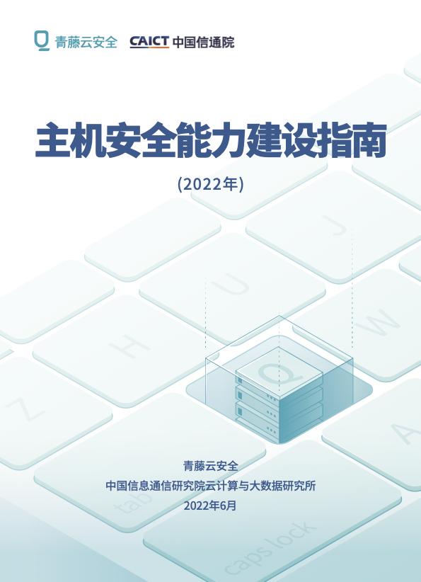
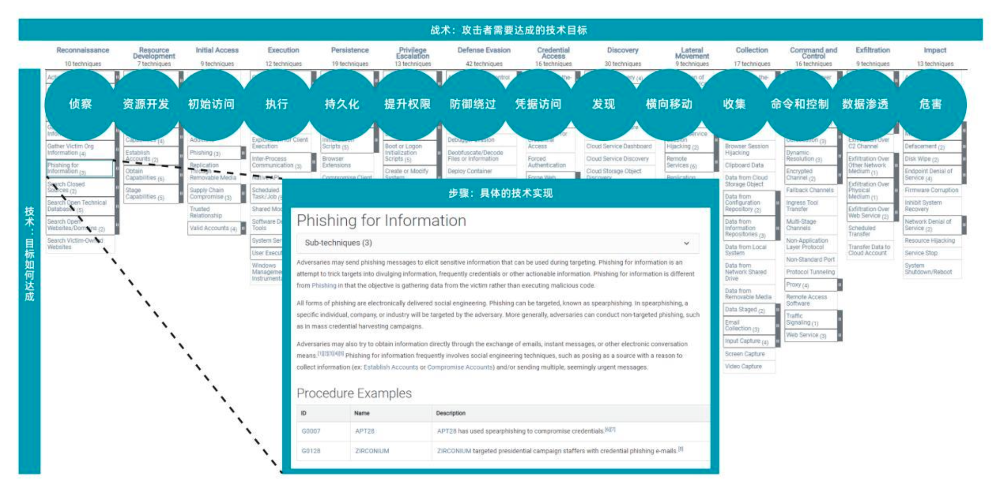
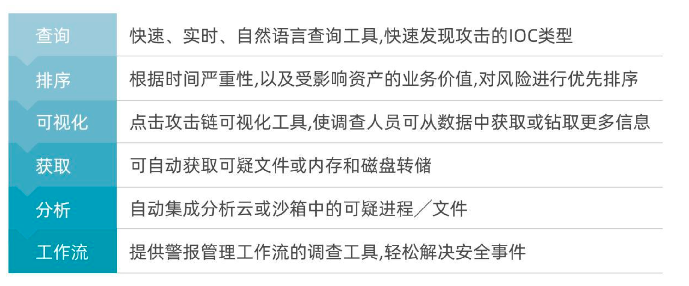
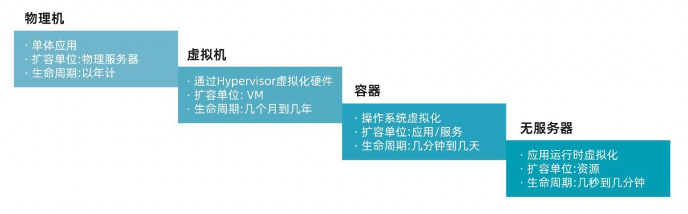
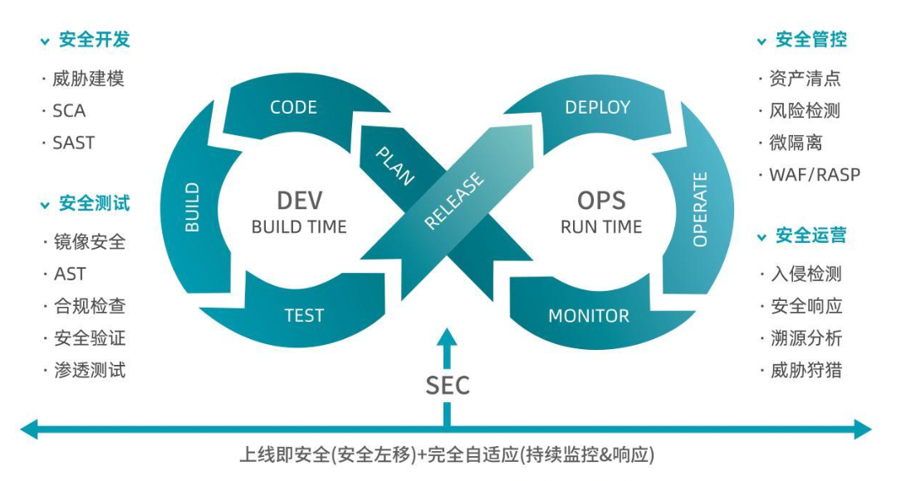
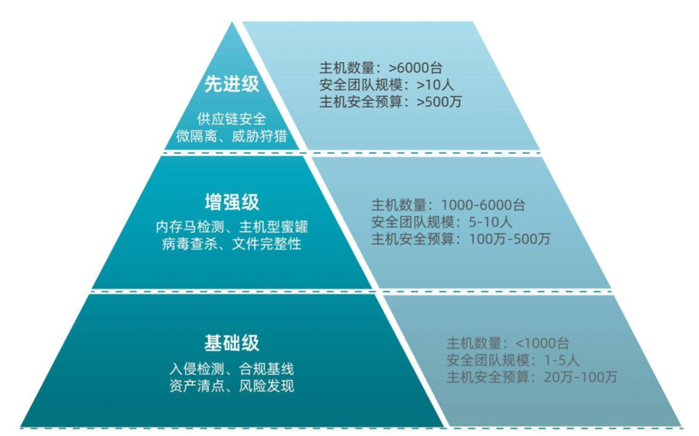
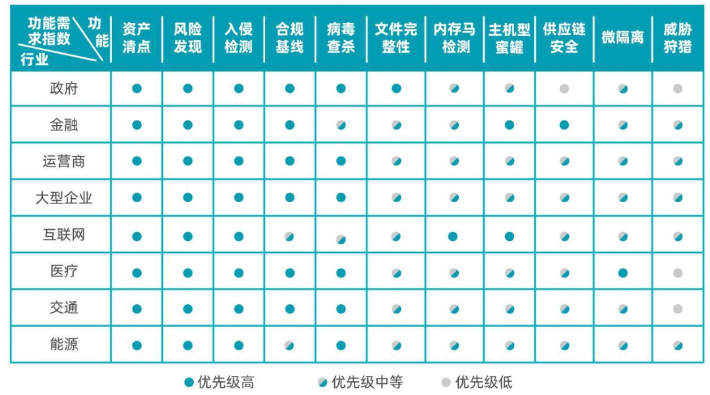

## 1. 概述

主机承载了企业越来越多的业务资产，成为攻击者的主要目标。攻击者通过各类工具利 用系统脆弱性突破企业防线，入侵主机内部完成攻击目的。守卫安全最后一公里，主机安全 成为关键。

据统计，在亚洲，80%以上企业被入侵后，需要数月时间才能发现入侵痕迹，而想要 了解攻击者如何入侵成功以及入侵后开展了哪些行为，则还需要数周调查时间。此外，后期 的漏洞修复和处置也将耗费数天完成，建立高效的主机安全检测与响应机制十分必要。

随着企业数字化转型的推进，业务变得更加开放和灵活，安全挑战也日益复杂，利用安 全边界保障主机的方式存在瓶颈，企业安全对抗和管理核心逐渐从边界转移至主机系统内。 为此，能够及时检测、保护主机工作负载安全的“主机安全平台”成为企业安全架构的重要 组成。

企业基于“主机安全平台”构建与现有安全工具协同工作的防御体系架构，以降低入侵 成功可能性，缩短恢复和处置时间。目前市场上主机安全类产品数量多，能力良莠不齐，企 业在选择产品时，需对现有的 IT 策略、安全策略、安全标准、安全基线和成本进行详细、 透彻的分析，充分考虑产品能力、安全性和业务需求。为此，青藤与中国信息通信研究院云 计算与大数据研究所联合推出国内首个《主机安全能力建设指南》，旨在帮助企业梳理主机 安全能力需求、产品评估阶段流程，为选择主机安全产品、建设自适应的主机安全能力提供 更好的策略指导。

本指南对主机安全能力发展态势和关键技术要求进行分析，梳理了重点行业主机安全能 力建设时的需求优先级和关键点，进一步明确了主机安全建设流程和评估要素，以帮助企业 选择满足其需求的产品，构建高效的主机安全能力体系。

##  2. 主机安全能力发展态势

达尔文《进化论》认为进化来源于突变，而安全面对的正是“不可预知的未来”。未知 威胁层出不穷成为安全进化的动力。主机安全作为该领域最重要的一个分支，也在快速进化 以应对全新的威胁。

###  2.1. 持续检测是基础

攻击者和防守者处于不对等地位，传统基于报警或已存在的威胁特征的检测技术，包括 防火墙、IPS、杀毒、沙箱等被动防御手段，在应对未知威胁过程中存在一些不足，表现为 以下几个方面：

- **检测技术单一：**基于签名检测技术无法检测未知威胁，更无法定位失陷主机；

- **缺乏持续检测：**仅支持阶段性检测，无法覆盖威胁入侵的全生命周期；

- **无法进行联动：**各安全检测产品单兵作战，攻击告警信息割裂，无法联动。

为了增强持续检测能力，防守方需要对攻击有深入的理解，并采用更加细粒度的安全模 型。MITRE ATT&CK提供了一个复杂框架，覆盖攻击者在攻击过程中使用的 14 项战术、 190 多项技术和 380 多项子技术，其中包括特定技术和通用技术，以及有关知名攻击组织 及其攻击活动的背景信息和攻击中所使用的战术、技术。简单来说，MITRE ATT&CK是一 个对抗行为知识库，可以帮助安全人员构建检测措施、验证防御措施并分析策略的有效性。 ATT&CK每一个战术类别包括了一系列的攻击技术，并提供了对每一项技术的细节描述、 检测技术和分析方法，以及可能的缓解措施。在行业应用中，该模型能够帮助分析和响应人 员更好地了解攻击者，帮助安全人员熟悉真实环境的对抗技巧，增强实战能力，从而更好地 组织防御。

图 1：ATT&CK矩阵的战术、技术和步骤

ATT&CK 框 架 模 型 对 于 安 全 从 业 者 的 最 大 价 值 是 增 强 其 对 检 测 能 力 的 理 解 ， 按 照 ATT&CK模型覆盖度、检测点，找到自身安全检测能力的改进方向。如何根据 ATT&CK框 架检查安全产品的整体覆盖度、做全面差异分析，以及如何将 ATT&CK所涵盖的技术点融 入到产品中，这些都是值得安全从业者深入思考的问题。

### 2.2. 快速响应是动力

安全攻防对抗日趋激烈，单纯的防范和阻止策略作用有限，企业必须更加注重检测与响 应，假定已遭受攻击，构建集防御、检测、响应和预防于一体的全新安全防护体系。从攻防 实战演习可以看出，无法保证系统不被入侵，入侵后的快速响应能力才是关键。为最大限度 科学、合理、有序地处置网络安全事件，建议建立完善的响应流程，包括查询、排序、可视 化、获取、分析、工作流，共 6 个阶段的工作。根据网络安全应急响应总体策略对每个阶 段定义适当的目标，明确响应顺序和过程。

图 2：网络安全应急响应流程

 建立完善的响应流程后，还需有合适的工具协助安全人员完成响应工作。当前企业内部应急响应人员数量有限，人员超负荷处理安全事件将会产生懈怠的情绪并可能忽视真正需要 处理的事件。因此，通过相应工具自动或半自动地对安全事件进行处理是进行安全响应的必 要手段。

安全编排自动化与响应 SOAR（Security Orchestration, Automation and Response） 聚焦安全运维领域，重点解决安全自动化响应问题。SOAR 通过剧本（Playbook）进行表 述，以工作流引擎支撑剧本执行。为了方便管理人员维护剧本，SOAR 通常提供一套可视化 的剧本编辑器。剧本面向编排管理员，让其聚焦于编排安全操作的逻辑本身，而隐藏了具体 连接各个系统的编程接口及其指令实现。SOAR 通常通过应用（App）和动作（Action） 机制来实现可编排指令与实际系统的对接。

### 2.3. 架构适配是未来

随着云计算市场快速发展，多云和云原生成为主流，生产效率提升的同时带来新的安全 挑战，各大云服务商、安全厂商、企业组织都应做好充分的技术准备，主机安全产品也在不 断发展以适配多云、云原生等新架构。

#### 2.3.1. 云工作负载保护平台 

近些年，Gartner 对云工作负载保护平台（CWPP）的定义不断演进。2017 年，CWPP 保护对象为由物理机和虚拟机（VM）、私有云以及多个公共云基础设施即服务（IaaS）环 境构成的现代混合数据中心中的主机工作负载。2019 年，Gartner 对工作负载的外延和内 涵进行细粒度解释，根据抽象度的不同分为物理机、虚拟机、容器和 Serverless。而 2022 年，CWPP 保护对象演进为混合云和多云环境中各类云原生工作负载。

图 3：工作负载抽象度的演变

随着云计算技术的不断发展，工作负载的粒度、生命周期和创建方式也在发生变化。Linux 容器被广泛应用，基于 Serverless 函数的 PaaS 平台（也称为函数 PaaS[fPaaS]）采 用率也在不断攀升，CI/CD 管道中工作负载部署频率增加，生命周期非常短暂。为了应对 工作负载的快速变化，CWPP 解决方案利用主动技术和流程，在开发管道的早期集成基础 设施即代码（IaC）或策略即代码（PaC）。

云原生安全防护平台（CNAPP）可以解决运行时保护、云配置和工件扫描问题，与 CWPP 具有一致性，许多增加了 CSPM 和 DevSecOps 功能的 CWPP 供应商也被认为是 CNAPP 供应商。

#### 2.3.2. 全生命周期的云原生安全体系

在数字经济发展战略的驱动下，企业加快数字化转型的步伐。为了支持数字化业务，开 发人员利用云原生技术进行应用开发成为常态，通常使用容器构建基于微服务的架构，以 DevOps 方 式 在 开 发 管 道 中 组 装 ， 部 署 到 可 编 程 的 云 基 础 设 施 中 ， 在 运 行 时 使 用 Kubernetes 进行编排，并以不变的基础设施思维方式进行维护。

上述转变给应用程序的安全保护带来新的挑战。将传统安全理念、管理思路及产品技术 “照搬”到云上并不能真正建立有效的云原生安全运营体系，仍存在较多安全风险。包括：

- 无法实现对各类型云原生资产的动态盘点；
- 无法对云原生基础设施的配置风险进行检测；
- 无法对合规风险持续地自动化评估；
- 缺乏对云原生上特有的新型威胁的检测；
- 缺乏云原生环境自动化响应处置机制与能力；
- 缺乏全面的云原生环境调查溯源能力。

面对云原生发展带来的安全挑战，安全测试需要尽可能无缝地集成到 DevOps 风格的 开发和云原生应用的部署中。企业不应将开发和运行时视为独立的问题，使用一组单点工具 进行保护和扫描，而应将安全性和合规性视为从开发阶段到运营阶段的连续统一体，并尽可 能使用一体化工具实现从开发到运营的全生命周期防护。

本指南倡导围绕 DevOps 流程打造全生命周期的云原生安全体系。体系以 DevOps 流 程为中心，基于“开发阶段-安全左移方案”和“运行阶段-完全自适应方案”，在云原生的 全生命周期过程中，提供原生的、融合的安全能力，覆盖云原生的整个开发过程，将安全防 护嵌入到每个步骤。

图 4：全生命周期的云原生安全体系

1. **在开发阶段（Dev），遵循“安全左移”原则，做到上线即安全**

通过早期定位和解决安全问题，减少攻击面和潜在的运行问题，做到“上线即安全”， 而不是把安全问题留到线上环境中去进行解决，例如通过对镜像层安全检查、应用层风险检 查、基础设施层安全检查。

2. **在运行阶段（OPS），遵循“持续监控&响应”原则，做到自适应安全**

在整体安全落地时，如图 4 所示，进行云原生安全的全生命周期管理，包括对工作负 载清点与可视化、微隔离、入侵检测、安全响应、溯源分析等。

## 3. 主机安全关键能力及技术要求

随着攻击手段不断演进，主机安全防护技术也在持续更新迭代，衍生出一系列不同细分 类别的主机安全产品，其安全能力按照成熟度以及可匹配的用户需求，可划分为三个级别： 基础级、增强级和先进级。基础级技术能力为**资产清点、风险发现、入侵检测、合规基线。** 增强级在基础级能力之上，还包括**病毒查杀、文件完整性、内存马检测、主机型蜜罐能力。** 先进级则在增强级之上增加了**供应链安全、微隔离和威胁狩猎能力**。上述能力将成为企业进 行产品选型和安全建设的核心参考指标。不同类型企业对不同级别主机安全能力需求优先级 不同：

- **基础级：**主机规模在 1000 台以下，安全团队规模人数在 1—5 人之间，主机安全建设 年预算在 20 万—100 万元之间，上述条件的企业优先建设基础级能力。
- **增强级：**主机规模在 1000 台—6000 台之间，安全团队规模人数在 5—10 人之间，主 机安全建设年预算在 100 万—500 万之间，上述条件的企业在基础级之上优先建设增 强级能力。
- **先进级：**主机规模在 6000 台以上，安全团队规模人数在 10 人以上，主机安全建设年 预算在 500 万以上，上述条件的企业在基础级和增强级之上还将建设先进级的能力。

图 5：不同等级主机安全能力

### 3.1. 基础级

建设基础级主机安全能力的主要企业，主机数量一般少于 1000 台，安全团队人数在 1-5 人之间，每年的主机安全预算在 20 万—100 万元之间。这一类企业需要用有限的预算 去建设最基础、最重要的安全能力，以解决大部分安全问题，主要包括资产清点、风险发现、 入侵检测、合规基线等。

#### 3.1.1. 资产清点

系统管理员通常需要对网络环境内的主机资产进行有效清点和管理，当主机规模过大时， 盘查和分析信息耗时耗力，只能通过远程执行命令或者借助一些工具手动或半自动地进行。 为进一步提高大规模集群主机的管理效率，需提高自动化程度，减少人工介入。

网络环境内的主机承载多类资产数据信息，如主机硬件、操作系统、运行进程、安装包、 网络端口、Web 资产等。上述资产信息数据量大、变化快、数据结构复杂，主机安全能力 需覆盖有效的资产清点，减少影子资产产生。

##### 技术类型

**基于 Agent 的资产扫描：**轻量级 Agent 作为运行在每台主机上的后台程序，占用极少 系统资源，定时对主机上各类资产信息进行采集。采集完成后，Agent 可通过增量方式将 信息作为所在主机的基础数据发送至后端云服务，减少网络带宽资源的消耗。

**网络侧资产探测：**设定多个扫描进程或线程，探测目标主机的相应端口。若每个端口收 到一种符合规则的回应包，则判定端口开放；每个主机有一个开放端口，则判定主机存活， 将存活主机的 IP、开放的端口及协议信息存入活动主机库。此外，可通过建立不同操作系 统、不同协议栈、服务等指纹数据库，检测目标主机的 TCP 和 UDP 应答数据包、识别系统

和协议栈指纹信息。

相比基于 Agent 的资产扫描，网络侧的资产探测方式能够探测到的资产信息有限，详 细内容依然需要采用 Agent 方式。此外，受网络原因影响，存在无法获取资产的情况。

##### 基础要求

- **主机发现：**能够自动进行主机发现，针对不同网络状况，提供多种探查方法，包括“ARP 缓存分析”、“Ping 扫描”、“Nmap 扫描”、“连接记录分析”等，同时需保证 探测与被探测主机正常运转。
- **应用清点：**自动化清点进程、端口、账号、中间件、数据库、大数据组件、Web 应用、 Web 框架、Web 站点等十余类安全资产，覆盖各类通用资产。
- **资产检索：**在复杂搜索场景下，提供关键资产（主机、账号、进程等）全系统关联，横 跨多种资产进行联合搜索。
#### 3.1.2. 风险发现

任何风险点都可能成为攻击者在未授权情况下访问系统和数据的突破口，风险发现能力 可以让安全管理人员在攻击入侵发生前进行系统加固，减少风险点存在。目前，风险发现能 力通常利用数十种技术实现主机操作系统、服务和应用程序的漏洞检测。

##### 技术类型

**基于网络的扫描器：**此类扫描器可以用来扫描检测远程主机上的风险，如远程利用漏洞。 首先，扫描器通过网络映射枚举主机；其次，通过向每个主机发送扫描探测包，以确定其操 作系统并识别正在运行的应用程序和服务；最后，检查每个应用程序和服务的已知漏洞、配

置情况、弱口令等。

**基于主机的扫描器：**此类扫描器一般基于 Agent 模式，部署在主机上运行，识别可以 被远程或本地利用的风险，包括弱口令、配置缺陷、漏洞等。以漏洞为例。基于 Agent 的 持续监测与分析机制，能迅速与丰富的漏洞库进行比对，精准高效地检测出系统漏洞，如管 理员为使用中的操作系统定义安全策略，扫描器将策略与主机实际情况进行比对。

与网络扫描相比，Agent 模式能够更清晰掌握主机上运行的业务逻辑，检测更精准， 数据识别更全面，高效且可以根据实际的运行环境进行漏洞修复业务影响性判断。

##### 基础要求

- 能够对新漏洞进行实时更新和响应，可按照需求在预设时间对漏洞库进行更新。
- 能够设置扫描偏好，包括扫描频率和速度，任务执行不应影响主机和网络正常业务。
- 减少主机资源消耗，避免主机崩溃、锁定，并且能够适配特定主机、特定环境。
- 漏洞扫描可以与现有的补丁管理系统集成。例如，在补丁修复之后立即重新执行扫描任 务，以确认补丁生效且打补丁过程没有引入新的漏洞。
- 支持企业所有操作系统（如 Windows、Unix、Linux 等）。
- 支持对漏洞修复的影响性进行判断，避免修复过程影响业务。

#### 3.1.3. 入侵检测

主机入侵检测是指识别主机中发生的入侵事件并分析其入侵迹象的能力，帮助安全人员 监控和分析入侵过程，包括执行未经授权的行为、绕过主机或网络安全机制的行为等。

检测方法主要包括两种：误用检测系统（基于知识的检测）和异常检测系统（基于行为 的检测）。这两种方法通常用于入侵检测系统（IDS）。

**误用检测系统（基于知识的检测）：**该方法通过收集非正常操作的行为特征，建立相关 特征库，当监测的用户或系统行为与库中的记录相匹配时，即判定为入侵行为。该方法假定 所有入侵行为和手段都能识别并表示成一种模式（攻击签名），进而所有已知的入侵都可以 通过匹配发现。误用检测的优点是误报率低，对计算能力要求不高，局限在于只能发现已知 攻击，对未知攻击无能为力，且模式库难以统一定义，特征库也必须不断更新。

**异常检测系统（基于行为的检测）**：异常检测对正常操作应该具有的特征（用户轮廓） 进行总结，当用户活动与正常行为有重大偏差时即被认为是入侵。由于入侵活动并不总与异 常活动相符合，该方法通常构造异常活动集并从中发现入侵性活动子集。在技术实现性方面， 异常检测包括三个关键点：一是特征，需要建立用户的“正常”行为特征轮廓，以选取特征 量；二是阈值，建立正常的特征轮廓并以此作为比较基准；三是频率，即时间窗口，对当前 行为和已建立的正常行为特征轮廓进行比较，以判断入侵是否发生。

##### 技术类型

基于网络的 IDS 和基于主机的 IDS 作为两种常见系统，都可以提供入侵检测能力。

**基于网络的入侵检测系统（NIDS）**：此类 IDS 通过捕获和分析网络数据包以检测攻击， 通过侦听网络段或交换机，监视连接到某网络段的多个主机的网络流量。基于网络的 IDS 通常由一组放置在网络中不同位置的专用传感器或主机组成，上述单元监视网络流量，对流 量进行本地分析，并向中央管理控制台报告攻击。但 NIDS 无法实现对加密信道和基于加密 信道的应用层协议数据的解密，对某些网络攻击的检测率较低。

**基于主机的入侵检测系统（HIDS）**：依托主机本身优势，基于主机的 IDS 能够精准确 定与攻击相关的进程和用户帐户。此外，与基于网络的 IDS 不同，基于主机的 IDS 可以直 接访问和监控数据文件、系统进程等潜在攻击目标，更容易“看到”攻击行为企图实现的预

期结果。

HIDS 基于主机上的数据源进行分析，主要包括被监测系统的操作系统事件日志、应用 程序事件日志、系统调用日志、端口调用、安全审计日志等。此类入侵检测系统，通过生成 诸多内在指标，并对这些指标进行持续的监控和分析，对入侵行为的检测效果较好。

此外，部分 IDS 具有入侵防御功能，不仅可以检测入侵活动，还可以进行防御。但入 侵防御存在误操作等问题，一旦对事件检测不准确，正常操作可能被识别为恶意活动进而被 阻断，企业在建设入侵防御能力时应特别注意检测的准确性。

##### 基础要求

- 操作简单，后期运维方便，有足够弹性以适应目前和未来环境。
- 最小系统占用，能够适配多种系统。
- 能够正确记录事件，并向安全管理员发送告警消息。
- 能够进行有效的入侵分析、事件处理和取证。
- 易于访问和查看日志，提供日志过滤功能，方便操作和搜索。
#### 3.1.4. 合规基线

近年来，《网络安全法》、《数据安全法》、《个人信息保护法》和《网络安全等级保 护基本要求》等法律法规和标准相继落地，合规成为企业安全防护基本准则。企业若基线管 理和系统加固存在不足，在突发安全事件时难以进行快速响应和事态控制。

合规基线能力指针对操作系统、数据库、中间件等进行配置安全检测，并提供检测结果 说明和加固建议，帮助企业进行系统安全加固，降低入侵风险并满足安全合规要求。

##### 技术类型

**基于 Agent 资产清点进行基线检查。**此方法基于 Agent 白盒探测机制，自动探查被核 查的操作系统、应用的类型及版本，并自动发现中间件及数据库安装路径，根据等保 2.0、 CIS 基准等基线模板进行核查，针对不合规 Checklist 提供精确的修复建议。

**通过尝试登录的方式进行基线检查。**针对 MySQL弱密码检测等项目，可以采用尝试登 录的方式进行检查。但此方法会占用一定的主机资源，产生较多登录失败记录，给业务和安 全人员造成困扰。

##### 基础要求

- 能够实现一键自动化检测，并根据检测结果提供修复建议，帮助企业达到合规要求。
- 支持用户按照法律法规要求、上级或行业监管部门要求自定义基线，通过制定策略提前 自查整改，灵活应对各强度标准。
- 基于国内外基线标准，如等保 2.0、CIS 基准，建立丰富的 Checklist 知识库。
- 能够适配不同操作系统环境，支持扫描操作系统、数据库、中间件等，扫描过程和结果 准确，以提高工作人员的效率。

### 3.2. 增强级

建设增强级主机安全能力的主要企业，主机数量一般在 1000 台—6000 台之间，安全 团队在 5—10 人之间，每年的主机安全预算在 100 万—5000 万元之间。这一类企业业务 更为复杂，容易受到高级攻击，因此在基础级安全能力外，还需要具备病毒查杀、文件完整 性监控与控制、内存马检测、主机型蜜罐等增强级的安全能力。

#### 3.2.1. 病毒查杀

各类攻击组织持续加大对病毒研发的投入，促使旧病毒变种升级、新病毒不断涌现，企 业面临严峻安全挑战，病毒查杀工作十分关键。

病毒查杀承担主机入口的安保角色，防止恶意程序进入。一方面，提前检测和预防病毒 比事后修复耗费更少的时间和财力；另一方面，从商业角度看，病毒可能导致客户个人数据 泄露或通过钓鱼邮件传播扩散，导致的企业声誉损失难以弥补。

##### 技术类型

传统病毒查杀存在多方面问题，一是以 Windows 上各类杀毒软件为主，缺少在 Linux 环境下使用且可统一管控的病毒查杀工具；二是病毒扫描资源消耗大且耗时长，病毒库的频 繁更新在云环境下存在流量下发问题；三是还原病毒入侵前的主机环境、在删除病毒后恢复 业务较为困难。等保 2.0 对恶意代码防范（即病毒查杀）能力提出了明确的要求，企业亟需 构建统一管控的病毒查杀能力，通过快速部署、高效检测和发现，保护主机环境免受攻击， 符合等保等合规要求。

**云端+客户端双重检测机制：**为有效解决传统病毒扫描在云环境下流量下发问题，应采 用云端+客户端双重检测机制。客户端负责实时监控用户各类进程的运行状态，在客户端检 测和云端分布式检测引擎的加持下，一旦判定为病毒立即上传服务端（云端数据控制中心） 备份，同时通过邮件、短信等多种方式向用户告警，并提供各项病毒文件静态和进程动态的 详细信息帮助用户分析病毒。同时，被确认病毒的源文件也会立即上传服务端备份，供用户 下载分析。

**沙箱验证：**对于检测发现的病毒，可以利用沙箱技术进行快速验证，从而发现并分析病 毒路径，确认查杀病毒的正确方法和手段。同时，沙箱技术可以自动生成对应的修复工具，

帮助用户还原主机被恶意修改的内容，修复病毒造成的影响。

##### 基础要求

- 综合多个具有影响力的病毒检测引擎，减少单一引擎被绕过的风险，并定期更新检测库， 通过实时监控的检测方式帮助用户及时查杀主机上运行的病毒。
- 贴合常见使用场景和等保要求，满足等保 2.0 中恶意软件防范二级和三级要求，帮助企 业通过等保审查。
- 对确认的病毒主动进行阻断和隔离，确保隔离后的病毒不具备启动运行和传播的能力， 不会再感染其他主机，有效抵御病毒攻击。
- 快速验证发现的病毒，并分析其入侵路径，从而确定查杀病毒的正确方法和手段。
- 能够还原主机被恶意修改的内容，修复病毒给用户造成的影响和损害。

#### 3.2.2. 文件完整性

文件完整性能力对于确保企业信息系统的安全性以及合规性至关重要。一方面，攻击者 往往通过复杂的恶意软件篡改企业主机和工作站上的注册表文件和其他关键数据，文件完整 性能力被企业视为恶意软件和威胁向量的重要防御层。另一方面，等级保护的合规性检查中 对文件完整性提出了明确要求，信息系统对于其主机上重要文件的变动需要进行记录、告警 通知和及时处理。

文件完整性能力可以帮助企业监控关键的系统文件、目录等，以便检测任何未经授权的 更改。该能力可依靠不同的验证方法，将当前的文件状态与基线状态进行比较，并在有可疑 变化时按照预定的策略发出警报。

##### 技术类型

文件完整性能力可以为企业环境中发生的任何变化添加业务背景，为安全团队提供实时 情报，以识别真正值得关注的事件，掌握变更人员、时间、地点和内容等信息。在文件完整 性能力中，核心能力包括两方面：

**检测文件变动行为：**一个文件的任何微小改动都可能导致整个网络暴露在潜在 攻击之下，文件完整性能力可以跟踪既定基线的变化，并对任何可能导致安全风险 或监管合规风险的意外变化进行告警。

**与安全基线进行对比：**为了识别与安全相关的文件变化，企业必须建立一个权威的文件 完整性基线，通过实时监测系统配置的变化以确保应用、服务和云网络未被入侵且在基线标 准范围内。

##### 基础要求

- 对常用或有合规要求的文件或目录建立文件完整性监控的能力，帮助用户方便快捷地部 署监控并满足日益规范化的合规要求。
- 能够发现非预期的文件变化，如黑客的恶意篡改行为等，为用户分析和处理事件提供变 化的详细信息。
- 提供监控规则的自定义能力，减少上报噪声，并对需要重点关注的文件变化事件进行告 警通知。

#### 3.2.3. 内存马检测

传统恶意软件利用二进制攻击载荷，存在两方面局限，一是易被杀毒软件扫描识别，或 者被应用白名单软件拦截；二是会留下较重的痕迹。为此，攻击者探索新型的恶意软件传播 方式，提升行为隐秘性和绕过应用规则检测的可能性，基于宏和脚本等的无文件攻击能够实 现上述目标，成为趋势，而内存马攻击则为无文件攻击的一种常见攻击类型。

最近几年，攻防演习热度越来越高。在攻防双方的博弈中，防守方综合使用 NDR、EDR 等专业安全产品，传统文件上传的 Webshell 或以文件形式驻留的后门易被成功检测，内存 马使用率快速提升。

##### 技术类型

在内存马攻击事件中，内存 Webshell 和内存恶意代码是攻击者最常用的手段，相应检 测能力十分必要。

**内存 Webshell 检测：**内存 Webshell 通常会调用恶意的函数和方法，此类攻击的检测 可通过监控 Java 进程加载方法（即 Java 类）的行为触发扫描，检测进程内存中加载的类是 否存在异常，例如包含恶意代码，或调用了可疑的方法，以发现内存中是否运行了 Webshell。

**内存恶意代码检测：**通过监控进程启动事件触发对进程内存空间的扫描，对当前已运行 进程中内存的代码段和数据段进行检测，通过恶意特征匹配发现存在的恶意代码。

##### 基础要求

- 能够检测内存 Webshell、进程内存注入、恶意动态链接库加载等常见的内存马。
- 最大化地减少不必要的资源消耗，内存后门检测时不应影响主体业务程序的运行。
- 能够发现在进程内存中运行的恶意代码，并及时向用户发送告警。
- 提供对恶意代码的特征分析和说明，为用户确认告警和处理提供支撑。
- 利用精确检测的能力验证对内存后门的修复结果，实现对事件全生命周期的管理。

#### 3.2.4. 主机型蜜罐

蜜罐技术的本质是对攻击方进行欺骗，与重交互的蜜罐系统相比，主机型蜜罐通过布置 诱饵主机、网络服务或者文件，诱使攻击方对诱饵进行攻击，从而对攻击行为进行捕获和分 析，了解攻击方所使用的工具与方法，推测攻击意图和动机。基于主机蜜罐捕获的信息，防 守方能够清晰地了解面临的安全威胁，并通过技术和管理手段增强实际系统的安全防护能力。

##### 技术类型

蜜罐运行与实际生产系统相同的进程且包含攻击者认为适合于目标进程的诱饵文件，看 似为真实业务时可达到最佳效果。通常，可将蜜罐置于企业网络的防火墙之后，以检查绕过 防火墙的威胁，并将攻击者的入侵限制在蜜罐范围内。目前，常见的主机型蜜罐包括网络蜜 罐、文件蜜罐，不同蜜罐的威胁捕获能力如下：

**网络蜜罐：**一是能够展示各主机的端口开放情况，提供对端口的批量设置能力和主机端 口管理能力；二是支持常见蜜罐端口列表，如 22 端口（SSH 远程连接）、23 端口（Telent 远程连接）、25 端口（SMTP 邮件服务）等，指导用户更好地完成蜜罐网络的部署；三是 具备一键清理冲突端口的能力，以防网络蜜罐的部署影响正常业务的进行；四是部署完成后， 能够对端口进行实时的扫描监控，端口被访问立即上报告警，并提供完整的攻击者信息。

**文件蜜罐：**通过在主机指定路径下部署不具备真实信息的蜜罐文件，诱导潜在黑客对文 件进行攻击，从而发现黑客行踪。文件蜜罐功能支持用户在指定主机的目标位置自定义蜜罐 文件的名称及大小，通过将蜜罐文件部署在关键目录下，赋予文件诱惑性的名称，诱导黑客 上钩，一旦捕捉到有进程试图对文件进行读写等行为，立即上报告警并记录完整的进程信息， 帮助用户进行研判。

##### 基础要求

- 设置蜜罐迷惑攻击者，收集实际攻击及其他未授权活动的真实数据，为分析人员提供大 量有用信息。
- 通过部署蜜罐文件，实时监控文件的操作行为，引诱黑客攻击，同时避免真实业务文件 泄漏。
- 实时监控可疑端口扫描行为并记录，分析黑客的攻击目的和动机，帮助用户及时修补系 统安全漏洞，避免真实攻击的发生。

### 3.3. 先进级

建设先进级主机安全能力的主要企业，主机数量一般在 6000 台以上，安全团队在 10 人以上，每年的主机安全预算在 500 万元以上。此类企业业务价值高，业务关系复杂，对 攻击者极具吸引力，易受到来自敌对组织、拥有丰富资源的威胁组织发起的恶意攻击。为此， 企业需具备更先进的主机安全能力，包括供应链安全、微隔离和威胁狩猎。

#### 3.3.1. 供应链安全

近些年，软件定义成为主流，软件需求不断扩展，开发难度和供应链管理复杂度不断上 升。为降低开发成本、加快交付速度，众多企业直接或间接采用供应商提供的软件，包括软 件包、库和模块，上述过程对终端用户透明度低，甚至完全隐藏。当多个客户依赖同一个供 应商时，供应商被攻击后影响范围大，可造成大规模的全国性甚至是跨国界的影响。同时， 软件供应链攻击具有成本低、效果好的特点，SolarWinds、Log4j2 等供应链安全事件均造 成极大社会影响，引起各行业对软件供应链安全的广泛关注。

##### 技术类型

当企业网络安全能力较强时，攻击者往往将注意力转移至供应商，以供应商为突破口实 现对企业的攻击。供应商正在成为供应链上最薄弱的环节，加强供应链安全能力成为企业的 必然选择，尤其是大型企业。

**利用软件物料清单提高软件透明度。**软件供应链安全始于对关键环节的可见性，需要持 续构建详细的软件物料清单，全面洞察软件的组件情况。软件物料清单（SBOM）是描述软 件包依赖树的一系列元数据，包括供应商、版本号和组件名称等多项关键信息，体现软件组 件与其依赖的基础组件之间的关系。SBOM 可以通过软件生命周期各阶段的工具和任务流 程化完成，例如采购管理、许可证管理、代码扫描、版本控制系统、编译器、构建工具、 CI/CD 工具、包管理器和版本库管理工具等。其中，漏洞利用交流（VEX）作为 SBOM 的 “辅助工件”，能够发现第三方依赖项中的漏洞，并评估漏洞可利用性。尽管 SBOM 无法 完全解决软件安全问题，但形成的元数据为后续安全工具、实践的构建奠定基础，SBOM 是实现软件透明度最终目标的基础工具。

**基于 DevSecOps 构建安全开发工具链。**仅掌握第三方组件基本信息不足以解决软件 供应链深层问题，需要构建安全开发工具链贯穿软件开发周期。DevSecOps 是由 DevOps 的概念延伸和演变而来的新安全理念和模式，其核心为“安全是开发、运维及安全团队等在 内的整个 IT 团队的责任”，需要贯穿到从开发到运营整个业务生命周期中。DevSecOps 通过 DevOps 流程工具链，将安全编码工具、安全测试工具、安全运营、安全管控等自动 化工具无缝集成到 DevOps 流程中，实现软件全生命周期安全。在软件供应链中每个阶段 都面临不同的安全风险，需要采用不同的安全工具，安全开发工具链应覆盖软件生命周期中 的所有阶段。

##### 基础要求

- 负责供应链网络安全的人员应与产品开发周期内相关团队通力合作，充分考虑供应商和 开发商的员工、流程、工具等方面的安全问题。在供应商正式加入供应链之后，安全团 队应协助解决其引入的漏洞和安全隐患。
- 企业应维护管理自身的 SBOM，能够精确识别关键信息，包括 Web 框架、系统安装包、 Jar 库/类库等，并能够有效识别已部署的业务系统对 PHP、JAVA、Python 等框架的 使用情况。同时，需支持云原生环境下的资产信息，包括容器、镜像、镜像仓库和主机 等基础资产信息。
- 采用云原生技术的企业，应基于 DevSecOps 理念，采用从开发阶段延伸到运行时保护 的集成方法，将基础设施即代码(IaC)扫描、容器扫描、云工作负载保护平台（CWPP）、 云基础设施授权管理(CIEM)、云安全态势管理(CSPM)进行整合，实现软件的全生命周 期安全。

#### 3.3.2. 微隔离

传统防护对数据中心建立防火墙，阻止内外网之间未经授权的连接，即对“南北向流量” 实行控制。随着数据中心的扩大和升级，以及企业业务上云用云程度加深，传统边界消失， 内外网间的数据交换仅约占现代数据中心流量的 20%，80%流量流转于内网主机之间，网 络安全重心由边界向数据中心内部迁移。

微隔离架构能够对内网（东西向）流量提供防护，契合行业发展需求。在微隔离框架下， 主机、操作系统、容器均成为传感器，一旦发生违反策略的访问，立即触发告警或拒绝访问， 只有授权的流量才可放行，内网中 90%以上不安全的网络访问可被消除。

##### 技术类型

目前，微隔离能力主要由三种策略实现：

**基于网络的策略：**此方法通过对第 2 层或第 3 层元素进行分组实现，例如 MAC 或 IP 地址，安全团队需要了解网络基础设施以部署基于网络的策略。因不使用基于动态属性 的分组，安全规则扩展概率较高，但该分组方式在仅迁移不同供应商防火墙现有规则的情况 下安全效果一般。

**基于基础设施的策略：**数据中心基础设施元素包括集群、分布式端口组等，此方法适用 于数据中心存在物理或逻辑边界的情况，因此需要安全团队和应用程序团队之间密切协作， 以理解数据中心内的逻辑和物理边界。同时，用户还需要了解此场景中可以部署应用程序的 位置，例如，若用户需要灵活地将 PCI 工作负载部署到任何具有足够计算资源的集群，则 不能将安全态势绑定到特定集群，安全策略应该随应用程序一起移动。

**基于应用程序的策略：**此方法基于可定制的机制对数据中心元素进行分组，如应用程序 类 型 （ 例 如 ， 标 记 为 “Web\_Servers”的 主 机 ） 、 应 用 程 序 环 境 （ 例 如 ， 所 有 标 记 为 “Production\_Zone”的资源）和应用程序安全态势。此方法存在两大优势，一是应用程 序的安全态势不与网络拓扑或数据中心基础设施绑定，安全策略可随应用程序迁移；二是可 以跨相似的应用程序类型和工作负载实例创建或重用策略模板。

##### 基础要求

- **零信任：**基于零信任理念实现网络之间的访问，通过管理员授信后才可访问，及时阻断 非授信机器的访问，扼杀潜在威胁。
- **可视化：**网络间的访问对用户可视化，当非法或者恶意访问发生后，能通过不同的颜色 分辨合法与非法的访问。
- **自适应：**网络访问策略自适应。基于固定 IP 地址进行网络访问的控制方式不再符合技 术发展趋势，策略应自动适应网络环境的变更，及时分发执行最新的策略。
- **持续监控：**应实时且持续不断地监控网络中可能发生的异常或非法访问行为，尽早发现 风险因素，帮助安全部门及时应对潜在威胁。

#### 3.3.3. 威胁狩猎

随着网络攻击技术和工具越发先进，传统基于特征值的被动检测技术作用有限，企业无 法 100%检测到恶意活动，出现明显入侵特征再进行响应价值不高，需主动出击寻找入侵者， 进行“威胁狩猎”。

威胁狩猎是一种主动的、假设驱动的威胁发现活动，旨在寻找被动监控功能中没有涵盖 的控件、活动或攻击者 TTP，形式开放，有时需要凭借猎人独特的直觉，是科学、艺术和哲 学的有机组合。

##### 技术类型

**基于高价值实体的威胁狩猎：**攻击者通常会瞄准企业中某些高价值或高风险的资产和用 户，因此无论企业安全团队规模如何，都需要确定威胁狩猎活动的优先次序，主动识别高价 值资产并以此进行威胁狩猎，最大限度地提高工作的 ROI。

**基于事件的威胁狩猎：**基于事件的威胁狩猎侧重于事件，通过对事件的分析，判断是否 发生了入侵。此方法需要研究特定的事件，了解其发生时间、方式和来源，并利用这些数据 判断行为是否为恶意行为。

**基于 IOC 的狩猎：**此方法是威胁狩猎的基本方法，IOC 作为网络威胁的指纹，其数据 通过在系统日志事务或文件中发现，可以识别恶意活动。

**数据驱动的威胁狩猎：**驱动狩猎活动以数据观察产生假设为着手点，即用户通过观察现 有数据，找出可疑之处。

**基于 TTP 的威胁狩猎：**通过了解攻击者的 TTP，掌握攻击者的使用工具、攻击时间、 攻击来源、攻击目标和攻击方式，可大大提高威胁狩猎的效率。

##### 基础要求

- **判断行为正常和不正常：**任何企业的业务运行均存在规律，攻击者入侵后便会破坏原有 规律、产生新数据。威胁狩猎需要从企业的行为中总结规律，生成相关模型，并定期查 看是否有破坏原有规律的行为，有效识别正常和不正常的行为。
- **了解组织的高价值目标：**在威胁狩猎中，需要知道攻击者的攻击目标，梳理企业所有高 价值目标，包括客户或员工数据等信息、面向公共 Web 主机等的关键资产。
- **数据关联分析：**有效实现威胁狩猎，需要联通资产、风险、入侵、日志、任务等数十类 原始数据，进行全局分析，关联查询，以快速有效地发现异常行为，实现未知威胁的及 时发现和已知威胁的路径溯源，解决单一产品能力不足的问题。
- **预测被攻击方式：**攻击者通过企业组织架构和数据流中的弱点，试图在不被注意的情况 下获取有价值的数据。例如，ATT&CK框架中汇集了主流攻击方式，基于 ATT&CK框 架进行威胁狩猎，可以有效降低用户进行威胁狩猎的难度，高效捕捉攻击者 TTP。

## 4. 重点行业主机安全能力需求分析

安全是企业业务开展的基本要求和保障，理想条件下，企业具备的主机安全能力越完善， 覆盖基础级、增强级、先进级中更多的能力，越能为主机及其承载业务提供更好的安全保护。 但在企业实际运营中，不同行业进行安全建设的驱动因素有所不同，且业务关系面临的风险

程度存在差异，综合建设成本、人才技术基础等因素，企业对各主机安全能力建设的优先级 也不尽相同，应在人力、财力有限的条件下，优先完成最迫切需要的、与业务安全要求最匹 配的能力建设。本章主要分析不同行业对各主机安全能力的需求优先级。

图 6：不同行业对主机安全能力的需求优先级

- **政府行业** 在政府行业信息化建设初期，安全建设主要以合规驱动为主，在进行主机安全选型时， 政府机构更加关注主机安全基础级能力和病毒查杀能力。随着政务信息化建设的发展和数字 化转型的推进，政务信息系统数据整合和互联共享，打破了原来封闭的信息化环境，从而让 政府机构面临着更多的网络安全风险。同时，最近几年我国也陆续颁布了《关键信息基础设 施安全保护条例》、《个人信息保护法》、《数据安全法》等相关法律法规，这也推动着政 府机构进一步加强网络安全建设。因此，可以预期，政府机构未来会优先关注高级威胁的检 测和分析溯源能力。
- **金融行业** 金融行业整体信息化水平相对较高，安全团队编制完善，有较完备的安全管理流程，以

业务驱动安全建设为主，更关注安全数据指标的采集和安全分析能力，并且对高级威胁的检 测较为关注，包括 0Day 漏洞攻击、内存马攻击等。因此，除主机安全的基础能力需求之外， 高级威胁检测和溯源分析能力的建设在金融行业优先级较高。另外金融行业对业务连续性要 求最高，尤其关注采购的安全产品在行业的成熟度和相关经验积淀。

- **运营商行业** 电信运营商主机数量十分庞大，网络资产复杂多样，传统通过在网络边界部署防火墙、 IPS、IDS 等安全设备，以流量分析和边界防护为主的防御方式很难消除潜在的安全风险。 同时，运营商行业网络安全状况随着安全漏洞的增加日益严峻，迫切需要有效的手段和方案 快速发现风险，化被动为主动，深入识别内部暴露的问题，并持续有效地对风险进行监控与 分析，从而提高攻击门槛，缩减修复漏洞的窗口期。另外，攻防演习常态化也使得运营商行 业逐渐关注攻防对抗场景下的入侵检测和溯源分析能力。
- **大型企业** 大型企业整体信息化建设相对比较完善，但业务开放、系统环境复杂、对资产和风险的 管理较为混乱。随着业务上云和数字化转型的驱动，传统的基于基础网络安全设备的防护手 段已经无法应对新型安全威胁，大型企业对主机的入侵防护需求迫切，同时目前主要依赖安 全人员的能力，因此对高级威胁检测和溯源分析的需求优先级不高。
- **互联网** 虽然互联网行业业务迭代迅速，采用的信息化新技术引入了新的入侵威胁，但行业安全 人员技术水平普遍较高，除了基础的主机安全需求外，会更多关注内存马、0Day 攻击、供 应链攻击等手段的监控和分析溯源，以及主机型蜜罐、威胁狩猎等能力。
- **医疗行业** 医疗行业大多依靠外采软件，一是存在对软件资产进行安全运维的需求，资产清点、风

险发现、合规基线能力优先级较高；二是医疗安全事件频发，需提升主机入侵检测能力；三 是医疗终端易引入病毒感染主机，且面临等保合规要求，病毒查杀的需求较为迫切；四是医 疗数据中心云化，云内安全边界消失，对业务之间访问关系实现可视可控变得极为重要，主 机微隔离也是医疗行业的主要需求。

- **交通行业** 随着“十四五”现代综合交通运输体系发展规划的推进，目前交通运输领域新型基础设 施建设取得重要进展，交通基础设施数字化率显著提高。在数据开放共享和平台整合优化取 得实质性突破的同时，存在网络安全主动防护、纵深防御、综合防范能力不适应新形势，关 键信息基础设施和关键数据资源保护能力不足等问题。而主机安全体系的建立将更好地弥补 纵深防御体系的不足，对关键信息基础设施尤其是主机的资产清点、风险发现、入侵检测成 为重要需求。另外基于行业合规的要求，病毒查杀和合规基线检测是基本。对内存马、主机 型蜜罐、威胁狩猎等能力的建设，可有效提高网络安全主动防御能力，行业需求选择较为优 先。
- **能源行业** 能源行业关系国家基础设施建设，尤其以石油、化工、电力为代表的产业在人们日常生 活中扮演着关键角色，行业对业务连续性要求高，业务系统的主机需要 7×24 小时、365 天不间断运营，不允许断电和重启，主机在支撑业务持续运营的同时要满足安全防护要求。 能源行业的安全需求以满足等保 2.0 合规性检查及主机安全监测和统一管控为主，因此，短 期内迫切需要建设基础性功能，包括资产清点、风险发现、合规基线和入侵检测，长远看则 应优先具备增强级功能，包括内存马检测、主机微隔离和高级威胁溯源分析等。此外，“十 三五”期间，能源行业已建设较为完备的网络安全体系，主机安全需更关注与安全体系整体

平台的融合与协同，以及自身能力的模块化、服务化和开放性，具备整合、编排和管理能力， 以满足用户业务场景的需求。

## 5. 主机安全能力建设流程

### 5.1. 主机安全平台评估

企业基于主机安全平台构建主机安全能力，存在两方面问题，一是主机安全产品作为相 对较新的产品类别，尤其是基于 Agent 模式的产品形态，许多企业对其还不够熟悉，需要 一定时间才能充分利用这些系统；二是企业存在自身独特需求，单个企业中的不同部门也可 能存在自己的特殊需求，比如安全部门和运维部门，需要将需求划分为不同的优先级。因此， 主机安全平台评估流程主要包括：

- 结合行业和企业需求，明确平台需具备的主机安全能力，可参考第 2 章和第 3 章

主要内容。

- 综合考虑平台总体性能，主要包括如下因素：

**功能丰富性：**随着黑客攻击方式的不断迭代，主机安全产品应具有丰富的功能以有效检测攻击者。事前，丰富的产品功能可以让用户将全量的主机纳入管理，通过细粒度的资产 清点，避免影子资产带来的安全风险，通过对漏洞、补丁、弱密码可视化呈现，快速修复及 验证，收窄主机层面的攻击面；在事中，用户能够进行实时监控，针对入侵行为进行检测， 记录黑客的操作行为、进程启动、网络连接等关键事件，通过邮件、短信、微信等方式进行 实时告警，并通过内网微隔离，限制攻击者的横向移动，遏制攻击者的影响范围；在事后， 对攻击者的入侵进行溯源和研判分析，帮助用户了解攻击者的 TTP，并给出处置建议。通过 丰富的主机安全功能，帮助用户构建完善的安全防御体系，全面覆盖攻击全阶段，提供专业化安全保障。

**稳定性：**安全与发展一体两翼，安全是为了更好的发展。因此，安全设备的稳定性至关 重要，不能因为安全产品的不稳定造成业务中断，让企业业务遭受损失。基于 Agent 的主 机安全产品通常分为两种形态：轻 Agent 和重 Agent。基于重 Agent 方式的主机安全产品 需装载驱动或改变内核，侧重病毒查杀和阻断，易造成系统崩溃或误杀业务系统等，影响业 务连续性。此方式的主机安全产品在 PC 端场景下尚可正常运行，但在主机场景中不能够满 足用户需求，企业用户因担心自动化处置造成业务中断，而进行更多的人工参与。轻 Agent 形态的主机安全产品则无须修改内核、不装驱动，通过实时监控与分析来发现威胁，为企业 用户提供告警，产品稳定性能够降低政府、金融等各行业企业因业务中断面临的影响。

**兼容性：**一方面，不同企业采用了不同类型的软硬件、操作系统及技术架构，尤其是大 型企业，由于其业务内容多、关系复杂，涉及多种不同的系统环境；另一方面，随着云计算 尤其是云原生的不断发展，企业的技术架构也在逐渐发生变更，从物理机向虚拟机、容器转 变。上述情况要求主机安全产品具有良好的兼容性，企业在进行主机安全产品选型时，需要 考虑到该产品是否支持物理主机、云主机，是否支持不同的操作系统，是否能够适用于虚拟 机、容器环境等不同架构。

**易用性：**无论产品的功能如何强大，若企业中的相关人员无法熟练使用，将限制产品价 值发挥。目前安全市场人才短缺，众多企业内能够熟练使用安全产品的人员十分有限。虽然 安全厂商能够提供不同形式的安全服务，进行日常运维和威胁检测，但部分企业无法接受外 包人员的驻场服务。鉴于此，主机安全产品应该能够确保用户操作和控制软件系统，完成预 期或指定任务。企业在进行主机安全选型时，要结合自身人员的安全技术能力，将产品的易 用性考虑在内。

**可维护性：**据已部署主机安全产品的企业调查显示，主机安全产品的可维护性是应特别关注的指标，直接影响到对产品的使用体验和安全人员的工作效率。对于使用主机安全产品 的人员，一是需要关注对于主机业务组、运维类信息和标签的批量自动化配置的能力，因为 主机数量庞大，依赖手工配置效率低；二是关注是否具备对 Agent 本身的运行情况监控， 对离线 Agent 的探测分析；三是关注对于平台本身的运行状况，资源占用，数据消费状况 等信息。

### 5.2. 资质评估

资质是指由国家认可的权威第三方认证机构，证明一个组织的产品、服务、管理体系符 合相关的标准、技术规范、强制性证明的要求。目前，主机安全类产品的资质主要包括企业 资质、产品资质、测试报告、知识产权等方面。主机安全产品是否具有资质，以及资质的权 威性都是产品竞争力的体现。因此，关注资质是企业进行主机安全平台评估的关键一步。

#### 5.2.1. 企业资质

对于产品供应商的企业资质考核是主机安全平台评估的第一步。对于企业资质，可关注 该企业是否通过 ISO9001。ISO9001 是 ISO9000 族标准所包括的一组质量管理体系核心 标准之一，是迄今为止世界上最成熟的质量框架，目前全球有数百个国家使用这一框架。通 过认证的企业，其各项管理系统整合上已经达到了国际标准，表明企业能持续地向客户提供 预期和满意的合格产品。站在消费者的角度，产品供应商要以客户为中心，能满足客户需求， 达到客户满意。

在评估过程中，关于企业资质的查询需要由供应商提供相关证书的信息，并到指定认证 机构查询确认信息。

#### 5.2.2. 产品资质

主机安全产品在进入市场销售之前，必须申请由公安部公共信息网络安全监察局颁发 的《计算机信息系统安全专业产品销售许可证》。由于该资质是市场准入的强制标准，因此 目前市场上所有主机安全类产品都具有该资质。同时，中国信通院组织的“可信安全”云工 作负载保护平台能力评估，对面向云场景的主机安全进行能力验证，是进行 CWPP 选型的 企业的重要参考。

在主机安全产品选型过程中，需要优先关注企业资质、产品认证以及行业标准，产品 认证越全面，通过的行业标准越多，一定程度上表明产品的可靠性及技术性能越高。因此， 客户在采购之前务必了解全面产品的资质情况，才能做出综合评估。

#### 5.2.3. 测试报告

每项产品资质均需要有一份检测报告的支持。在产品证书资质相当的情况下，检测报告 对用户选型的指导意义不大。在主机安全领域，选型过程中企业可要求供应商提供《信息安 全产品测试报告》等相关测评报告作为选型参考。

#### 5.2.4. 知识产权

对于主机安全产品，知识产权主要包括软件著作权和发明专利两方面。软件著作权对主 流厂商较为通用，专利部分分为三类：发明专利、实用新型专利和外观设计专利，其中发明 专利在主机安全产品中占据核心地位。特别注意，应是反映产品技术的发明专利，代表某一 产品的核心创新性，且由该产品独占，在一定期限内享有独占实施权。供应商主机安全产品 白皮书一般会对自身创新性技术进行描述，企业可根据需求重点分析和评估。

### 5.3. 成本评估

成本是任何安全产品购买决策的重要组成部分，主机安全产品也不例外。常见参考指标 包括：

- 产品采购成本；

- 安装成本；

- 产品维护与更新成本；

- 其它成本（例如误报、可见性、检测效率、检测时间）。 

此外，由于地理位置、企业规模以及供应商或代理商关系的不同，直接进行成本比较可能较为困难。企业应评估产品的价值而不是价格，以标准化方法考虑设备的安全有效性、性 能和成本。

除了进行产品试用及性能评估之外，在购买产品前企业还需要与供应商进行充分沟通， 包括：

- 供应商根据企业需求给出综合报价，详细列明每一项费用，包括设备采购、部署实 施、后期维护及产品升级等费用。
- 报价需要全面涵盖可能涉及的所有费用，若某些项目的费用无法在前期报价中给出， 则需给出价格计算方式。
- 若同时有多家供应商产品均满足企业要求，企业可根据供应商给出的报价进行综合 成本评估，评估因素包括口碑、市场影响力以及售后服务评价。

### 5.4. 合同签订

在综合进行资质评估、需求评估、性能评估以及成本评估后，企业才可最后确定选型 产品。在部署实施前，企业需与供应商进行服务合同的敲定。

合同内容需要包括以下几个方面：

- 合同金额及产品服务的报价
- 实施周期
- 验收标准、方法
- 双方责任、义务
- 付款方式
- 违约责任

## 6. 出版单位介绍

### 6.1. 青藤云安全简介

青藤云安全成立于 2014 年，是国家级专精特新“小巨人”企业、国家高新技术企业。 青藤聚焦关键信息基础设施安全防护，提供包括主机安全、云原生安全、大数据安全等新一 代安全技术，助力用户构建更加强大的安全体系。

公司总部设在北京，并在上海、武汉、深圳、广州等 20 多个城市设有分支机构，员工 人数 900+。青藤通过自主研发，为政府、金融、运营商、互联网等行业的 1000+大型企 业，600 万+台核心业务服务器提供稳定、高效的安全防护。

凭借强大的技术研发能力和业务拓展实力，青藤连续 6 年入围 Gartner CWPP 报告和 推荐供应商名录，并在 2020 年获第二十四届全国发明展金奖。青藤的业务覆盖全国各地， 连续四年销售复合增长率增长超过 100%，主机安全市场占有率全国第一。

### 6.2. 中国信息通信研究院云计算与大数据研究所简介

中国信息通信研究院（以下简称“中国信通院”）是工业和信息化部直属科研事业单位， 以“国家高端专业智库产业创新发展平台〞为发展定位，在信息通信行业重大战略、规划、 政策标准和测试认证等方面发挥了有力支撑作用。云计算与大数据研究所作为中国信通院设 置的核心业务单元，旨在对云计算、大数据、人工智能、区块链等新兴技术展开深入研究， 推进相关标准的制定以及生态圈打造，促进 ICT 技术加速与工业、金融、医疗、电力等传统 行业的深度融合，助力我国产业互联网和实体经济发展。

云计算与大数据研究所从 2015 年开始开展数字化安全研究，创建“可信安全”品牌， 聚焦软件供应链安全、业务安全、零信任、安全防护、数字基础设施安全、安全保险等领域， 成为政府支撑、行业规范、用户选型与开发建设的重要参考。
