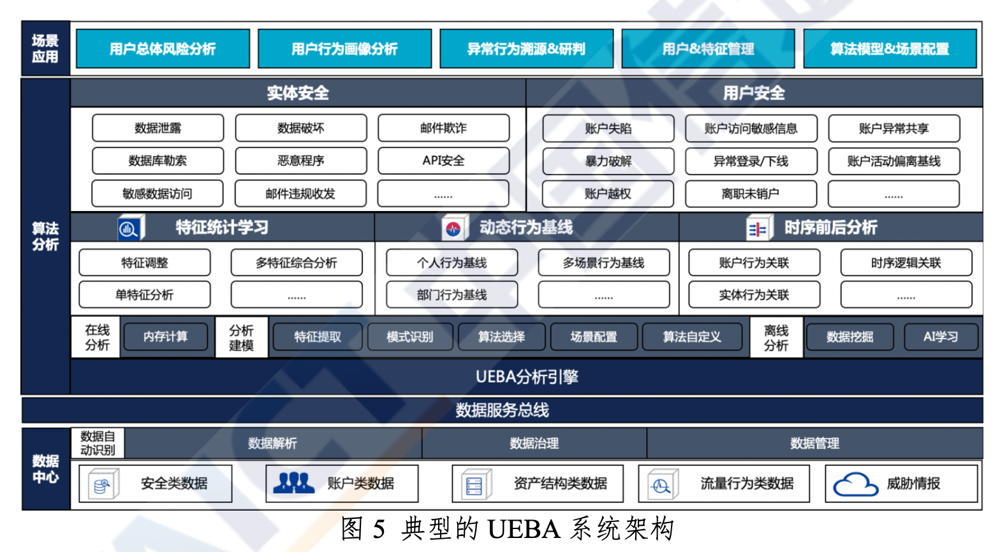
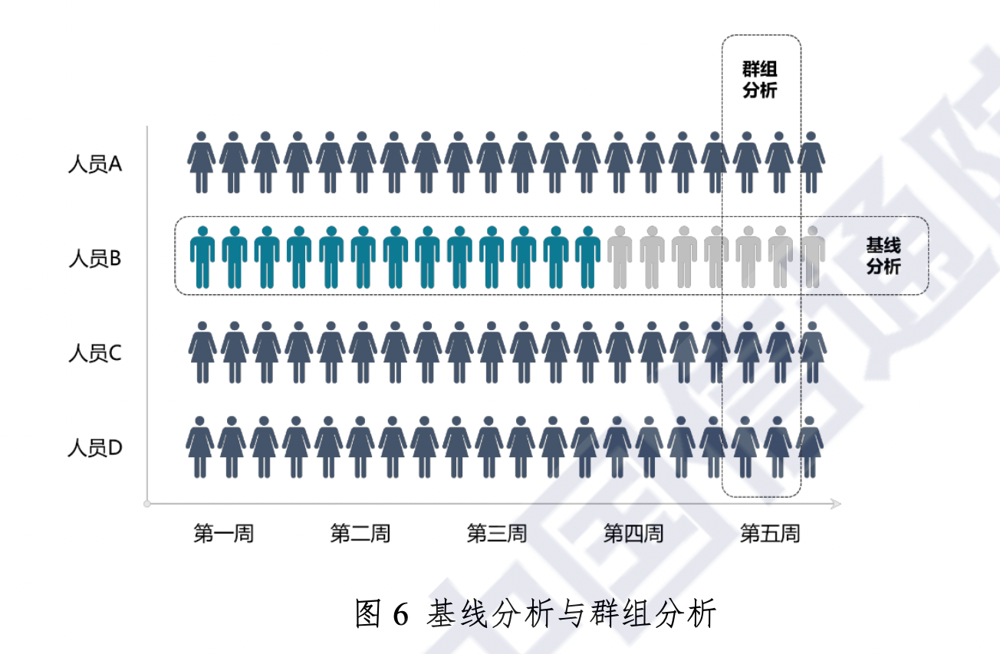
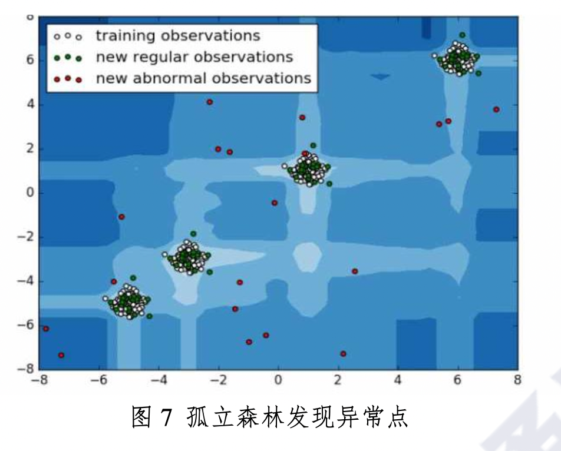
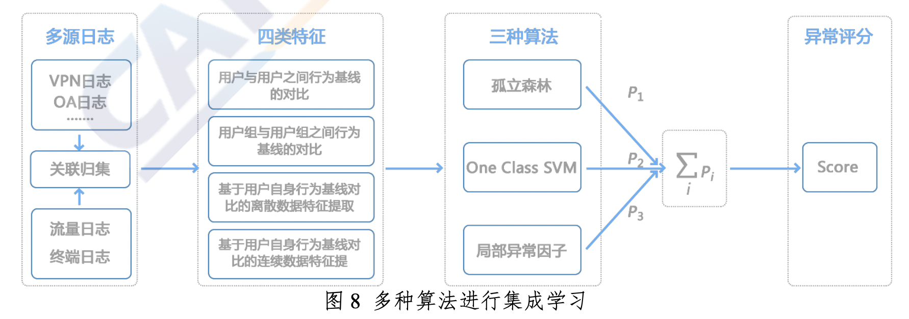
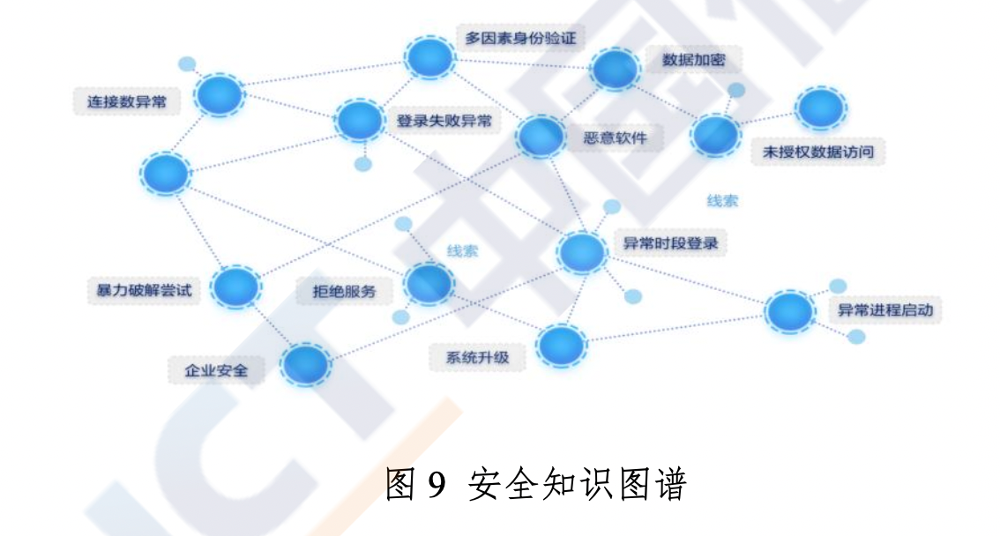
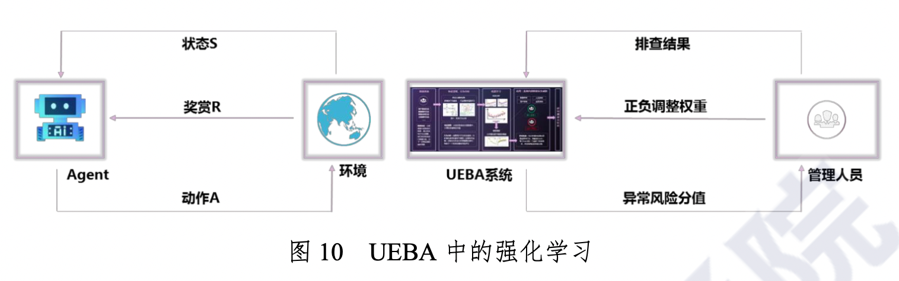

# 二、架构与技术

UEBA是一个完整的系统，涉及到算法、工程等检测部分，以及用户实体风险评分排序、调查等用户交互、反馈。从架构上来看，UEBA系统包含三个层次，分别是数据中心层、算法分析层、场景应用层。其中，算法分析层一般运行在实时流处理、近线增量处理、离线批量处理的大数据计算平台之上。典型的完整UEBA架构如图5所示。

该平台运行着传统的规则引擎、关联引擎，同时也支持人工智能引擎，如基线及群组分析、异常检测、集成学习风险评分、安全知识图谱、强化学习等UEBA核心技术。

## (一) 基线及群组分析

以史为鉴，可以知兴替。历史基线，是行为分析的重要部分，可以进行异常检测、风险评分等。以人为鉴，可以明得失。通过构建群组分析，可以跨越单个用户、实体的局限，看到更大的事实;通过对比群组，易于异常检测;通过概率评估可以降低误报，提升信噪比;组合基线分析、群组分析，可以构成全时空的上下文环境。如图6所示，展现了几个人员的历史基线以及群组分析。

## (二) 异常检测

异常检测关注发现统计指标异常、时序异常、序列异常、模式异常等异常信号，采用的技术包括孤立森林、K均值聚类、时序分析、异常检测、变点检测等传统机器学习算法。其中，基于孤立森林的异常检测效果图如图7所示。现代的异常检测也利用深度学习技术，包括基于变分自编码器(VAE)的深度表征重建异常检测、基于循环神经网络(RNN)和长短时记忆网络(LSTM)的序列深度网络异常检测、图神经网络(GNN)的模式异常检测等。针对标记数据缺乏的现状，某些UEBA系统能够采用主动学习技术(Active Learning)、自学习(Self Learning)，充分发掘标记数据和无标记数据的价值。

## (三) 集成学习风险评分

UEBA作为一种新范式，把安全运维从事件管理转换到用户、实体风险，极大的降低工作量、提升效率。其中，实现转换的关键在于使用集成学习进行风险评分。如图8所示，风险评分需要综合各种告警、异常，以及进行群组对比分析和历史趋势。同时，风险评分技术中用户间风险的传导同样重要，需要一套类似谷歌搜索使用的网页排名PageRank算法的迭代评估机制。风险评分的好坏，将直接影响到UEBA实施的成效，进而直接影响到安全运营的效率。

## (四) 安全知识图谱

知识图谱已经成为人工智能领域的热点方向，在网络安全中同样也有巨大的应用潜力。部分UEBA系统已经支持一定的安全知识图谱能力，可以将从事件、告警、异常、访问中抽取出的实体及实体间关系，构建成一张网络图谱，如图9所示。任何一个事件、告警、异常，都可以集成到网络图谱中，直观、明晰的呈现多层关系，可以让分析抵达更远的边界，触达更隐蔽的联系，揭露出最细微的线索。结合攻击链和知识图谱的关系回放，还能够让安全分析师近似真实的复现攻击全过程，了解攻击的路径与脆弱点，评估潜在的受影响资产，从而更好的进行应急响应与处置。

## (五) 强化学习

不同客户的环境数据源的多元性及差异性，以及用户对异常风险的定义各有不同，UEBA需要具有一定的自适应性，“入乡随俗”输出更精准的异常风险。强化学习能够根据排查结果自适应地调整正负权重反馈给系统，进而得到更符合客户期望的风险评分。如图10所示，UEBA给出异常信号后，结合安全管理人员的排查结果，获取反馈奖赏或惩罚，通过学习进行正负权重调整，从而让整体效果持续优化改进。

## (六) 其他技术

除了以上5个主要关键技术外，UEBA一般还使用到了特征工程、会话重组、身份识别。

### 1.特征工程

如何从行为模式中提取合理特征向量?有些特征在不同业务系统之间通用，有些特征需要根据业务场景具体分析，涉及到如何合理、高效设计指标体系，一般需要参考5W1H模型(又称六何法，或6W分析法，即何人(Who)、何事(What)、何时(When)、何地(Where)、何解(Why)及如何(How)。由这六个疑问词所组成的问句，均不是是非题，而是需要一个或多个事实佐证的应用题)。

### 2.会话重组

会话对象为每个用户从会话启动到终止缝合所有事件，并将这些事件与用户联系起来，即使更改了帐户、更改了设备或更改了IP。通过查找启动会话的事件，如Kerberos或NTLM登录、VPN事件、应用程序登录、物理打卡记录等，开启生成会话;登出、打卡离开、超时或其他信号指示会话结束。会话的风险得分是分配给会话中每个活动的风险分数的总和。

### 3.身份识别

在识别同一个用户、实体过程中，并不是所有环境中都有集中认知管理，同一个用户、实体，在不同的系统中的标识、用户名可能不同，需要把这些行为关联到同一个身份标示上，才能让行为画像、异常检测更准确更有效。