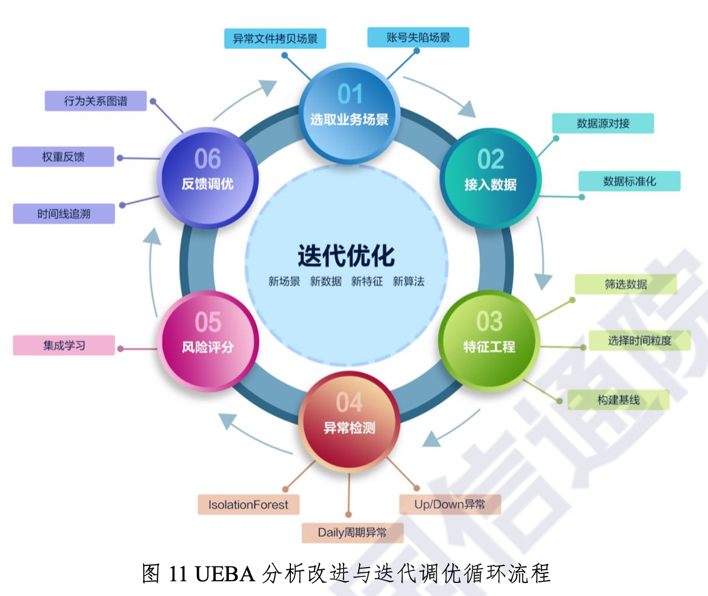

# 三、部署实施

## (一) 聚焦目标

UEBA 部署实施的目标有很多，例如:组织当前最大的安全焦虑 是什么?管理层对于企业安全的最大担忧是什么?组织所处行业的 安全环境如何?最大的安全威胁是什么，是用户隐私数据保护，还 是内部安全威胁?安全团队的使命是什么?安全运营的关键绩效指 标是什么?

安全负责人和安全团队需要认真深入的思考上述问题，并和各 利益相关者紧密沟通，提出自身视角的安全关切。组织的安全不仅 仅是首席信息安全官(CISO)和安全团队的职责，需要最高管理层 的反馈和资源保障，同时需要把安全放到数字经济、业务连续性的 视角进行全面评估。

## (二) 识别数据源与接入数据

从部署规划角度，UEBA 接入的数据源主要包括主机、终端、网 络设备、安全设备、业务系统、应用系统、物理安全系统等。接入 的数据格式主要包括日志、网络流量两大类，以及组织内各种上下 文数据。

具体来说，为了有效的评估检测用户及实体的行为，可以根据 情况选择，应该包括但不限于虚拟私人网络(VPN)日志、高级可持 续威胁防御系统(APT)日志、入侵防御系统(IPS)日志、入侵检测系统(IDS)日志、WEB 应用防护系统(WAF)日志、网络流量分析 系统(NTA)日志、深度报文解析系统(DPI)日志、Windows 主机日 志、Linux 主机日志、Unix 主机日志、邮件审计(Mail Audit)日 志、终端检测与响应系统(EDR)日志、应用程序接口服务(API 服 务)访问日志、上网行为审计(SWG)日志、数据库审计日志、统一 运维管理平台(USM)日志、堡垒机日志、微软系统监控(SYSMON) 日志、网络防火墙(FW 和 NGFW)日志等数据。

此外，比较有价值的数据源还包括物理安全系统，如门禁打卡 日志、饭卡消费日志、车库出入日志、监控日志、钉钉考勤记录等。

同时建议接入如威胁情报数据、活动目录域(AD)日志、身份 访问管理(IAM)数据、配置变更管理(CMDB)记录、人力资源系统 (HR)记录、办公自动化系统(OA)记录等。

## (三) 确定部署模式

在评估 UEBA 方案时，首先需要根据组织的信息系统架构、业务 数据流、数据量进行审慎评估，比如部分厂商仅提供客户本地部署， 部分厂商同时还支持云化(比如虚拟化及容器化)部署，以及软件 即服务(SAAS)化部署。UEBA 系统部署位置和数据源的位置，直接 影响到 UEBA 数据集成的速度，对网络延时的容忍度较低，数据传输 的带宽成本同样也是一个重要的考虑因素。

## (四) 分析微调与定制

主流的 UEBA 系统会提供一定数量的内置分析模型 (Pre-Packaged Analytics)，开箱即用，可以较好自适应常用环境 和典型场景。部署完成后，一般情况下通过 2 到 4 周的时间学习构 建基线，即可开始有效运作。

但是每个组织都有自己的业务特征，采用的信息技术存在差异， 行为数据存在一些细微甚至较大的差异，需要进行一些微调，比如 增加一些特征或调整权重。可以根据业务领域知识，多尝试一些可 能有效的特征、算法，通过持续的权重微调，让重要有效的凸显出 来。

## (五) 迭代优化

与 SIEM 实施类似，UEBA 实施也是一个迭代优化、持续改进的过 程，是数据科学在安全领域的应用，需要遵循 PDCA 循环。UEBA 还需 要持续的探索不同的数据源、不同的数据特征、不同的检测算法， 以更好的提升异常检测性能，改进威胁检测响应的能力和效率。

如图 11 所示，根据新业务场景的需求分析，可能需要接入新数 据 、探索新特征工程、测试新算法、进行反馈调优，以便满足项目 的安全分析检测需求。

