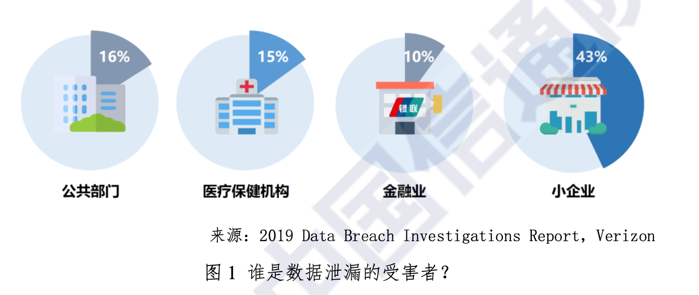

# 一、安全新范式

全球数字化浪潮下，各类信息化成果持续融入亿万大众的生活，也深刻改变着信息技术环境。一方面，以云计算、大数据、物联网、移动互联网等为代表的新技术得到快速应用;另一方面，传统能源、电力、交通等行业平台联入网络，成为关键信息基础设施的有机组成;与此同时，5G通信、人工智能、区块链等更多颠覆式创新科技已经来到。

以云计算为例，当前，云计算正处于快速发展阶段，技术产业创新不断涌现。其中，产业方面，企业上云成为趋势，云管理服务、智能云、边缘云等市场开始兴起;自2017年起，中国公有云市场持续保持高速增长，零售、制造和金融等行业用户对于公有云的接受程度越来越高，公有云在传统行业的渗透率持续提升，云服务在当年的采用率已经达到70%。

> 中国公有云发展调查报告(2018年)，中国信息通信研究院，2018年8月
> 云计算发展白皮书(2019年)，中国信息通信研究院，2019年7月

而随着万物互联的到来，边缘计算和物联网(IoT)也蓬勃发展。到2021年，边缘托管容器数量将达到7亿，企业数据中心之外的工作负载占比50%，到2022年，物联网(IoT)设备数量将达到146亿，增强现实(AR)和虚拟现实(VR)的使用量将增长12倍，2017至2022年，业务移动流量将每年增加42%，53%网络安全攻击导致的损失将超过50万美元。

> 2020全球网络趋势报告，思科，2020

普华永道和微软中国在2019年四季度，联合进行了一次现代化云办公解决方案调研。调研结果发现81%企业员工在工作中需要在移动设备上使用办公软件，100%企业高管需要使用移动设备进行办公，24%调研对象反映他们每日工作中有超过30%的任务需使用移动设备在非办公场所完成(比如家中、咖啡厅、机场、火车上、酒店等场所)。预计到2020年将有100亿台移动设备投入使用，而移动技术的普及正在从根本上改变人们的思考、工作、行动和互动方式。公司已广泛接受自带设备(BYOD)策略，允许或鼓励员工使用其个人移动设备(如手机、平板电脑和笔记本电脑)访问企业数据和系统。2020年春季一场突如其来的新冠病毒全球大流行，更是让远程办公、移动办公进入了公众视线。

> 现代化云办公解决方案中国市场白皮书，普华永道和微软中国，2020

如前所述，数字新时代正在加速全面到来，网络环境变得更加多元、人员变得更复杂、接入方式多种多样，网络边界逐渐模糊甚至消失，同时伴随着企业数据的激增。发展与安全，已成为深度融合、不可分离的一体之两面。在数字化浪潮的背景下，网络信息安全必须应需而变、应时而变、应势而变。

## (一)数字化面临的安全挑战

凡有收益，必有代价。数字资产的巨大价值同样被网络犯罪组织所垂涎。2018年流行的挖矿病毒、勒索软件等安全威胁均以可直接给网络犯罪分子带来经济收益为典型特征，垃圾邮件攻击、移动安全威胁也处于不断上升趋势。数字化转型促进组织的业务发展的同时，也带来了重大的网络安全挑战。越来越多的敏感数字信息遭受网络攻击被窃取，网络和系统平台被暴露或被操纵，数字资产的保密性、可用性、完整性遭受挑战。网络威胁的影响遍及医疗保健、金融、零售等各行各业，未能采取适当的安全保护举措可能给组织带来巨大的财务和声誉损失。

根据Verizon发布的2019数据泄露调查报告，如图1所示，公共部门、医疗组织、金融机构是数据泄漏的主要受害者，同时大量的数据泄漏事件也波及到了中小型组织。部分原因可能是由于领先组织的安全能力提升，导致一些直接攻击向供应链间接攻击转变。随着最终用户和消费者的安全意识、隐私意识越来越强，对安全事件越来越敏感，每个组织面临的安全事件成本压力也愈加突出。

> 2019DataBreachInvestigationsReport，Verizon，2019

根据PonemonInstitute的报告，基于一项涉及12个国家、383个公司的调查，在2016年的数据泄漏的平均代价是400万美金，相比2013年增长了29%。2018年，在美国数据泄漏的平均代价已经达到了790万美金，全世界范围内，每7分钟就有一起合规性告警事件发生。IBMSecurity在《2019年度数据泄露成本调研报告》中对2018年7月至2019年4月期间的全球16个国家和地区的17个行业的507家公司发生的数据泄露事件进行了调查。调查结果显示，数据泄露事件的全球平均成本为392万美元，平均泄露25575条记录，每条记录的平均成本为150美元，检测和控制数据泄露事件的时间为279天。

> 2018CostofaDataBreachStudy，PonemonInstituteLLC，2018
> 2019年度数据泄露成本调研报告，IBM，2019

随着网络犯罪集团的增加和国家隐蔽网络活动的激增，网络攻击在数量和复杂性方面都在增长。网络攻击技术不断升级，网络犯罪分子也在不断提升专业攻击技术，意图突破安全防线，例如，采用非常规文件扩展名、“无文件”组件、数字签名技术、微软HTML应用程序(MSHTA)等新技术，躲避安全防护系统的检测与查杀，更好地攻击入侵目标系统。

同时，攻击者也采用了新策略。根据赛门铁克的一份报告，2018年供应链攻击增长了78%。据分析LotL策略(Living-off-the-Land攻击，指的是借助系统中已存在的应用程序或工具完成攻击)已成为攻击者最重要的攻击方式之一，旨在协助网络犯罪分子进行复杂攻击时尽量隐藏攻击行为。LotL技术允许攻击者隐藏在合法进程中，相关攻击事件呈爆发趋势。例如，2018年恶意PowerShell脚本的使用增加了十倍。赛门铁克每月阻止11.5万个恶意PowerShell脚本，但不到PowerShell总使用量的百分之一。如果阻止全部PowerShell脚本将对业务运行产生影响，进一步佐证了LotL技术已成为许多高级持续性威胁(APT)攻击团体躲避安全团队检测的首选策略。

> 2019InternetSecurityThreatReport，Symantec，2019

外部网络攻击威胁加剧的同时，组织内部及其网络周边的内部威胁也持续增长。网络犯罪分子可能伪装成合法用户，进而突破网络边界、窃取网络凭证、植入恶意软件，或由于组织内部人员工作失误，引发组织内部的网络安全威胁。

根据IBMX-Force安全团队的监测，2019年全球超过85亿条记录遭到泄露，相比2018年增长超过200%。究其原因，可能由于内部人员玩忽职守导致数据泄露。由于错误配置的服务器(包括公开访问的云存储、不安全的云数据库以及安全措施不到位的远程同步备份或开放的互联网络区域存储设备)而泄露的记录占2019年泄露记录数量的86%。据外媒报道称，2017年，美国五角大楼由于在使用亚马逊简单存储服务(S3)时配置错误，意外暴露了美国国防部的机密数据库，其中包含美国当局在全球社交媒体平台中收集到的18亿用户的个人信息。

> X-Force威胁情报指数，IBM，2020
> 
> 五角大楼AWSS3配置错误，意外在线暴露包含全球18亿用户的社交信息，2017，https://www.sohu.com/a/205831467_354899

雪上加霜的是，在外部攻击、内部威胁的压力之下，由于数字化时代的信息系统、数字科技越来越复杂，组织和机构脆弱性暴露面也越来越多。

根据中国国家信息安全漏洞库(CNNVD)网站数据统计，新增漏洞数量近几年一直保持上升趋势。2018年，新增漏洞15040个，与2017年披露的漏洞数量11097个相比，增加了36%。2019年，国家信息安全漏洞共享平台(CNVD)新收录通用软硬件漏洞数量达16193个，与前一年相比同比增长14.0%，创下历史新高。漏洞影响范围也从传统互联网到移动互联网，从操作系统、办公自动化系统(OA)等软件到虚拟私人网络(VPN)、家用路由器等网络硬件设备，以及芯片、SIM卡等底层硬件。

> 2019年我国互联网网络安全态势综述，国家计算机网络应急技术处理协调中心，2020

因此，安全防护运营团队通常需要跟踪最新漏洞，持续识别网络环境中的隐患，进行加固防护;持续进行安全监控，保持最大的安全可见性，感知全域安全威胁与风险;关注最新的威胁情报，了解最新的攻击组织、技术和方法，持续监控失陷指标(IoC)并应用到威胁检测过程中，同时主动进行威胁狩猎;以及对组织成员进行安全意识教育培训。

但是根据思科的一份调查报告，77%的中型企业发现，从数量繁多的安全解决方案中找出真正有价值的安全警报非常困难。在众多安全警报中，几乎有46%的警报未经分析验证;54%的警报经过验证后，其中只有将近四成是真实警报，能得到修复的只有不到半数。总体来看，仅不到10%的告警最终被有效处置。

> 思科2018年度网络安全报告，思科，2018

此外，安全团队正在遭受“拒绝服务(DDoS)攻击”。在不对称且长期持久的网络安全攻防对抗形势下，“安全勇士们”责任重大。

总之，组织面临的严峻网络安全挑战来自四个方面:

1.越来越多的外部攻击，包括被利益驱动或国家驱动的难以察觉的高级攻击;
2.心怀恶意的内鬼、疏忽大意的员工、失陷账号与失陷主机导致的各种内部威胁;
3.数字化基础设施的脆弱性和风险暴露面越来越多，业务需求多变持续加剧的问题;
4.安全团队人员不足或能力有限，深陷不对称的“安全战争”之中。

挑战催生革新，正是在数字化带来的巨大安全新挑战下，安全新范式应运而生。

## (二)新范式破局之道

2012年咨询公司高德纳(Gartner)发表了一份题为《信息安全正在成为一个大数据分析问题》的报告，提出当前信息安全问题正在转变成大数据分析问题，大数据的出现将对信息安全产生深远的影响。在数字时代，安全团队迫切希望通过大数据分析和机器学习，提高内部威胁和外部攻击的可见性，提升威胁检测响应能力，成为组织探索将安全分析应用于其网络和其他数据源的关键驱动因素。

> InformationSecurityIsBecomingaBigDataAnalyticsProblem，Gartner，2012

安全是人和人攻防对抗的游戏，一切的意图都需要通过行为表达，这是安全运营中最重要也最有价值的一块拼图，同时也是传统方式最欠缺的。传统安全产品、技术、方案，基于单次单点的有限信息，运用签名、规则进行非黑即白式的防护控制，可能导致大量的噪声和误报。虽然已经有告警聚合等基础聚合技术等，尝试修复上述问题，但是仍未产生较好效果。传统方式仍无法自动适应攻击者的逃逸绕过，策略升级也经常需要长达数月时间，存在严重的滞后效应，对未知攻击甚至完全无法察觉。可见，传统安全倚重旧范式，基于特征、规则和人工分析，存在安全可见性盲区，有严重的滞后效应、无力检测未知攻击、容易被绕过，以及难以适应攻防对抗的网络现实和快速变化的企业环境、外部威胁等问题。

如图2所示，通过对困境的持续探索，安全行业逐渐转向基于大数据驱动、安全分析和机器学习的安全新范式，以期弥补传统安全短板。同时，网络安全也已经开始从单纯强调边界防护到纵深安全检测响应的艰巨转变。攻击者的不对称性优势，一直是安全团队面临的最大问题。只要能充分利用行为分析这块拼图，以及充分利用网络纵深路径上的各种数据，安全团队可能逆转这种不对称的情况，从海量的安全数据中识别和发现攻击和恶意行为。

用户实体行为分析(UEBA)就是安全新范式的一个典型体现，其新范式的破局之道主要体现在如下五个方面:

### 1.行为分析导向

身份权限可能被窃取，但是行为模式难以模仿。内部威胁、外部攻击难以在基于行为的分析中完全隐藏、绕过或逃逸，行为异常成为首要的威胁信号。采集充分的数据和适当的分析，可发现横向移动、数据传输、持续回连等异常行为。

### 2.聚焦用户与实体

一切的威胁都来源于人，一切的攻击最终都会必然落在帐号、机器、数据资产和应用程序等实体上。通过持续跟踪用户和实体的行为，持续进行风险评估，可以使安全团队最全面地了解内部威胁风险，将日志、告警、事件、异常与用户和实体关联，构建完整的时间线。通过聚焦用户与实体，安全团队可以摆脱告警疲惫，聚焦到业务最关注的风险、有的放矢，提升安全运营绩效，同时通过聚焦到以账号、资产和关键数据为中心，可以大幅降低误报告警数量。

### 3.全时空分析

行为分析不再是孤立的针对每个独立事件，而是采用全时空分析方法，连接起过去(历史基线)、现在(正在发生的事件)、未来(预测的趋势)，也连接起个体、群组、部门、相似职能的行为模式。通过结合丰富的上下文，安全团队可以从多源异构数据中以多视角、多维度对用户和实体的行为进行全方位分析，发现异常。

### 4.机器学习驱动

行为分析大量的采用统计分析、时序分析等基本数据分析技术，以及非监督学习、有监督学习、深度学习等高级分析技术。通过机器学习技术，可以从行为数据中捕捉人类无法感知、无法认知的细微之处，找到潜藏在表象之下异常之处。同时机器学习驱动的行为分析，避免了人工设置阈值的困难和无效。

### 5.异常检测

行为分析的目的，是发现异常，从正常用户中发现异常的恶意用户，从用户的正常行为中发现异常的恶意行为。

总结新范式破局的五个方面，就是在全时空的上下文中聚焦用户和实体，利用机器学习驱动方法对行为进行分析，从而发现异常。

## (三)UEBA的定义与演进

Gartner对UEBA的定义是“UEBA提供画像及基于各种分析方法的异常检测，通常是基本分析方法(利用签名的规则、模式匹配、简单统计、阈值等)和高级分析方法(监督和无监督的机器学习等)，用打包分析来评估用户和其他实体(主机、应用程序、网络、数据库等)，发现与用户或实体标准画像或行为相异常的活动所相关的潜在事件。这些活动包括受信内部或第三方人员对系统的异常访问(用户异常)，或外部攻击者绕过安全控制措施的入侵(异常用户)”。

> 2019MarketGuideforUserandEntityBehaviorAnalytics，Gartner，2019

Gartner认为UEBA是可以改变游戏规则的一种预测性工具，其特点是将注意力集中在最高风险的领域，从而让安全团队可以主动管理网络信息安全。UEBA可以识别历来无法基于日志或网络的解决方案识别的异常，是对安全信息与事件管理(SIEM)的有效补充。虽然经过多年的验证，SIEM已成为行业中一种有价值的必要技术，但是SIEM尚未具备帐户级可见性，因此安全团队无法根据需要快速检测、响应和控制。

> 2019MarketGuideforUserandEntityBehaviorAnalytics，Gartner，2019

作为现代化SIEM演进的方向，如图3所示，SIEM、UEBA、安全编排自动化响应(SOAR)将会走向融合。

如图4展示UEBA的发展历程。由于身份和访问管理(IAM)无法提供全面的数据分析等原因，UEBA的前身用户行为分析(UBA)应运而生。随后，来自于用户侧强劲的需求不断推动UEBA市场持续快速增长，复合年增长率达到了48%。

如表1所示，市场上参与UEBA的厂商也逐渐增多，从早期独立的纯UEBA厂商，到主流SIEM厂商、网络流量分析(NTA)厂商也开始引入UEBA能力特性。

## (四)UEBA的价值

通过对比安全新旧范式，可以看到UEBA具有明显的独特价值。UEBA可以给安全团队带来独特的视角和能力，即通过行为层面的数据源以及各种高级分析，增强现有安全工具能力，提高风险可视性，弥补了安全运营中长久以来缺失的、极度有价值的视角，并提高了现有安全工具的投资回报率。

UEBA比现有的分散工具具有更大的风险可视性，尤其是经过评分排序的威胁线索减少了噪音和误报告警。通过直观的点击式界面访问上下文和原始事件，从而加速了事件调查和根本原因分析，缩短了调查时间，降低了事件调查人数以及与雇用外部顾问相关的成本。

在增加现有安全投资的回报方面，UEBA主要通过以下方式实现:安全信息和事件管理(SIEM)系统、恶意软件威胁检测工具端点检测响应(EDR)和端点平台保护(EPP)，以及数据泄漏防护(DLP)技术自动确定威胁和风险的优先级。通过无监督的机器学习来自动化、大规模的正常和异常行为的统计测量，从而降低了运营成本，实现无需管理复杂的基于阈值、规则或策略的环境。

如表2所示，UEBA的价值主要体现在:

### 1.发现未知

UEBA可以帮助安全团队发现网络中隐藏的、或未知威胁，包括外部攻击和内部威胁;可以自适应动态的环境变化和业务变化;通过异常评分的定量分析，分析全部事件，无需硬编码的阈值，即使表面看起来细微的、慢速的、潜伏的行为，也可能被检测出来。

### 2.增强安全可见

UEBA可以监控所有账号，无论是特权管理员、内部员工、供应商员工、合作伙伴等;利用行为路径分析，贯穿从边界到核心资产的全流程，扩展了对关键数据等资产的保护;对用户离线、机器移动到公司网络外等情况，均增强了保护;准确检测横向移动行为，无论来自内部还是外部，都可能可以在敏感数据泄露之前发现端倪，从而阻止损害发生;可以降低威胁检测和数据保护计划的总体成本和复杂性，同时显著降低风险以及对组织产生的实际威胁。

### 3.提升能效

UEBA无需设定阈值，让安全团队更有效率。引入全时空上下文，结合历史基线和群组对比，将告警呈现在完整的全时空上下文中，无需安全团队浪费时间手动关联，降低验证、调查、响应的时间;当攻击发生时，分析引擎可以连接起事件、实体、异常等，安全人员可以看清全貌，快速进行验证和事故响应;促使安全团队聚焦在真实风险和确切威胁，提升威胁检测的效率。

### 4.降低成本

UEBA通过聚合异常，相比SIEM、DLP等工具，大量降低总体告警量和误报告警量，从而降低安全运营工作负载，提升投资回报率(ROI);通过缩短检测时间、增加准确性，降低安全管理成本和复杂性，降低安全运营成本;无监督、半监督机器学习让安全分析可以自动化构建行为基线，无需复杂的阈值设置、规则策略定制，缓解人员短缺问题;通过追踪溯源及取证，简化事故调查和根因分析，缩短调查时间，降低每事故耗费的调查工时，以及外部咨询开销;通过自动化进行威胁及风险排序定级，提升已有安全投资(包括SIEM、EDR、DLP等)的价值回报。

总之，UEBA的价值主要体现在发现未知、增强安全可见、提升能效、降低成本。