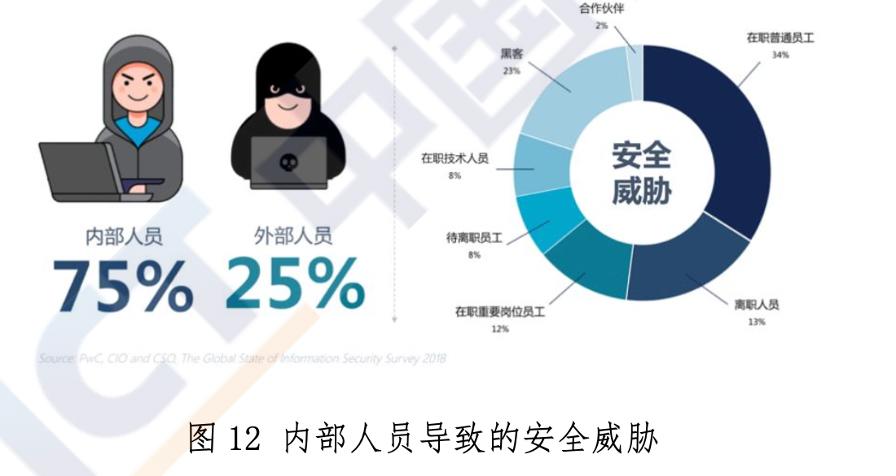
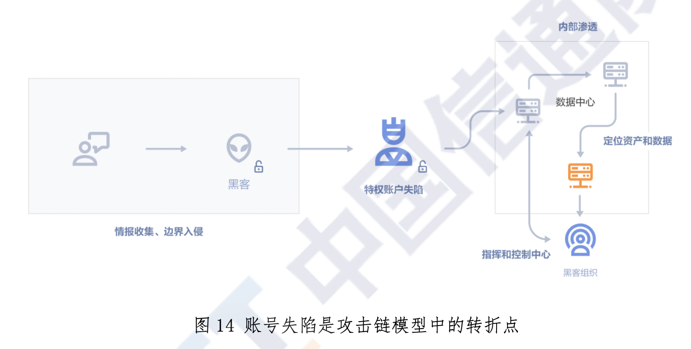
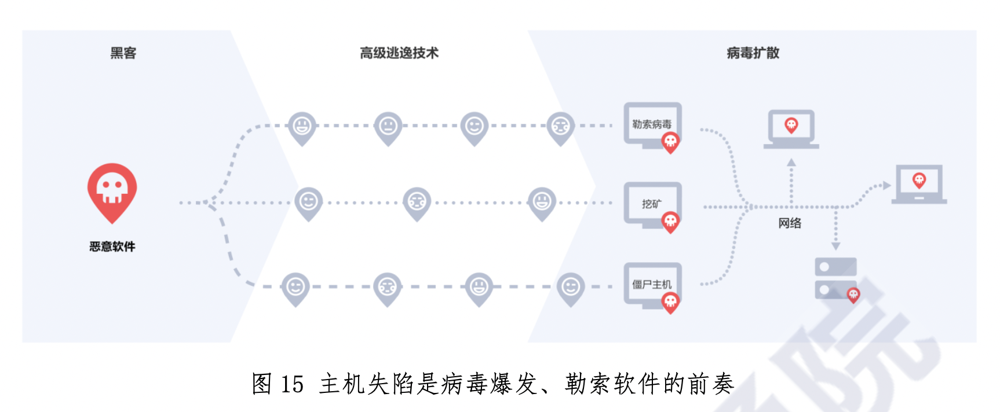
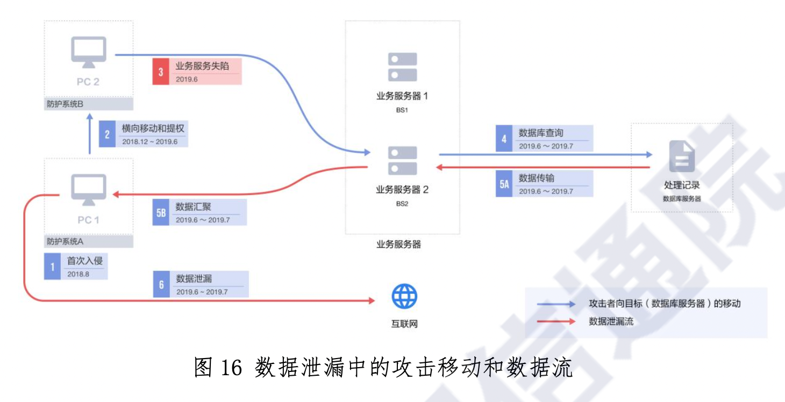

# 五、典型应用案例

## (一) 恶意内部人员

根据Haystax于2019年发布的网络内部安全威胁报告，如图12所示，内部威胁是造成数据泄露的第二大原因。往往因为非授权访问、雇员和外包员工工作失误等原因，导致“合法用户”可以非法访问特定的业务和数据资源，造成组织内部数据泄漏。从本质上讲，恶意内部威胁来自具有试图对雇主施加损害等恶意意图的可信用户。由于难以评估恶意意图，需要分析数据中难以获取的上下文行为信息。

> 2019 INSIDER THREAT REPORT，Haystax，2019

内部人员窃取敏感数据是企业典型的内部威胁场景。由于内部人员具备企业数据资产的合法访问权限，且通常了解企业敏感数据的存放位置，因此通过传统的行为审计手段无法检测该类行为。但是利用UEBA技术，选取敏感数据访问相关的特征，构建企业员工和系统创建正常的活动基线、用户画像，可以通过基线构建模型用于判断是否存在内部人员窃取敏感数据行为。

针对此类场景，UEBA解决方案通过治理组织的数据库日志、会话日志、用户访问日志以及访问全流量等信息，生成敏感数据访问周期、时序、动作、频繁度等相关特征，通过时序关联和自学习算法生成敏感数据被访问的动态基线、用户访问动态基线、群体访问动态基线。

利用动态基线，通过如图13所示流程，可实现对高频、越权、伪造身份、冒用身份、数据窃取等多种异常行为的分析和检测，进一步关联敏感数据的访问特征，定位是否存在内部人员窃取敏感数据行为，保障企业核心数据资产的安全。

## (二) 失陷账号

账号盗用一直是困扰各种组织的痛点，且涉及到最终用户的利益和体验，特权账号更是黑客瞄准的攻击目标。如图14所示，攻击者一旦渗透进组织边界且获取失陷账号后，会在组织内部网络中横向移动，形成高级持续性威胁(APT)以及未知或尚无法理解的各种威胁，比如众所周知的零日攻击，该类攻击行为难以发现，并且通常隐藏在合法用户或服务帐户的面纱之下。

传统范式难以对付该类攻击，同时难以跟随攻击者的技术升级。该类威胁通常有一个复杂的作战模式如攻击链，而且会长期留存，其中大部分行为尚未被认定为恶意行为，通过简单的分析如模式匹配、阈值或关联规则均难以检测。

然而，许多高级威胁会使得用户和资产行为方式与平时不同，如失陷账号。针对此类场景，UEBA通过对正常行为和人员进行抽象归纳，利用大数据技术生成个体行为画像和群体行为画像。在此基础上，对比账户的活动是否存在异常行为，如频繁登录和退出、访问历史未访问过的信息系统或数据资产、异常时间地点登录等，并对比分析账户的活动是否偏离个人行为画像和群体(如部门或项目组等)行为画像，综合判断账户疑似被盗用风险评分，帮助安全团队及时发现账号失陷。

UEBA技术为检测失陷账号提供了最佳的安全视角，提高了数据的信噪比，可合并和减少告警量，让安全团队优先处理正在进行的威胁，并且促进有效的响应调查。

同时，UEBA还可针对已建立的账号监视分析用户行为，识别过多的特权或异常访问权限，适用于特权用户和服务帐户等所有类型的用户和帐户。使用UEBA还可以用来帮助清理帐户和权限设置高于所需权限的休眠帐户和用户权限。通过UEBA的行为分析，身份识别与访问管理(IAM)和特权账号管理(PAM)系统能够更全面的进行访问主体安全性评估，支持零信任(ZeroTrust)网络安全架构和部署场景。动态权限策略控制是零信任的核心能力，而UEBA已经成为实现动态权限策略控制最有效的方法。

## (三) 失陷主机

失陷主机是典型的企业内部威胁之一，如图15所示，攻击者常常通过入侵内网服务器，形成“肉机”后对企业网络进行横向攻击。基于此类场景的特性分析，失陷主机通常包含回链宿主机和内网横向扩散两大重要特征。

针对此类场景，UEBA可构建时序异常检测模型，根据企业内网主机或服务器时序特征的历史时序波动规律，以及请求域名、账户登录、流量大小、访问安全区频繁度、链接主机标准差等特征，构建单服务器的动态行为基线，群体(如业务类型、安全域等)服务器动态行为基线。

利用基线，考虑具体的主机疑似失陷场景，如僵尸网络、勒索病毒、命令控制(C&C或C2)等，给出不同模型不同实体在不同时间段的综合异常评分，从而检测失陷主机，并结合资产信息，定位到具体的时间段和主机信息，辅助企业及时发现失陷主机并溯源处理。

## (四) 数据泄露

数据泄露可能给组织的品牌声誉带来严重损失，导致巨大的公关压力，是组织最关注的安全威胁之一。内部员工窃取敏感数据是企业典型的数据泄漏场景，由于内部员工具备企业数据资产的合法访问权限，且通常了解企业敏感数据的存放位置，因此通过传统的行为审计手段无法有效检测该类行为。

UEBA可以增强DLP系统，使其具有异常检测和高级行为分析功能。通过对数据访问行为的分析，结合其他上下文，融入网络流量(如Web安全代理)和端点数据进行分析，有助于了解数据传输活动。组合UEBA和DLP，数据泄露检测可以用于捕获内部人员和外部黑客组织。

如图16所示，根据数据泄漏的技术、方法及途径，选取敏感数据访问相关的特征，构建企业员工和系统创建正常的活动基线和用户画像，判断是否存在内部员工窃取敏感数据行为。针对此类场景，UEBA解决方案通过治理企业数据库日志、回话日志、用户访问日志以及访问全流量等信息，生成敏感数据访问相关特征，如访问周期、时序、动作、频繁度等，通过时序关联和自学习算法生成敏感数据库的被访问动态基线、用户访问动态基线、群体访问动态基线等多种检测场景。

## (五) 风险定级排序

由于安全团队人力资源有限，所有组织几乎都面临告警过量的问题，难以全面处理各个安全设备触发的安全告警。根据SANS2019事故响应调查报告，57%的受访者认为安全团队人员短缺和技能短缺是主要障碍。如何让有限宝贵的人力资源投入，带来最大的安全运营收益，成为风险排序定级的价值所在。

> Incident Response (IR) Survey: It’s Time for a Change，SANS Institute，2019

UEBA不仅使用基线和威胁模型，而且也会根据所有安全解决方案中生成的报警，构建用户及实体的行为时间线，进行风险聚合。通常也会结合组织结构、资产关键性、人员角色和访问级别等进行权重评估，进行综合风险定级并排序，从而明确用户、实体、事件或潜在事件应该优先处理范围。通过风险定级排序，可以极大的缓解安全团队人力短缺的现状。

为了构建现代化SIEM(Modern SIEM)能力，安全团队可以将SIEM、UEBA、安全编排自动化响应(SOAR)结合，进行数据双向集成，透过SOAR的安全编排，进行安全告警的分析和分类，利用人机结合的方式对安全事件进行定义、划分优先级，建立标准化安全事件的处理工作流，从而达到一体化安全运营，提升安全团队整体协同，形成行为异常的检测与响应闭环。

> 网络安全先进技术与应用发展系列白皮书安全编排自动化响应，中国信息通信研究院，2018

比如在某市医疗机构出现勒索病毒事件后，安全团队需要进行应急响应，可是应该从何处着手?等待数据被加密收到勒索通知后，再处理就为时已晚。如果该机构部署了UEBA，就可以快速分析文件创建、文件读取、磁盘读取、磁盘写入等行为，发现可疑的病毒感染资产，基于风险进行定级排序，对高风险资产优先进行隔离处理。安全团队还可以进行回溯调查，明确勒索病毒的传染源、传播扩散的路径，有针对性的进行网络阻断，遏制勒索病毒的进一步爆发。

另一方面，如果该机构一直持续监控这些勒索病毒相关的行为特征，持续检测异常行为，就可能在勒索发生前及时阻止事件的发生。

## (六) 业务 API 安全

企业WEB业务系统通常会提供大量的业务应用编程接口(API)，如登录API、数据获取API、业务调用API等，攻击者通过对具体网站访问数据或请求数据进行抓包，可获取企业业务API入口的大致范围，通过对这些API进行恶意调用，可实现恶意访问、数据窃取以及其他相关恶意活动，严重影响企业的正常业务开展。

针对此类场景，攻击者可能利用变换多个不同的请求参数已达到恶意调用API的目的。UEBA通过分析目前常用的API组成和使用方式，通常包括API所对应的URL请求参数和请求主体两部分，通过提取企业业务API访问频率特征、请求者访问频率特征、参数变换标准差、以及请求时间昼夜分布等特征，构建API请求频率动态基线、API请求时序动态基线、参数变换动态基线等多种检测场景。

基于动态基线，实现检测对API请求量突变异常检、周期性异常、未知用户、可疑群体潜伏用户(某用户使用大量不同IP)等异常行为，进一步结合API的具体业务属性，实现WEB业务系统API异常请求行为检测，可定位到具体的时间段和业务、数据信息，辅助企业及时发现异常调用行为，保证整体业务和数据安全。

## (七) 远程办公安全

远程办公可以解决疫情等特殊时期的企业复工需要，但是同时也会带来一些额外的网络安全风险，促使基于用户行为分析新范式发挥其价值所在。

企业一般通过VPN进行远程办公，从而隔离避免外部人员直接能访问到内部资源，同时也会带来一定的安全风险。

UEBA可以收集VPN及内部流量日志，构建涵盖每个员工登录地点、登录时间、在线时长、网络行为、协议分布等特征的行为画像。通过对比用户的历史行为基线，以及对比同组人员的行为基线，可以第一时间发现可疑的人员账号，通过调查分析，及时防范VPN账号违规操作或账号失陷风险。