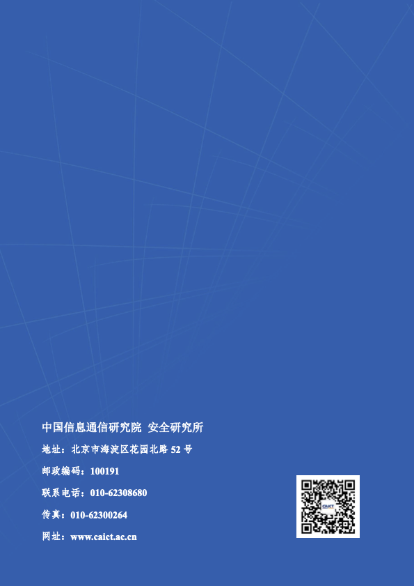

# 关于

## 中国信息通信研究院简介

中国信息通信研究院始建于1957年，是工业和信息化部直属科研事业单位。多年来，中国信通院始终秉持“国家高端专业智库产业创新发展平台”的发展定位和“厚德实学兴业致远”的核心文化价值理念，在行业发展的重大战略、规划、政策、标准和测试认证等方面发挥了有力支撑作用，为我国通信业跨越式发展和信息技术产业创新壮大起到了重要推动作用。

## 中国信息通信研究院安全研究所

中国信息通信研究院安全研究所，是专门从事ICT领域安全技术研究的科研机构，主要职责包括开展信息通信领域安全的战略性和、前瞻性、技术性问题研究，为国家主管部门有关网络安全发展战略、决策、规范的制定提供强有力的技术支撑。安全所拥有雄厚的网络安全技术评估评测能力以及高端的专业网络安全支撑团队，承担大量重大网络安全专项科研课题，牵头制定大量国际国内网络信息安全标准规范，对前沿新兴网络安全技术的研究有深厚积累。

## 杭州安恒信息技术股份有限公司

杭州安恒信息技术股份有限公司，是2007年5月由范渊先生创办的国家级高新技术企业，中国领先的信息安全产品和服务提供商。国内总部设在杭州及北京，并在上海、南京、广州、深圳、成都、武汉、重庆、济南、西安等三十多个城市设有分支机构，服务客户包括政府、公安、运营商、金融、教育、企业等多个行业。目前已是享誉国内外的网络安全品牌，于2016年成功跻身“全球网络安全500强中国区榜首”，并于2019年11月登陆科创板。

## AiLPHA大数据实验室

随着信息技术的飞速发展，传统安全设备无法解决越来越复杂和隐蔽的安全威胁。以安恒首席科学家刘博为核心的研发团队为此突破核心技术难点，安恒信息创建AiLPHA大数据实验室。实验室以“AI驱动安全”为核心理念，研究超大规模存查、大数据实时智能分析、用户实体行为分析(UEBA)、多维态势安全视图、企业安全联动闭环等技术。目前具备全网流量处理、异构日志集成、核心数据安全分析、办公应用安全威胁挖掘等前沿大数据智能安全威胁挖掘分析与预警管控等核心能力。为企业用户提供全局态势感知和业务不间断稳定运行安全保障。致力于让安全更智能，更简单。

