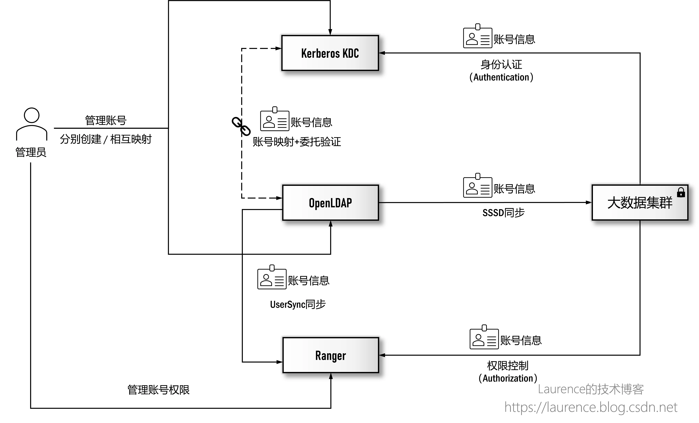
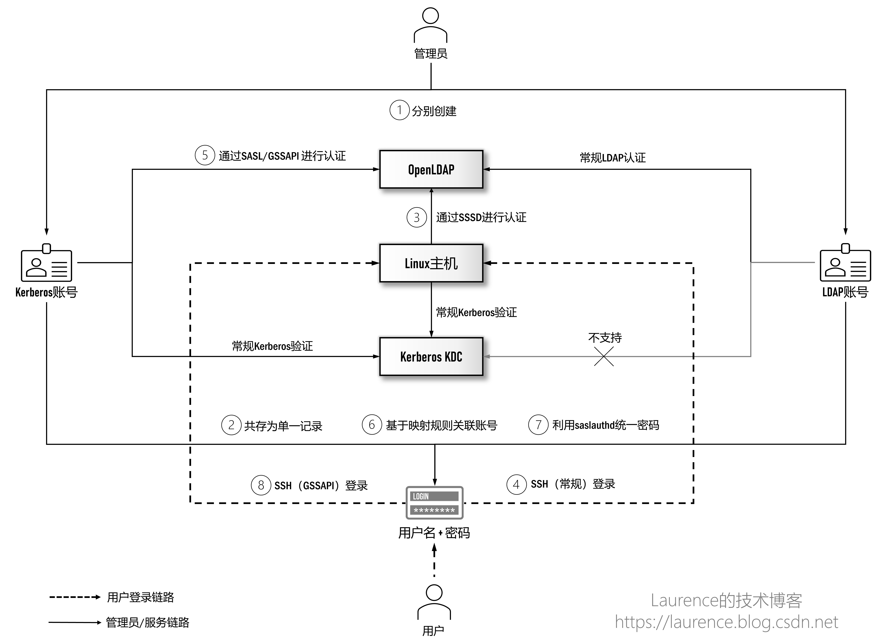
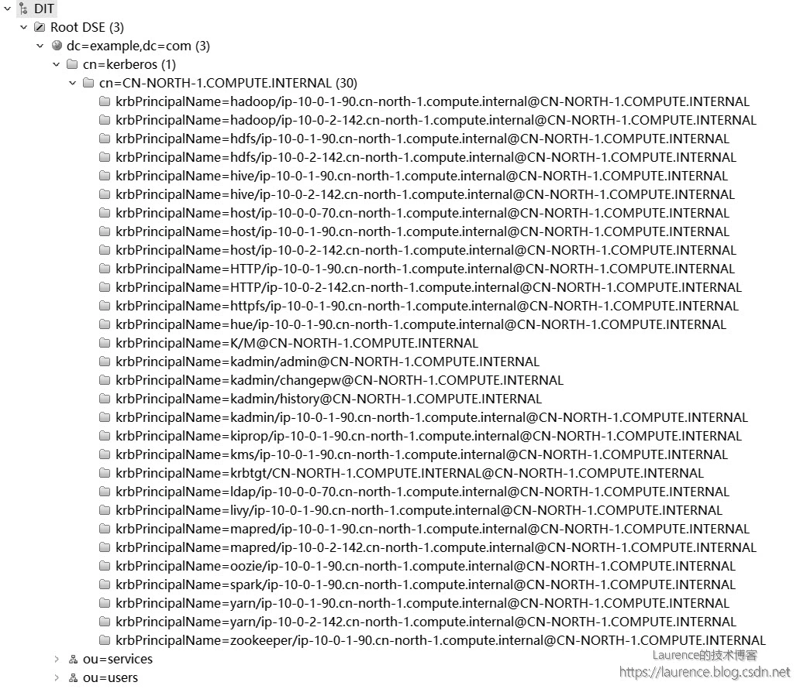
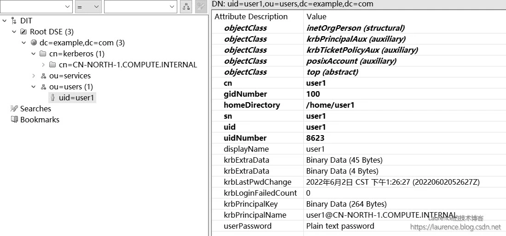

# 整合后台数据库

## 1. 写作背景

写作本系列文章的背景是我们要在大数据平台/企业数据湖场景下给出中心化的用户身份认证方案。此前，我们实现过 Windows AD + Kerberos 的集成方案，由于 Windows AD 是 LDAP 和 Kerberos 的双重实现，这种天然优势使得 Windows AD 可以实现真正意义上的（大数据集群的）Kerberos 账号与企业用户账号的统一管理。当我们想在 OpenLDAP + Kerberos 上实现同样的目标时，发现这一领域的知识与方案琐碎而凌乱，缺少统一连贯，脉络清晰的讲解，在经过大量技术调研和系统梳理后，我们特别撰写了本系列文章，希望可以借此将这一话题全面彻底地阐述清楚。

本系列由三篇文章组成，将沿着“如何集成 OpenLDAP 与 Kerberos 实现统一认证管理”这一主线推进，在实现过程中会详细介绍使用到的技术和原理并给出完备的执行脚本用于实际环境的搭建。我们假设读者已经具备 OpenLDAP 和 Kerberos 的基本知识，不再对两者进行单独介绍。此外，本系列文章写作期间正值 2022 年 4 月-5 月上海疫情最严重的时期，特以此文纪念这段艰难的特殊时光。

## 2. 既定目标

系统安全有两个重要领域：身份认证和权限管理，前者要解决“系统里有没有这个人？”的问题，后者要解决“他有没有权限执行某项操作？”的问题。在大数据领域，权限管理一般由 Apache Ranger 负责，这是一个与众多大数据组件均有集成的权限管理工具（由于众所周知的原因，另一款工具 Sentry 的前景已经非常暗淡）。

但是在身份认证方面，情况则有一些复杂：一方面，很多企业都建立了以 Windows AD 或 OpenLDAP 为代表的中心化账号管理基础设施，各 IT 系统通常都需要与之对接，以便实现统一的身份认证，大数据平台/数据湖作为企业 IT 生态的一部分，也不例外。但是，在大数据生态圈里，最被广泛支持的认证机制其实是 Kerberos，虽然有部分组件（如 HiverServer2、Hue 等）也支持 LDAP，但是普及程度远不如 Kerberos，如果仅针对大数据平台/数据湖建立一套统一认证机制的话，Kerberos 几乎是唯一的选择。于是，一个很直接的问题就摆在了面前：如何将 OpenLDAP 与 Kerberos 对接，把大数据平台/数据湖的身份认证统一到企业的中心化认证服务上？

下图描绘的就是集成 OpenLDAP 与 Kerberos 后，大数据集群/企业数据湖进行用户身份认证和权限控制的全景视图：



<center>图 1: 大数据领域的场景下用户身份认证与权限控制全景视图</center>


在这个生态系统架构中，OpenLDAP 作为企业全局的用户认证中心独立于大数据集群存在；Kerberos KDC 作为大数据集群的身份认证中心，既可以是集群专属的，也可以是一个独立于集群的全局 KDC（如果存在的话），管理员会为用户在 Kerberos 和 OpenLDAP 上分别创建账号，然后通过一系列技术将两套认证系统的账号打通；大数据集群的各个节点通过 SSSD 与 OpenLDAP 对接后，用户可以凭借 LDAP 账号（准确地说是账号中的用户名）登录集群的各个节点。在 Kerberos 和 OpenLDAP 账号打通的前提下，用户还可以使用同一账号完成 Kerberos 认证，进而可以提交作业或访问大数据相关服务；Ranger 负责集群用户的权限管理，其账号数据同样来自于 OpenLDAP。这样，OpenLDAP、Kerberos 和 Ranger 三方的用户数据一致，就可以实现统一的用户认证和权限管理了。

在展开介绍 OpenLDAP 与 Kerberos 的集成方案前，需要读者清楚提前接受这样一个事实：OpenLDAP 与 Kerberos 作为两套独立的认证系统，是无法做到绝对意义上的统一的，这一点随着后续的深入介绍，读者应该会有所体会。但是在实际应用中，由于绝大多数以 OpenLDAP 和 Kerberos 作为用户认证源的外围系统通常只验证或同步两系统账号中的“用户名”部分，即 OpenLDAP 账号中的 uid 部分和 Kerberos 账号中的 Principal Name（(@前面的）)部分，这为统一两个认证系统的账号创造了可利用的外部条件，只要我们能将两套账号的用户名部分和密码统一在一起，就可以达到“使用效果”上的账号统一，这是目前各类技术方案之所以可行的一个重要支点。

下面就是本系列文章给出的集成 OpenLDAP 与 Kerberos 的整体方案，也是接下来三篇文章的技术路线图：



<center>图 2: OpenLDAP 与 Kerberos 集成方案</center>

这个方案涉及 OpenLDAP 和 Kerberos KDC 两个身份认证源（两台服务器）；Linux 主机代表大数据集群的各个节点，由于其需要与 OpenLDAP 和 Kerberos KDC 进行通信，所以每一个 Linux 主机同时也是 OpenLDAP 和 Kerberos KDC 的客户端（客户端的安装会在后续章节中介绍）；参与人员有管理员和用户。方案整体的工作机制如下：

```
①：管理员会为用户创建 Kerberos 和 OpenLDAP 两个配套账号，并保证两个账号中的用户名部分相同。用户并不需要区分和记忆这两个账号，实际上，管理员只需要将两账号中相同的用户名部分和一个密码发送给用户即可，作为用户，只需要知道自己的用户名和密码即可（至于在登录过程中走的是 OpenLDAP 认证还是 Kerberos 认证，对用户来说其实是透明的）；

②：将 Kerberos 的后台数据库迁移到 OpenLDAP 上，并将用户在这两个系统上的配套账号统一存储为一条记录（LDAP Entry）；

③：配置并启用 SSSD，允许 Linux 主机（大数据集群各个节点）通过 SSSD 连接到 OpenLDAP 进行账号认证；

④：完成上述操作后，用户就可以使用自己的用户名和密码以常规的 SSH 方式登录 Linux 主机（大数据集群各个节点）了，此时，用户的身份认证链路是：用户 -> Linux 主机 -> OpenLDAP；

⑤：配置 SASL/GSSAPI，赋予 Kerberos 账号登录 OpenLDAP 的能力；

⑥：配置 OpenLDAP 的账号映射规则，将 Kerberos 账号映射到目标 OpenLDAP 账号上，实现“账号（用户名）统一”；

⑦：配置 saslauthd，让 OpenLDAP 委托 Kerberos 验证密码，实现“密码统一”；

⑧：完成上述操作后，用户就可以使用自己的用户名和密码以 GSSAPI 方式 SSH 登录 Linux 主机（大数据集群各个节点）了，在登录的同时还将自动完成 Kerberos 认证，为提交大数据作业铺平了道路，此时，用户的身份认证链路是：用户 -> Linux 主机 -> Kerberos KDC；
```


我们将在第一篇文章完成第①、②两步操作；在第二篇文章完成第③、④步操作；剩余的第⑤、⑥、⑦、⑧四步操作将在第三篇文章中完成。其他未标记数字的操作均为常规机制，无需额外配置。

## 3. 环境说明
为了更好地说明和演示，我们将在一套真实环境上执行各项操作，这套环境将贯穿整个系列文章，以下是实操环境的各项信息：

※ 提示：以下环境信息（主机名，账号等）将会频繁出现在脚本中，如果读者要进行实操，建议将文章拷贝至文本编辑器，然后根据自己的实际环境，统一查找并替换相关的信息项。其中，只有 OpenLDAP 和 Kerberos KDC 的主机名是每次安装必须替换的项，其他项可视需求自行调整。

**主机信息**

|        角色        |                  主机名                  |    操作系统    |
| :----------------: | :--------------------------------------: | :------------: |
|      OpenLDAP      | ip-10-0-0-70.cn-north-1.compute.internal | Amazon Linux 2 |
|    Kerberos KDC    | ip-10-0-1-90.cn-north-1.compute.internal | Amazon Linux 2 |
| 大数据集群各个节点 | 操作中无需引用节点主机名进行配置，故省略 | Amazon Linux 2 |

大数据集群通常由多个节点组成，由于后续操作没有需要显示配置或使用节点主机名的地方，所以在此省略。但是读者需要注意的是：后续文章中凡标记需在[ 大数据集群各个节点 ] 上执行的操作，均需逐一登录集群各个节点重复执行相关操作。此外，从 OpenLDAP 和 Kerberos KDC 的视角看，大数据集群的每一个节点同时也是一个 OpenLDAP 和 Kerberos 的客户端。

※ 备注：本系列文章的所有操作均在 Amazon Linux 2 上测试通过，原则上同样适用于 CentOS/RHEL 7.0+

**OpenLDAP 环境**

|  项目   |            取值            |
| :-----: | :------------------------: |
| Base DN |     dc=example,dc=com      |
| Root DN | cn=admin,dc=example,dc=com |
|  版本   |           2.4.44           |

**OpenLDAP 账号**

|             USER/SERVICE              |    密码    |        说明         |
| :-----------------------------------: | :--------: | :-----------------: |
|      cn=admin,dc=example,dc=com       | Admin1234! |  OpenLDAP Root DN   |
| uid=user1,ou=users,dc=example,dc=com  | Admin1234! |  测试用的普通账号   |
| cn=sssd,ou=services,dc=example,dc=com | Admin1234! | 分配给SSSD的Bind DN |

**OpenLDAP OU 与 Container DN**

|        OU/Container DN        |                 说明                 |
| :---------------------------: | :----------------------------------: |
|  ou=users,dc=example,dc=com   |           普通用户所属的OU           |
| ou=services,dc=example,dc=com |           服务账号所属的OU           |
| cn=kerberos,dc=example,dc=com | Kerberos Principal所属的Container DN |

**Kerbersos 环境**

| 项目  |            取值             |
| :---: | :-------------------------: |
| REALM | CN-NORTH-1.COMPUTE.INTERNAL |
| 版本  |         krb5 1.15.1         |

**Kerberos 账号**


|                          Principal                           |    密码    |             说明              |
| :----------------------------------------------------------: | :--------: | :---------------------------: |
|              user1@CN-NORTH-1.COMPUTE.INTERNAL               | Admin1234! |     一个测试用的普通账号      |
| ldap/ip-10-0-0-70.cn-north-1.compute.internal@CN-NORTH-1.COMPUTE.INTERNAL | 基于keytab |    OpenLDAP服务的Principal    |
| host/ip-10-0-0-70.cn-north-1.compute.internal@CN-NORTH-1.COMPUTE.INTERNAL | 基于keytab | OpenLDAP服务器主机的Principal |


## 4. 安装操作
※ 提示：本文所有命令均以 root 用户身份执行，不再显式使用 sudo 修饰。

### 4.1 安装 OpenLDAP
#### 4.1.1 安装软件包

※ 提示：本节操作在 [ OpenLDAP ] 上执行

登录准备安装 OpenLDAP 的主机，执行如下安装命令：
```
yum -y install openldap openldap-clients openldap-servers compat-openldap openldap-devel migrationtools
```
#### 4.1.2 启动服务
※ 提示：本节操作在 [ OpenLDAP ] 上执行

安装完毕后，需要启动 OpenLDAP，OpenLDAP Server 端的守护进程是“slapd”，使用如下命令启动：
```
systemctl enable slapd
systemctl start slapd
systemctl status slapd
```
#### 4.1.3 初始化
※ 提示：本节操作在 [ OpenLDAP ] 上执行

启动 OpenLDAP 服务后，需要进行必要的初始化工作，包括配置 Base CN、Root DN，导入常用 Schema 等等，命令如下：

```
# Base CN、Root DN等基础配置
cat << EOF | ldapadd -Y EXTERNAL -H ldapi:///
dn: olcDatabase={1}monitor,cn=config
changetype: modify
replace: olcAccess
olcAccess: {0}to * by dn.base="gidNumber=0+uidNumber=0,cn=peercred,cn=external,cn=auth" read by dn.base="cn=admin,dc=example,dc=com" read by * none

dn: olcDatabase={2}hdb,cn=config
changetype: modify
add: olcRootPW
olcRootPW: $(slappasswd -s Admin1234!)
-
replace: olcRootDN
olcRootDN: cn=admin,dc=example,dc=com
-
replace: olcSuffix
olcSuffix: dc=example,dc=com
-
add: olcAccess
olcAccess: {0}to attrs=userPassword by self write by dn.base="cn=admin,dc=example,dc=com" write by anonymous auth by * none
olcAccess: {1}to * by dn.base="cn=admin,dc=example,dc=com" write by self write by * read
EOF

# 导入常用schema
ldapadd -Y EXTERNAL -H ldapi:/// -f /etc/openldap/schema/core.ldif
ldapadd -Y EXTERNAL -H ldapi:/// -f /etc/openldap/schema/cosine.ldif
ldapadd -Y EXTERNAL -H ldapi:/// -f /etc/openldap/schema/nis.ldif
ldapadd -Y EXTERNAL -H ldapi:/// -f /etc/openldap/schema/inetorgperson.ldif
```

这是我们初次对 OpenLDAP 进行配置，需要说明一点：目前网络上流传的不少关于 OpenLDAP 的文章都是让读者去修改slapd.conf等配置文件，这种做法已不再推荐，自 OpenLDAP 2.4 之后，所有的配置都已统一为使用 ldif 文件，也就是我们上面采用的做法。

#### 4.1.4 禁止匿名访问
※ 提示：本节操作在 [ OpenLDAP ] 上执行

OpenLDAP 默认是允许匿名访问的，可以使用如下命令禁用：
```
cat << EOF | ldapmodify -Y EXTERNAL -H ldapi:///
dn: cn=config
changetype: modify
add: olcDisallows
olcDisallows: bind_anon

dn: cn=config
changetype: modify
add: olcRequires
olcRequires: authc

dn: olcDatabase={-1}frontend,cn=config
changetype: modify
add: olcRequires
olcRequires: authc
EOF
```

#### 4.1.5 创建 O 和 OU
※ 提示：本节操作在 [ OpenLDAP ] 上执行

我们需要先创建example这个 organization（(简称 O），然后在其下面创建两个 OU：ou=users,dc=example,dc=com用于存放用户账号；ou=services,dc=example,dc=com用户存放服务账号，创建命令如下：
```
cat << EOF | ldapadd -D "cn=admin,dc=example,dc=com" -w Admin1234!
dn: dc=example,dc=com
objectClass: dcObject
objectClass: organization
dc: example
o: example

dn: ou=users,dc=example,dc=com
objectclass: top
objectclass: organizationalUnit
ou: users
description: OU for user accounts

dn: ou=services,dc=example,dc=com
objectclass: top
objectclass: organizationalUnit
ou: services
description: OU for service accounts
EOF
```

至于环境介绍中的cn=kerberos,dc=example,dc=com这个 Container DN，不需要显式创建，后续操作中将由命令行工具自动创建。

### 4.2 迁移 Kerberos 数据库

本系列文章的预设场景是：在 Kerberos 集群已存在的前提下，将 KDC 的后台数据库迁移到 OpenLDAP 上。这一预设场景符合绝大多数用户和数据团队面临的现状，因为主流的 Hadoop 发行包（如 CDH）以及云平台上的大数据产品（如 AWS 的 EMR）都已内置了 Kerberos 功能，这些产品都能自动安装 Kerberos 并将大数据集群纳入到 Kerberos 的管控中，采用这种方式安装 Kerberos 是比较明智的。所以，本文会跳过 Kerberos 的安装环节，直接从迁移现有 Kerberos 数据库开始介绍。

#### 4.2.1 导入 Kerberos Schema
※ 提示：本节操作在 [ OpenLDAP ] 上执行
```
wget https://raw.githubusercontent.com/krb5/krb5/master/src/plugins/kdb/ldap/libkdb_ldap/kerberos.openldap.ldif -O /etc/openldap/schema/kerberos.ldif
```

然后，导入该 Schema 文件：
```
ldapadd -Y EXTERNAL -H ldapi:/// -f /etc/openldap/schema/kerberos.ldif
```

#### 4.2.2 创建 Kerberos 在 OpenLDAP 上的服务账号

※ 提示：本节操作在 [ OpenLDAP ] 上执行

在配置/var/kerberos/krb5kdc/kdc.conf 时，有这样两个配置项：
```
ldap_kdc_dn：给 krb5kdc 服务使用的 LDAP 账号
ldap_kadmind_dn ：给 kadmin 服务使用的 LDAP 的账号
```

配置的这两个账号必须要具备一定的读写权限，因为 Kerberos 要使用这两个账号在 LDAP 上对 Principal 数据进行增删查改操作。针对这两个 LDAP 账号，我们有两种选择：

- 新建专职账号
- 使用 LDAP 的 admin 账号

如果只是单纯的将 OpenLDAP 作为 Kerberos 后台数据库使用，我们推荐使用专职账号，因为默认情况下 Kerberos 的所有账号都会放置在ldap_kerberos_container_dn定义的子树下面，此时使用专职账号可以为其配置精准的权限管控范围。

但是，由于本系列文章的最终目标是要实现 Kerberos 和 OpenLDAP 的账号统一，在后续的第三篇文章中我们会将一个 Kerberos 账号映射为一个普通的 LDAP 账号，那时，大多数的 Kerberos 账号将不在ldap_kerberos_container_dn定义的子树下面，两个专职账号的权限范围就会难以定义，因此，我们选择直接以 LDAP 的 admin 账号作为 Kerberos 的服务账号。

#### 4.2.3 添加索引
※ 提示：本节操作在 [ OpenLDAP ] 上执行

为了迁移后能在 LDAP 中快速检索到 Kerberos 账号，建议给krbPrincipalName和krbPwdPolicyReference两个属性添加索引，具体操作如下命令：

```
cat << EOF | ldapmodify -Y EXTERNAL -H ldapi:/// 
dn: olcDatabase={2}hdb,cn=config
changetype: modify
add: olcDbIndex
olcDbIndex: krbPrincipalName eq,pres,sub

dn: olcDatabase={2}hdb,cn=config
changetype: modify
add: olcDbIndex
olcDbIndex: krbPwdPolicyReference eq
EOF
```
#### 4.2.4 备份现有 Kerberos 数据

※ 提示：本节操作在 [ Kerberos KDC ] 上执行

对 Kerberos 进行配置前，须提前备份好现有 Kerberos 数据，以便在新的 OpenLDAP 数据库创建完成后可以将备份数据恢复到 OpenLDAP 上。备份前，建议先打印一份 Kerberos 账号列表并保存到文件中，以便在后续恢复数据时有一个参照。具体操作为登录 Kerberos KDC，执行命令：
```
kadmin.local -q "listprincs" | tee principals.txt
```

然后，执行正式的备份操作：
```
kdb5_util dump kdc-db.dump
```

该命令会在当前目录生成 kdc-db.dump 和 kdc-db.dump.dump_ok 两个文件，后续 4.2.10 一节将会使用这两个文件恢复数据。

#### 4.2.5 安装 krb5-server-ldap

※ 提示：本节操作在 [ Kerberos KDC ] 上执行

由于后续操作需要使用 krb5-server-ldap 这个软件包，需要先行安装：

```
yum -y install krb5-server-ldap
```

#### 4.2.6 创建密码文件
※ 提示：本节操作在 [ Kerberos KDC ] 上执行

继续在 KDC 上使用如下命令生成 admin 的 password 文件，该文件会在配置 kdc.conf 时使用到：
```
kdb5_ldap_util stashsrvpw -f /etc/openldap-admin.keyfile "cn=admin,dc=example,dc=com"
```

命令执行后会要求输入账号密码，验证完毕后会在指定位置上生成密码文件。

注意：使用kdb5_ldap_util这个命令需要安装krb5-server-ldap，而krb5-server-ldap又依赖krb5-server，所以：krb5-server-ldap应安装在 Kerberos KDC 上，这个操作也是在 KDC 上执行的。

#### 4.2.7 修改 KDC 配置
※ 提示：本节操作在 [ Kerberos KDC ] 上执行

这是配置 KDC 改用 OpenLDAP 作为后台数据库的关键一步，涉及 OpenLDAP 的各种信息都要配置到 kdc.conf 中。具体操作是打开/var/kerberos/krb5kdc/kdc.conf文件，在 realm 中将原有的文件数据库配置：database_name = /var/kerberos/krb5kdc/principal注释掉，同时添加database_module = openldap_ldapconf，然后添加[dbmodules]模块，提供 OpenLDAP 的若干配置，具体内容如下：
```
[realms]
    CN-NORTH-1.COMPUTE.INTERNAL = {
        ...
        # database_name = /var/kerberos/krb5kdc/principal
        ...
        database_module = openldap_ldapconf
    }

[dbmodules]
    openldap_ldapconf = {
        db_library = kldap
        ldap_servers = ldap://ip-10-0-0-70.cn-north-1.compute.internal
        ldap_kerberos_container_dn = cn=kerberos,dc=example,dc=com
        ldap_kdc_dn = cn=admin,dc=example,dc=com
        ldap_kadmind_dn = cn=admin,dc=example,dc=com
        ldap_service_password_file = /etc/openldap-admin.keyfile
        ldap_conns_per_server = 5
 }
```

关于上述配置，有如下几项需要特别解释一下:

- ldap_kerberos_container_dn:  Kerberos 会将账号集中存放该配置项指定的子树下面，这个 DN 不需要提前创建，Kerberos 在初始化数据库时会自动创建它；
- ldap_kdc_dn: Kerberos KDC 的服务账号，如前所述，本文不会创建专职账号而是使用 LDAP 的 admin 账号；
- ldap_kadmind_dn : Kerberos 的管理员账号，如前所述，本文不会创建专职账号而是使用 LDAP 的 admin 账号；
- ldap_service_password_file：用于存放ldap_kdc_dn和ldap_kadmind_dn（即 LDAP 的 admin）密码的 stash 文件，已在上一节创建完成

上述配置可以通过以下脚本直接完成：
```
cp -f /var/kerberos/krb5kdc/kdc.conf /var/kerberos/krb5kdc/kdc.conf.$(date +%s)
# 找到database_name这一行，将其注释掉;
# 并在下一行插入：database_module = openldap_ldapconf
sed -i 's/\(^\s*\)database_name\(.*\)/\1#database_name\2\n\1database_module = openldap_ldapconf/g' /var/kerberos/krb5kdc/kdc.conf
# 在文件尾部追加[dbmodules]部分
tee -a /var/kerberos/krb5kdc/kdc.conf <<EOF

[dbmodules]
    openldap_ldapconf = {
        db_library = kldap
        ldap_servers = ldap://ip-10-0-0-70.cn-north-1.compute.internal
        ldap_kerberos_container_dn = cn=kerberos,dc=example,dc=com
        ldap_kdc_dn = cn=admin,dc=example,dc=com
        ldap_kadmind_dn = cn=admin,dc=example,dc=com
        ldap_service_password_file = /etc/openldap-admin.keyfile
        ldap_conns_per_server = 5
 }
EOF
```

#### 4.2.8 创建数据库

※ 提示：本节操作在 [ Kerberos KDC ] 上执行

接下来就要在 OpenLDAP 上创建 Kerberos 数据库了，命令如下：
```
kdb5_ldap_util -D cn=admin,dc=example,dc=com -w Admin1234! -H ldap://ip-10-0-0-70.cn-north-1.compute.internal create -r CN-NORTH-1.COMPUTE.INTERNAL -subtrees dc=example,dc=com
```

执行时会要求输入“KDC database master key”，统一输入默认密码：Admin1234!。该命令和安装 Kerberos 时执行的建库操作kdb5_util create -r [YOUR-REALM] -s在性质上是一样的，只是后者创建的数据库是以文件（(/var/kerberos/krb5kdc/principal）)形式存储在 KDC 上，而这条命令会将数据库建到 OpenLDAP 上。执行成功后可登录 OpenLDAP 查看结果，此时cn=kerberos,dc=example,dc=com会被自动创建出来，并且下面还会有若干 Kerberos 的初始账号数据。

对于 4.2.7，4.2.8 和 4.2.9 三节的执行顺序要注意一下，本节 4.2.8 在执行时需要读取/var/kerberos/krb5kdc/kdc.conf 中与 OpenLDAP 相关的配置信息才能在指定的 OpenLDAP 上创建数据库，所以要先完成 4.2.7 节 kdc.conf 的配置，然后再执行本节的建库操作，最后重启 Kerberos KDC 让新库配置生效，这个逻辑关系和应用程序迁移数据类似，一般都是：先修改数据库配置文件，然后创建数据库，最后重启应用让配置生效。

#### 4.2.9 重启 Kerberos KDC

※ 提示：本节操作在 [ Kerberos KDC ] 上执行

全部配置工作完成后，需要重启 Kerberos 让配置生效：

```
systemctl restart krb5kdc kadmin
systemctl status krb5kdc kadmin
```

#### 4.2.10 导入原有备份数据
※ 提示：本节操作在 [ Kerberos KDC ] 上执行

呼应“4.2.4 备份 Kerberos 数据库”一节，完成数据库迁移后，现在需要将此前备份的 Kerberos 数据恢复到新的 OpenLDAP 数据库上了，命令如下：
```
kdb5_util load -update kdc-db.dump
```

命令完成后，再次查看一下 OpenLDAP 的cn=kerberos,dc=example,dc=com子树，此前大数据集群的若干服务和主机的 principal 记录应该都已经恢复到 OpenLDAP 上了：


<center>图 3: 迁移完成后 OpenLDAP 上的 Kerberos 数据</center>

#### 4.2.11 使用addprinc -x dn=...创建账号

完成上述操作后，整合 OpenLDAP 作为 Kerberos 后台数据库的配置工作就全部结束了，现在就可以将一个用户的 Kerberos 账号与 OpenLDAP 账号统一存储为一条记录（LDAP Entry）)了。以此前提到的用于测试的 OpenLDAP 账号uid=user1,ou=users,dc=example,dc=com和 Kerberos 账号user1@CN-NORTH-1.COMPUTE.INTERNAL为例，假定它们属于同一用户 user1，管理员可以通过以下方式为 user1 创建这两个账号：

※ 提示：以下操作在 [ OpenLDAP ] 上执行

登录 OpenLDAP 服务器，通过以下命令创建 OpenLDAP 账号uid=user1,ou=users,dc=example,dc=com：
```
cat << EOF | ldapadd -D "cn=admin,dc=example,dc=com" -w Admin1234!
dn: uid=user1,ou=users,dc=example,dc=com
objectClass: posixAccount
objectClass: top
objectClass: inetOrgPerson
uid: user1
displayName: user1
sn: user1
homeDirectory: /home/user1
cn: user1
uidNumber: $((1000+$RANDOM%9000))
gidNumber: 100
userPassword: Admin1234!
EOF
```

※ 提示：以下操作在 [ Kerberos KDC ] 上执行

然后登录 KDC，通过以下命令创建 Kerberos 账号user1@CN-NORTH-1.COMPUTE.INTERNAL（提示输入密码时请使用统一默认密码：Admin1234!）：
```
kadmin.local -q "addprinc -x dn=uid=user1,ou=users,dc=example,dc=com user1@CN-NORTH-1.COMPUTE.INTERNAL"
```

命令执行后，登录 OpenLDAP 查看一下user1的用户数据：


<center>图 4: user1 的用户数据</center>

从显示的账号信息可以清楚地看到：Kerberos 账号的相关属性（如 krbPrincipalName 等）全部添加到了uid=user1,ou=users,dc=example,dc=com这条记录（entry）)上，也就是说：LDAP 账号和 Kerberos 账号的信息共同存储在一条记录上。

要特别注意上述 addprinc 命令中的-x dn=uid=user1,ou=users,dc=example,dc=com部分，参数-x的作用是显式控制 Principal 在 LDAP 上的存放位置，正是通过这个参数，我们才能将user1@CN-NORTH-1.COMPUTE.INTERNAL这个 Principal 创建到uid=user1,ou=users,dc=example,dc=com这个 DN 上，也就是将两个系统账号建到一条记录上。

至此，本系列文章的第一阶段目标：“实现 OpenLDAP 与 Kerberos 用户数据统一存储”已全部完成，但是，这离我们最终的集成目标还差得很远，因为，虽然在数据库层面上我们让一个用户的 Kerberos 账号和 OpenLDAP 账号存储为了一条记录（一个 LDAP Entry）)，但是在 Kerberos 和 OpenLDAP 两个系统中，它们依然是两个独立的账号，彼此没有任何关系，也不可能互相识别出对方。一个更让人沮丧的事实是：整合 OpenLDAP 作为 Kerberos 后台数据库并不是一个“必选项”，即使跳过本文 4.2 节中的绝大多数操作，也不会影响后续的集成工作。统一存储的主要收益是给统一维护用户数据创造了便利，之于 Kerberos 和 OpenLDAP 的集成，并没有多少实质性的影响，真正的深度集成要到本系列的最后一篇文章才能展开。

附录：常见错误

在使用addprinc -x ...创建 principal 时报错：
```
add_principal: DN is out of the realm subtree while creating "xxx"
```

原因：-x 参数配置的 DN 不在创建 realm 时指定的 subtree 下面，也就是不在“kdb5_ldap_util ... create ... -subtrees xxxx”命令中指定的 subtrees 下面.


解决方法：调整 DN 到指定的 subtrees 下面，或调整 subtrees 的配置。提示：subtrees 支持以冒号分隔的多个 subtrees 列表。


作者介绍：

耿立超，架构师，多年系统开发与架构经验，对大数据、云计算、企业级应用、SaaS、分布式存储和领域驱动设计有丰富的实践经验，著有 《大数据平台架构与原型实现：数据中台建设实战》（https://item.jd.com/12677623.html）一书，个人技术博客：https://laurence.blog.csdn.net

> 声明：本文来自infoq.cn，版权归作者所有。文章内容仅代表作者独立观点，不代表本网站立场，转载目的在于传递更多信息。如有侵权，请联系 anhk@ir0.cn。

> 原始链接：https://www.infoq.cn/article/s1NGM7EubQer9bw8XHK4