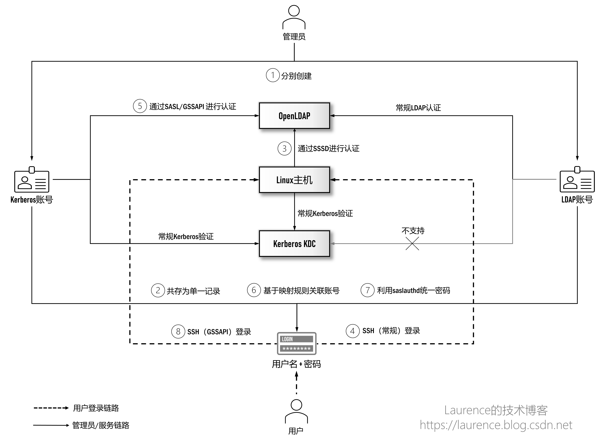

# 基于 SSSD 同步 LDAP 账号

## 1. 写作背景

写作本系列文章的背景是我们要在大数据平台/企业数据湖场景下给出中心化的用户身份认证方案。此前，我们实现过 Windows AD + Kerberos 的集成方案，由于 Windows AD 是 LDAP 和 Kerberos 的双重实现，这种天然优势使得 Windows AD 可以实现真正意义上的（大数据集群的）Kerberos 账号与企业用户账号的统一管理。当我们想在 OpenLDAP + Kerberos 上实现同样的目标时，发现这一领域的知识与方案琐碎而凌乱，缺少统一连贯，脉络清晰的讲解，在经过大量技术调研和系统梳理后，我们特别撰写了本系列文章，希望可以借此将这一话题全面彻底地阐述清楚。

本系列由三篇文章组成，将沿着“如何集成 OpenLDAP 与 Kerberos 实现统一认证管理”这一主线推进，在实现过程中会详细介绍使用到的技术和原理并给出完备的执行脚本用于实际环境的搭建。我们假设读者已经具备 OpenLDAP 和 Kerberos 的基本知识，不再对两者进行单独介绍。此外，本系列文章写作期间正值 2022 年 4 月-5 月上海疫情最严重的时期，特以此文纪念这段艰难的特殊时光。

## 2. 既定目标

在上一篇文章中，我们安装了 OpenLDAP 并将 Kerberos 的后台数据库迁移到了 OpenLDAP 上，实现了两系统用户数据的统一存储。本文将展开第二阶段的集成工作，即此前在技术方案（路线图）中介绍的第③和第④步：


<center>图 1: OpenLDAP 与 Kerberos 集成方案</center>


这两步操作将在 Linux 主机上启用 SSSD，用户通过 SSH 登录大数据集群各个节点时，将会通过 SSSD 转到 OpenLDAP 进行身份认证。

对于大数据集群来说，③④两步操作的主要意义并不在于可以让用户登录 Linux，而在于：当我们向 Yarn 提交作业时，Yarn 会要求执行作业的各 Worker 节点上能找到提交作业的 Linux 用户，因此，我们需要架设一条通道将 OpenLDAP 账号同步到各个 Linux 主机上，这个通道就是 SSSD。

## 3. 工作原理

本文操作的主要对象是 SSSD（System Security Services Dameon，官网地址：[https://sssd.io](https://sssd.io)，它是一个工作在 Linux 系统上与 LDAP/AD 对接进行身份认证和账号缓存的服务，与直接同 LDAP 对接相比，SSSD 有如下一些优点：

- 支持离线认证：当本地主机与 LDAP 服务器断网的情况下，用户依然可以登录
- 减轻 LDAP 服务器的负载：通过 SSSD，一台 Linux 主机仅与 LDAP 服务器建立一个连接
- 支持多个 LDAP/AD：通过 SSSD，可以同时配置多个 LDAP/AD 作为认证源

## 4. 安装操作

※ 提示：本文所有命令均以 root 用户身份执行，不再显式使用 sudo 修饰。

### 4.1 创建 SSSD 的 Bind DN

※ 提示：本节操作在 [ OpenLDAP ] 上执行

由于 SSSD 需要登录 OpenLDAP 检索账号，所以需要为其在 OpenLDAP 上创建一个专职账号：cn=sssd,ou=services,dc=example,dc=com，操作命令如下：

```
cat << EOF | ldapadd -D "cn=admin,dc=example,dc=com" -w Admin1234!
dn: cn=sssd,ou=services,dc=example,dc=com
sn: sssd
cn: sssd
objectClass: top
objectclass: person
userPassword: Admin1234!
EOF
```

备注： 这是本文唯一一处需要在 OpenLDAP 上执行的操作，后续所有操作均在大数据集群各个节点上执行。

### 4.2 安装软件包

※ 提示：本节操作在 [ 大数据集群各个节点 ] 上执行

使用如下命令安装必要的软件包：
```
yum -y install openldap-clients sssd sssd-client sssd-ldap sssd-tools authconfig nss-pam-ldapd oddjob-mkhomedir
```

### 4.3 使用 authconfig 配置 SSSD

※ 提示：本节操作在 [ 大数据集群各个节点 ] 上执行

authconfig 是 Linux 系统上一个对各种认证资源进行统一配置的工具，我们将通过它完成一部分的 SSSD 配置，命令如下：

```
authconfig --enablesssd --enablesssdauth --enablemkhomedir --enablerfc2307bis --enableldap --enableldapauth --disableldaptls --disableforcelegacy --disablekrb5 --ldapserver ldap://ip-10-0-0-70.cn-north-1.compute.internal --ldapbasedn "dc=example,dc=com" --updateall
```

关于这条命令，大部分选项都可以直接从名称上了解其作用，需要特别解释的是下面几个配置项：


**--disableforcelegacy**

--disableforcelegacy 其实是默认值，不显式配置也会生效，和它对应的是--enableforcelegacy 选项。官方文档对这两个选项的解释并不够细致，它们是为兼容某些旧式服务（例如一些很旧的 OpenLDAP 版本）而设计的，但其实这两个选项对配置的影响非常大，最大的区别在于：

如果使用--disableforcelegacy，则启动的是 sssd 进程，并且会自动创建并使用/etc/sssd/sssd.conf 文件

如果使用--enableforcelegacy，则启动的是 nslcd 进程，不会创建和使用/etc/sssd/sssd.conf 文件，命令行中的若干配置项会更新到/etc/nslcd.conf，/etc/pam.d/system-auth 和/etc/pam.d/password-auth 等文件中

总之，在安装新环境时，建议首选--disableforcelegacy，它会让 authconfig 将配置（特别是 ldap 相关的）信息写到/etc/sssd/sssd.conf 文件的[domain/default]中，如该 sssd.conf 文件不存在，authconfig 还会自动创建该文件。

**--updateall**

该选项的作用是将命令行中的各项配置更新到对应服务的配置文件中，与之类似的是--update 参数，它们的区别在于--updateall 会更新全部配置。我们建议大家使用--updateall 而不是--update，因为这样可以保证始终以 authconfig 命令给出的配置为准，避免手动修改一些配置文件。网上有很多文章告诉读者在使用了 authconfig 命令后还要再去修改/etc/pam.d/system-auth 和/etc/pam.d/password-auth 等文件，都是因为没有使用--updateall 导致的，这种做法不能说有错，但确实是有隐患的。典型的例子是：这些文章会要求读者手动修改/etc/pam.d/system-auth 和/etc/pam.d/password-auth 两个文件中与 pam_sss.so 和 pam_ldap.so 有关的 4 个配置项，但其实这些配置会有很大概率在下次执行 authconfig 命令时被覆盖掉。

正确控制 pam_sss.so 和 pam_ldap.so 相关配置项的做法是：在每次执行 authconfig 时，总是使用--enableforcelegacy 和--updateall 两个选项，通过 enable 或 disable ldapauth 与 sssdauth 可以精确控制与 pam_sss.so 和 pam_ldap.so 有关的四项配置，具体逻辑是：

- --enableldapauth：将会在/etc/pam.d/system-auth 和/etc/pam.d/password-auth 追加 pam_ldap.so 相关的 4 项配置
- --disableldapauth：将会在/etc/pam.d/system-auth 和/etc/pam.d/password-auth 移除 pam_ldap.so 相关的 4 项配置
- --enablesssdauth：将会在/etc/pam.d/system-auth 和/etc/pam.d/password-auth 追加 pam_sss.so 相关的 4 项配置
- --disablesssdauth：将会在/etc/pam.d/system-auth 和/etc/pam.d/password-auth 移除 pam_sss.so 相关的 4 项配置

再次提醒一下，以上情形只在启用了--enableforcelegacy 和--updateall 的前提下才有效。由于我们使用了--disableforcelegacy，所以不必手动修改/etc/pam.d/system-auth 和/etc/pam.d/password-auth 两个文件，只需要简单执行上面的 authconfig 命令即可。authconfig 命令执行完毕后，可以通过下面的命令查看一下当前配置，从输出的信息可以判断出哪些认证模块被启用哪些没有：

**authconfig --test**

备注：针对 CentOS 8，应该使用 authselect 替换 authconfig 进行配置，本文使用的演示环境不支持 authselect，故不再单独介绍。

### 4.4 其他必要配置项

※ 提示：本节操作在 [ 大数据集群各个节点 ] 上执行

尽管 authconfig 命令配合--disableforcelegacy 选项可以自动生成/etc/sssd/sssd.conf 文件，但是 authconfig 还是不能涵盖 sssd.conf 中的所有配置，以下几项配置无法通过 authconfig 参数设置，但必须要在 sssd.conf 中提供：


```
ldap_default_bind_dn = cn=sssd,ou=services,dc=example,dc=com
ldap_default_authtok_type = password
ldap_default_authtok = Admin1234!
```


ldap_default_bind_dn 用于指定 SSSD 的 bind dn，我们已经在第一步先行创建好了这个 DN，如果想简化操作，可以直接使用 admin。ldap_default_authtok_type 用于指明定 bind dn 的认证方式，这里使用的是密码认证，ldap_default_authtok 是用来配置 bind dn 的密码。此外，还有一些与 ldap 有关的配置项是用于账号检索的，它们是：


```
ldap_user_object_class = posixAccount
ldap_user_name = uid
ldap_user_uid_number = uidNumber
```

上述三项给出的值本身就是这些配置项的默认值，所以并不需要显式配置，这些默认值适用于绝大多数情况，仅当 SSSD 同步不到你想要的账号时，才可能需要适当修改一下相应的值。


接下来两项是用户登录后与环境有关的配置项：

```
override_homedir = /home/%u
default_shell = /bin/bash
```

“override_homedir = /home/%u”用于配置 LDAP 用户登录 Linux 后的 home 目录，当用户初次登录时，系统会根据这里的配置为用户创建 home 目录，其中 %u 表示用户名。自动创建 home 目录的功能是通过安装 oddjob-mkhomedir 实现的，这个安装包中有一个名为 pam_oddjob_mkhomedir.so 的库，authconfig 命令就是利用这个库创建 home 目录的。

“default_shell = /bin/bash”用于配置同步的 LDAP 用户在 Linux 下的默认 shell，这里我们统一使用 bash shell。

此外，如果配置过程中出现错误，详细的日志信息对排查错误非常重要，此时，可以通过以下的配置项提升日志输出的详细度：

```
debug_level = 9
```

最后，我们可以使用如下命令，将 authconfig 生成的内容与需要额外添加的内容合并，生成一份完整的配置：

```
tee /etc/sssd/sssd.conf<<EOF
[sssd]
services = nss, pam, autofs
domains = default

[domain/default]
autofs_provider = ldap
ldap_schema = rfc2307bis
krb5_realm = CN-NORTH-1.COMPUTE.INTERNAL
ldap_search_base = dc=example,dc=com
krb5_server = ip-10-0-1-90.cn-north-1.compute.internal:88
id_provider = ldap
auth_provider = ldap
chpass_provider = ldap
ldap_uri = ldap://ip-10-0-0-70.cn-north-1.compute.internal
ldap_id_use_start_tls = False
cache_credentials = True
ldap_tls_reqcert = never
ldap_tls_cacertdir = /etc/openldap/cacerts
ldap_default_bind_dn = cn=sssd,ou=services,dc=example,dc=com
ldap_default_authtok_type = password
ldap_default_authtok = Admin1234!
override_homedir = /home/%u
default_shell = /bin/bash

[nss]
homedir_substring = /home

[pam]

[autofs]
EOF

chmod 600 /etc/sssd/sssd.conf 
```

关于更多 sssd.conf 文件的配置项可参考：https://linux.die.net/man/5/sssd.conf

### 4.5 配置 SSH

※ 提示：本节操作在 [ 大数据集群各个节点 ] 上执行

如果允许 SSSD 同步的用户 SSH 登录服务器，需要对 SSH 做一些必要配置，具体操作是打开/etc/ssh/sshd_config 文件，将“UsePAM no”和“PasswordAuthentication no”注释掉（如果有的话），并设置“UsePAM yes”和“PasswordAuthentication yes”：

```
#UsePAM no
UsePAM yes
#PasswordAuthentication no
PasswordAuthentication yes
```

或执行如下脚本：
```
cp -f /etc/ssh/sshd_config /etc/ssh/sshd_config.$(date +%s)

items=(UsePAM PasswordAuthentication)

for item in ${items[@]}; do
    searchExp="^\s*[#]\?\s*${item}\s*\(yes\|no\)$"
    # 所有待删除的行号
    lineNums=($(grep -n -e "$searchExp" /etc/ssh/sshd_config | cut -d: -f1))
    # 生成sed行表达式
    printf -v linesExp "%sd;" "${lineNums[@]}"
    # 删除所有行
    sed -i -e "$linesExp" /etc/ssh/sshd_config
    # 在原第一行处插入新配置（为了保持配置项出现在合适的位置）
    sed "${lineNums[0]}i ${item} yes" -i /etc/ssh/sshd_config
done
```

### 4.6 重启服务

※ 提示：本节操作在 [ 大数据集群各个节点 ] 上执行

完成上述所有操作后，需要激活并重启以下服务：
```
systemctl enable sssd oddjobd
systemctl restart sssd oddjobd sshd
systemctl status sssd oddjobd sshd
```

### 4.7 登录验证

※ 提示：本节操作在 [ 大数据集群各个节点 ] 上执行

服务重启后，LDAP 的账号数据就可以经 SSSD 同步至本地 Linux 主机了，以“user1”用户为例，可以使用命令：
```
id user1
```

如果命令打印出了 user1 的相关信息，则表示 SSSD 已经可以和 OpenLDAP 正常通信了，同时也可以切换到 user1 用户上验证：

```
su -l user1
```

最后，就是使用 SSH 进行登录验证了，读者可以使用自己熟悉的 SSH 客户端工具以user1为用户名，以Admin1234!为密码进行 SSH 登录验证。至此，我们已经完成本文的预定目标，实现了集成方案示意图中的第③、④两步。

## 附录：常见错误
当遇到配置无效或配置中出现错误的时候，可以重点留意如下日志文件中的错误信息：

```
/var/log/secure
/var/log/sssd/sssd_default.log
```

以下是一些常见的错误和处理方法：

- 启动 SSSD 服务时报错：SSSD couldn't load the configuration database [2]: No such file or directory.


原因：/etc/sssd/sssd.conf 文件不存在。可以使用 authconfig 命令配合--disableforcelegacy 选项自动生成 sssd.conf 文件


- SSH 登录时报错：pam_sss(sshd:auth): received for user ...: 6 (Permission denied)

原因：如果 OpenLDAP 没有启用 TLS，则必须要在 sssd.conf 文件中显式地配置ldap_tls_reqcert = never


- /var/log/sssd/sssd_default.log 文件报错：User [xxx] filtered out! (primary gid out of range)

原因是在 LDAP 中查看用户的 GID 是 0，这是使用 LdapAdmin 创建用户时，不选 Group 时自动赋予的值，由于 0 是 root group 的 GID，不在允许的 GID 范围内。解决方法明确设置一个合理值，例如大于 1000 的随机值，或者取一个实际存在的 GID。


- 用户登录后不能创建 Home 目录

如果在 authconfig 中使用了--enablemkhomedir，是会创建 home 目录的，但如果没有在/etc/sssd/sssd.conf 中显式地配置 override_homedir，默认的 home 目录其实是在根目录下。所以，要同时保证启用了--enablemkhomedir，并在/etc/sssd/sssd.conf 中配置了：

```
override_homedir = /home/%u

```

作者介绍：耿立超，架构师，多年系统开发与架构经验，对大数据、云计算、企业级应用、SaaS、分布式存储和领域驱动设计有丰富的实践经验，著有 《大数据平台架构与原型实现：数据中台建设实战》（https://item.jd.com/12677623.html）一书，个人技术博客：https://laurence.blog.csdn.net


> 声明：本文来自infoq.cn，版权归作者所有。文章内容仅代表作者独立观点，不代表本网站立场，转载目的在于传递更多信息。如有侵权，请联系 anhk@ir0.cn。

> 原始链接：https://www.infoq.cn/article/dyp0xqjdeamqcxyeap8t
