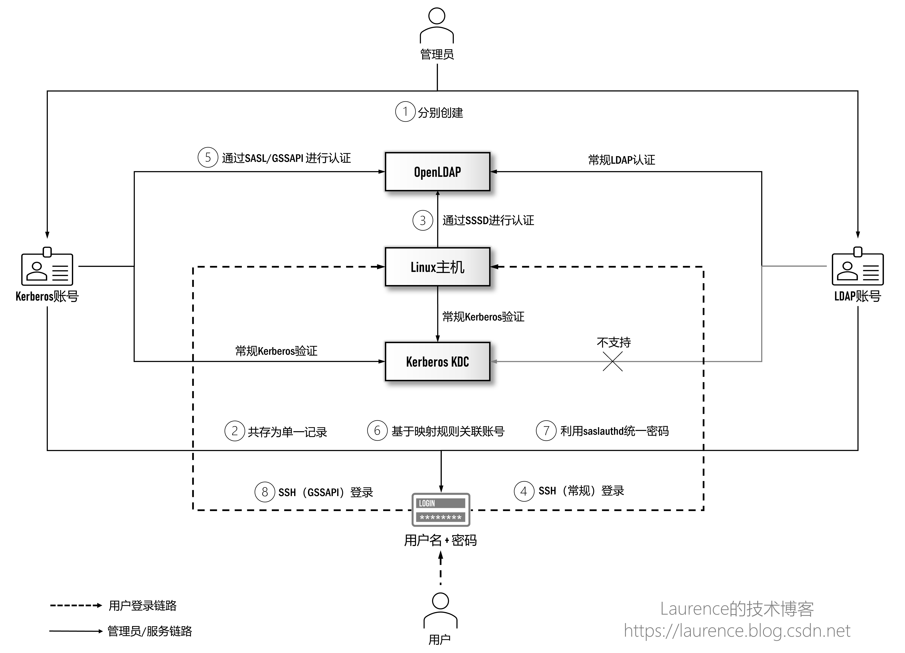
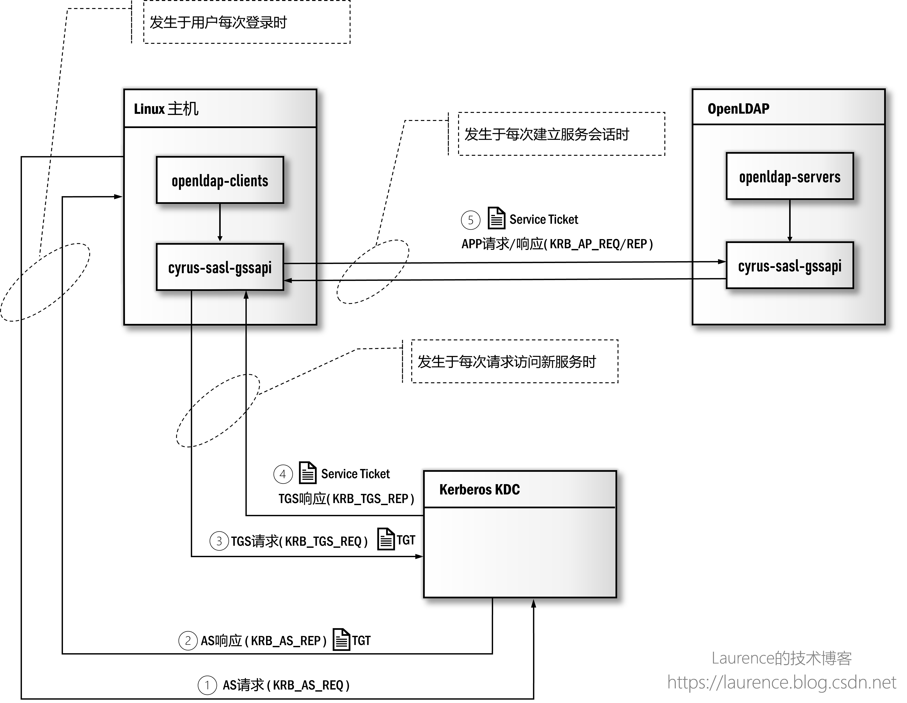

# 基于 SASL/GSSAPI 深度集成

## 1. 写作背景

写作本系列文章的背景是我们要在大数据平台/企业数据湖场景下给出中心化的用户身份认证方案。此前，我们实现过 Windows AD + Kerberos 的集成方案，由于 Windows AD 是 LDAP 和 Kerberos 的双重实现，这种天然优势使得 Windows AD 可以实现真正意义上的（大数据集群的）Kerberos 账号与企业用户账号的统一管理。当我们想在 OpenLDAP + Kerberos 上实现同样的目标时，发现这一领域的知识与方案琐碎而凌乱，缺少统一连贯，脉络清晰的讲解，在经过大量技术调研和系统梳理后，我们特别撰写了本系列文章，希望可以借此将这一话题全面彻底地阐述清楚。

本系列由三篇文章组成，将沿着“如何集成 OpenLDAP 与 Kerberos 实现统一认证管理”这一主线推进，在实现过程中会详细介绍使用到的技术和原理并给出完备的执行脚本用于实际环境的搭建。我们假设读者已经具备 OpenLDAP 和 Kerberos 的基本知识，不再对两者进行单独介绍。此外，本系列文章写作期间正值 2022 年 4 月-5 月上海疫情最严重的时期，特以此文纪念这段艰难的特殊时光。

## 2. 既定目标

作为本系列的最后一篇文章，在前面两篇文章的基础上，我们要对 OpenLDAP + Kerberos 进行深度集成，实现最终的用户账号统一管理。在正式展开前，要再次提醒大家清楚这样一个事实：人们通常认为的“账号统一”是指：一处创建账号，多处登录使用。在 Windows AD + Kerberos 环境下，我们确实可以实现这一目标，根本原因在于 Windows 的 AD 服务即是 LDAP 的实现又是 Keberos 的实现，其从产品内部整合了这两套认证系统，但是 OpenLDAP 和(MIT) Kerberos 作为两套独立的认证系统，是无法实现绝对意义上的账号统一的，这一点在厘清全部技术细节之后，相信读者会深有感触。

本文的目标是利用 SASL、GSSAPI、saslauthd 等技术实现两系统间的“账号映射”与“委托认证”，在“使用效果上”达成账号统一的目标，也就是完成集成方案中的第⑤、⑥、⑦、⑧四步操作：


<center>图 1: OpenLDAP 与 Kerberos 集成方案</center>

为了能更加细致地解释每一步操作，我们切换一下观察视角，以user1@CN-NORTH-1.COMPUTE.INTERNAL和uid=user1,ou=users,dc=example,dc=com这两个配套账号为例，重新理解一下实现账号统一和密码统一要做的工作和实现的效果：


<center>图 2: 账号视图下的 OpenLDAP 与 Kerberos 集成方案</center>


- ①：管理员会为用户 user1 创建两个配套账号，分别是 Kerberos 上的user1@CN-NORTH-1.COMPUTE.INTERNAL和 OpenLDAP 上的uid=user1,ou=users,dc=example,dc=com，两个账号中的用户名部分，即user1必须保持一致；
- ⑤：通过 SASL/GSSAPI，让user1@CN-NORTH-1.COMPUTE.INTERNAL可以登录 OpenLDAP，登录后获得默认身份uid=user1,cn=gssapi,cn=auth，该身份只是过渡用的临时身份；
- ⑥：配置 OpenLDAP 的账号映射规则，将uid=user1,cn=gssapi,cn=auth映射为uid=user1,ou=users,dc=example,dc=com，这样，当 Kerberos 用户再次登录时将会获得uid=user1,ou=users,dc=example,dc=com的身份；
- ⑦：启用 OpenLDAP 的委派认证机制，通过 saslauthd 服务向 Kerberos 发起密码验证请求，将 OpenLDAP 账号的密码指向 Kerberos 账号的密码

通过第①、⑤、⑥步，可以将两个认证系统的账号统一到用户持有的名为user1的账号上，通过第⑦步可以将两个认证系统的账号密码统一到用户持有的密码Admin1234!上。

## 3. 重要概念

统一 OpenLDAP 与 Kerberos 用户认证的关键技术是 SASL，具体来说包括：SASL（程序库）、GSSAPI 以及 saslauthd，清楚这些技术的工作原理对理解整个方案是非常重要的。下面，我们就来逐一介绍一下这些技术以及它们之间的相互关系。

### 3.1 SASL

> SASL - Simple Authentication and Security Layer，中文译作：“简单认证与安全层”，它是一个在网络协议中用来认证和数据加密的构架。

SASL 的官方定义非常抽象，很难让人直接明白它是做什么的。实际上，我们可以把 SASL 理解为一个用于身份认证（Athentication）的编程框架或者是一组接口定义，不同的认证机制可以基于这个框架编写各自的实现，从而允许客户端和服务器之间通过协商选出一种共同支持的认证机制完成身份认证。

引入 SASL 后，应用系统不必再针对某一种认证机制去硬编码，而是具备了认证机制的可插拔能力；对于应用系统的开发者而言，使用 SASL 可以避免从一种认证机制的最底层 API 开始编写实现方案，将精力集中在与 SASL 框架的集成上即可，因为与各种认证机制对接的细节都已由相应的 SASL 插件实现了。

作为 SASL 最主流的实现 Cyrus SASL，其官方文档列出了大量开箱即用的插件：https://www.cyrusimap.org/sasl/#features。SASL 由共享程序库 cyrus-sasl-lib 和若干面向特定认证机制的实现库，如：cyrus-sasl-plain，cyrus-sasl-gssapi 等组成。

### 3.2 GSSAPI

GSSAPI - Generic Security Services Application Program Interface，它是另一个身份认证框架，基于这个框架也有多种认证机制的实现，如 Kerberos，NTLM，SPNEGO 等，但最为人所熟知还是 Kerberos5 的实现，所以会有很多人把“GSSAPI”等同于“Kerberos 认证”。GSSAPI 的程序库是 cyrus-sasl-gssapi，它需要依赖 SASL 的共享程序库 cyrus-sasl-lib。

### 3.3 SASL 与 GSSAPI 的关系

GSSAPI 除本身是一个独立的认证框架外，它同时也适配了 SASL，也就是说 GSSAPI 同时也是 SASL 规范下的一种认证机制，这就使得 SASL 可以通过 GSSAPI 间接支持 Kerberos5，这就是 SASL 与 GSSAPI 之间的微妙关系。本文我们将使用“SASL/GSSAPI”同时指代两者。

为了更好地解释 SASL/GSSAPI 是如何工作的，我们参考了 https://serverfault.com/questions/139896/what-is-sasl-gssapi 给出的一份解释，稍加修改，得到了下面一段模拟 SASL/GSSAPI 协商过程的会话，它可以很好地帮助大家理解一个应用程序的客户端和服务器是如何通过 SASL/GSSAPI 协商完成 Kerberos 认证的：

客户端连接到服务器说：“Hi，我要登录，我支持 SASL，请问我要如何证明自己的身份？”服务器收到连接并作出响应：“收到，我也支持 SASL，具体来说支持如下几种 SASL 认证实现：PLAIN，CRAM-MD5，GSSAPI，...”客户端回答：“我想使用其中的 GSSAPI。”服务器响应: “收到。你知道 GSSAPI 也是一个认证框架，在 GSSAPI 方式下，具体来说我又支持：Kerberos5，SPNEGO，...”客户端回复：“让我们使用 Kerberos5 吧，给你我的加密票据...”

### 3.4 saslauthd

saslauthd 是 Cyrus SASL 的一个组件，是专门接受明文（plaintext，即用户名+密码）认证请求再调用具体的 SASL 认证机制完成身份认证的守护进程。它随 cyrus-sasl-lib 一起安装，但默认不会自动激活并启动，需要通过 systemctl 手动配置。我们会在后面专门介绍它的工作原理。

### 3.5 Kerberos 化

我们不确定“Kerberos 化”这一称谓是否是广泛认可且无歧义的概念，但是它确实很好地传达了概念的本质，所以我们决定在本文使用这一术语。“将某应用或服务 Kerberos 化”意为将该服务添加到 Kerberos 认证体系里，由此需要为该服务创建服务主体，生成 keytab 文件，在应用端，它们通常会提供一个配置项，用于指定其所使用的 keytab 文件，用户需要找到这个配置项，将准确的文件路径配置给该项，然后重启应用，该应用即可凭借 keytab 文件以服务主体（Service Principal）的身份通过 Kerberos 认证，进而可以为 Kerberos 上合法的 Principal 提供服务了。我们把这一过程和连带的一系列操作称为：“Kerberos 化”。

## 4. 核心原理

熟悉了上述重要概念之后，我们需要把这些概念串联起来，看一下它们是如何协同工作的。最核心的就是在介绍集成方案时列出的第⑤、⑥、⑦三项所对应的技术原理：

- 基于 SASL/GSSAPI 实现 Kerberos 账号登录 OpenLDAP
- 基于 olcAuthzRegexp 规则映射 Kerberos 与 OpenLDAP 账号
- 基于 saslauthd 进行委托认证

### 4.1 基于 SASL/GSSAPI 实现 Kerberos 账号登录 OpenLDAP

Kerberos 账号能够登录 OpenLDAP 的关键在于 OpenLDAP 集成了 SASL/GSSAPI 认证机制。 整个登录流程遵循的是标准的 Kerberos 认证规范，只是 OpenLDAP 并不直接参与，而是由 SASL/GSSAPI 全程负责，下面是具体的工作原理：


<center>图 3: SASL/GSSAPI 认证原理</center>

熟悉 Kerberos 原理的读者应该能够看出，这是一个标准的 Kerberos 认证流程，我们要特别留意 SASL/GSSAPI（即 cryus-sasl-gssapi）在其中扮演的角色。


在 Kerberos 中，客户端与服务器的身份认证通常需要进行三次通信，也称 Kerberos 认证的三个阶段：第一阶段（图示中的①、②）是客户端向 KDC 的 AS 请求 TGT，这一工作通常是通过 kinit 命令完成的，SASL/GSSAPI 并不参与这一阶段的工作，而是在客户端获得了 TGT（存储于本地的 Ticket Cache）后，才会接棒第二和第三阶段的认证工作。在第二阶段（图示中的③、④），客户端的 SASL/GSSAPI 将代表 OpenLDAP 客户端与 KDC 的 TGS 交互获得访问 OpenLDAP 的 Service Ticket。在第三阶段（图示中的⑤），服务器端的 SASL/GSSAPI 将代表 OpenLDAP 服务器端接收客户端 SASL/GSSAPI 提交的 Service Ticket，完成身份验证后，OpenLDAP 的客户端与服务器端就可以正常通信了。


为了突出 SASL/GSSAPI 在整个认证过程中扮演的角色，示意图简化了 Kerberos 登录的细节，实际的 Kerberos 认证过程要比图示复杂得多，且每次交互客户端都会得到两条消息，除了内容有所差别外，最重要的是其中一条客户端可以解密，另一条只能被下一步的被请求方解密，这是 Kerberos 验证中非常重要的一个机制，更为详细的过程请参阅 Kerberos 官方文档。

### 4.2 基于 olcAuthzRegexp 规则映射 Kerberos 与 OpenLDAP 账号


一旦允许 Kerberos 账号登录 OpenLDAP，就会立即遇到一个现实问题：这个 Kerberos 账号在 OpenLDAP 上应该是什么身份？不管 Kerberos 和 OpenLDAP 有没有统一后台存储，Kerberos 账号在 OpenLDAP 上都是无意义的，后者没有“Kerberos 账号”这样的概念。为此，OpenLDAP 给出的解决方案是：将 Kerberos 账号关联到一个特定的临时账号上，用户登录后，将自动获得这个临时身份，这个临时账号的格式是：

```
uid=<primary[/instance][@realm]>,cn=gssapi,cn=auth
```

对于从 Kerberos 登录的账号，“cn=gssapi,cn=auth”部分是固定的，表示用户来自于 GSSAPI 认证，uid 部分是登录用户的 Kerberos 账号名，如果登录用户的 realm 是/etc/krb5.conf 中定义的默认 realm，SASL 会将“@realm”部分省略。以我们的测试用 Kerberos 账号：user1@CN-NORTH-1.COMPUTE.INTERNAL为例，其登录 OpenLDAP 后获得的临时身份是：

```
uid=user1,cn=gssapi,cn=auth
```

如果是一个非默认 realm 账号，例如:admin1/admin@FOREIGN.COM，其登录 OpenLDAP 后关联的 DN 将会是：

```
uid=admin1/admin@foreign.com,cn=gssapi,cn=auth
```

分配默认临时账号的做法很好地解决了使用不同认证机制登录 OpenLDAP 时如何获得合法身份的问题，但是绑定在一个固定且临时的账号上是不够灵活和实用的，为此 OpenLDAP 提供了一种基于正则表达式进行账号映射的机制，利用这一机制，我们可以将 Kerberos 账号精准映射到配套的 LDAP 账号上，实现两个账号的软性关联。


OpenLDAP 中用于配置账号映射规则的项是cn=config下面的olcAuthzRegexp。它接收两个正则表达式，第一个用于匹配要被替换的 DN，第二个用于描述替换成的 DN：
```
olcAuthzRegexp: <search pattern>   <replacement pattern>
```

在我们的示例中，为 user1 用户创建的 Kerberos 账号是user1@CN-NORTH-1.COMPUTE.INTERNAL，登录 OpenLDAP 后默认的映射账号是uid=user1,cn=gssapi,cn=auth，而我们为 user1 创建的配套 LDAP 账号是uid=user1,ou=users,dc=example,dc=com，如果要将前者映射为后者，映射规则应该这样配置：

```
olcAuthzRegexp: uid=([^,]*),cn=gssapi,cn=auth uid=$1,ou=users,dc=example,dc=com

```

其中`uid=([^,]*),cn=gssapi,cn=auth为 search pattern` 部分，这一 pattern 会命中所有通过 GSSAPI 登录的账号，并将 uid 部分提取为一个 capturing group。由于逗号在 DN 中是特殊字符，所以提取时要特别剔除；`uid=$1,ou=users,dc=example,dc=com是 replacement pattern`，`$1`指代 search pattern 中的第一个 capturing group，也就是小括号中的部分。这个映射规则用一句话概括就是：将使用 GSSAPI 登录的 Kerberos 账号全部映射到`ou=users,dc=example,dc=com`下面的同名（uid 部分）DN 上。完成上述配置后，Kerberos 账号`user1@CN-NORTH-1.COMPUTE.INTERNAL`再次登录 OpenLDAP 时就将变成`uid=user1,ou=users,dc=example,dc=com`用户了。

### 4.3 基于 saslauthd 进行委托认证

SASL/GSSAPI 与账号映射机制解决了 Kerberos 这一侧的账号问题，但是在 OpenLDAP 这一侧，由于用户可以设置独立的 LDAP 账号密码（存储在userPassword属性里），这会导致虽然两侧账号的用户名一致，但密码却有可能不同，对于用户来说，使用体验上还是两个独立的账号。为此，OpenLDAP 提供了一种叫“Pass-Through Authentication”的密码验证机制（本文将使用“委托认证”这一称谓，因为这个名称更加准确），它允许 OpenLDAP 将密码的核验工作委派给第三方处理，这样的话，LDAP 账号将不再单独设置密码，而是可以“关联”到被委派一方的密码上，这可以实现“统一密码”的效果。在 OpenLDAP 中，启用 Pass-Through Authentication 的方法是：将用户的userPassword属性设置为如下特殊格式：


```
userPassword: {SASL}username@REALM
```

其中{SASL}部分表示该账号的密码将委托 SASL（准确地说是 saslauthd）进行验证，而username@REALM是提交委托对方验证密码时应使用的委托方账号，username和REALM都需要根据账号实际情况替换相应的值。以测试用的 LDAP 账号uid=user1,ou=users,dc=example,dc=com为例，它的userPassword应该设置为：

```
userPassword: {SASL}user1@CN-NORTH-1.COMPUTE.INTERNAL
```

其中user1@CN-NORTH-1.COMPUTE.INTERNAL正是关联的 Kerberos 账号。下图展示了密码委派验证的整个流程：


<center>图 4: OpenLDAP 的委派认证机制</center>


- ①：当客户端使用 LDAP 账号uid=user1,ou=users,dc=example,dc=com登录 OpenLDAP 服务器时，OpenLDAP 会去数据库中查找这个账号的密码；
- ②：当 OpenLDAP 发现密码是{SASL}user1@CN-NORTH-1.COMPUTE.INTERNAL这种特殊形式时，它将发起委派验证请求；
- ③：OpenLDAP 将使用user1@CN-NORTH-1.COMPUTE.INTERNAL作为账号名，加上用户输入的密码一起提交给 saslauthd；
- ④：saslauthd 会负责和 Kerberos KDC 通信，完成密码工作，并将结果反馈给 OpenLDAP


前面已经简单介绍过 saslauthd，它是一个接受明文用户名和密码再调用 SASL 进行身份验证的守护进程，saslauthd 运行在 OpenLDAP 服务器端，它对于 OpenLDAP 客户端是透明的。客户端只负责向 OpenLDAP 服务器提交用户名和密码，对于后台是否会执行委派验证以及委派给什么系统验证都是无感知的。

## 5. 安装操作

接下来，我们就进入正式的安装实操环节，下表是将要安装的软件列表：

|    软件    |                             说明                             |                       安装包                        |  版本  |
| :--------: | :----------------------------------------------------------: | :-------------------------------------------------: | :----: |
|  OpenLDAP  | LDAP的开源实现，分Server与Client，其Server端的守护进程名为：slapd |         openldap-clients，openldap-servers          | 2.4.44 |
| Cyrus SASL | SASL的开源实现，Cyrus SASL是一个程序库，不会单独运行，而是由集成了SASL验证功能的应用程序（如OpenLDAP）调用。它由核心程序库cyrus-sasl-lib和若干面向不同认证机制开发的具体实现库组成，如面向PLAIN和LOGIN的cyrus-sasl-plain，面向GSSAPI的cyrus-sasl-gssapi等 | cyrus-sasl-lib，cyrus-sasl-gssapi，cyrus-sasl-devel | 2.1.26 |
|  Keberos5  |      大数据领域广泛支持的认证系统，同样分Server与Client      |         krb5-worksation，krb5-server（略）          | 1.15.1 |


我们将使用两台服务器分别作为 OpenLDAP 客户端和服务器端，主要的安装与配置工作是在这两台服务器上展开的，同时还需要在一台已有的 Kerberos KDC 服务器上进行一些必要操作，整体的安装示意图如下：


<center>图 5: SASL/GSSAPI 安装示意图</center>


关于该示意图，有三点需要解释：

1. 图中各服务器上的虚线框表示程序库或客户端，无守护进程，实现框表示安装后以守护进程形式运行，方框中的名称均为 yum 安装包的名称
2. saslauthd 不是安装包，而是打包在 cryus-sasl-lib 里的一个组件，安装 cryus-sasl-lib 后可以在系统里找到它，但是作为守护进程，它不会自动启用，需通过 systemctl 手动激活并启用。
3. 我们预设的场景是 Kerberos KDC 服务器已经存在，所以本文不介绍 Kerberos KDC 的安装（大部分的大数据平台产品内置 Kerberos 功能，可以在集群各节点上自动完成 Kerberos 的安装与配置，我们建议读者使用集群自建的 Kerberos），但我们需要在 Kerberos KDC 服务器上完成如下操作：
    - 将 KDC 上的 krb5.conf 文件分发给 OpenLDAP 客户端和服务器，便于后者与 KDC 通信；
    - 在 KDC 上为 OpenLDAP 服务创建主体（Principal）并将其 keytab 文件 ldap.keytab 分发给 OpenLDAP 服务器，以便将 OpenLDAP 服务“Kerberos 化”，这是服务器端 SASL/GSSAPI 插件要求的；
    - 在 KDC 上为 OpenLDAP 服务器主机创建主体（Principal）并将其 keytab 文件 krb5.keytab 分发给 OpenLDAP 服务器，以便将 OpenLDAP 服务器主机“Kerberos 化”，这是服务器端 saslauthd 要求的

※ 提示：本文所有命令均以 root 用户身份执行，不再显式使用 sudo 修饰。

### 5.1 安装客户端

本节所谓的“客户端”是指 Linux 主机，即大数据集群的各个节点，从 OpenLDAP 和 Kerberos KDC 的角度看，这些机器都是它们的客户端。

#### 5.1.1 安装客户端软件包

※ 提示：本节操作在 [ 大数据集群各个节点 ] 上执行

登录 Linux 主机安装如下软件包：
```
yum -y install openldap-clients cyrus-sasl-lib cyrus-sasl-gssapi cyrus-sasl-devel krb5-workstation
```

- openldap-clients 是 OpenLDAP 客户端的安装包；
- cyrus-sasl-lib 是 SASL 的共享程序库，SASL 的各种具体实现都依赖该库；
- cyrus-sasl-gssapi 是 SASL 面向 GSSAPI 的实现，使用 SASL 验证时，OpenLDAP 客户端需要使用这个库与 KDC 交互，所以这个软件包是必须的；
- cyrus-sasl-devel 与其基他 devel 包类似，为开发基于 SASL 的应用提供额外的支持，一般情况下并不需要，我们这里选择安装的原因是后面会使用 pluginviewer 命令检查当前机器上安装了哪些可用的 SASL 认证机制，这个命令在 cyrus-sasl-devel 包中；
- krb5-workstation 是 Kerberos 客户端的安装包，如果当前 Linux 主机是启用了 Kerberos 的大数据集群中的节点，则 Kerberos 客户端已经自动安装。命令执行完毕后可以使用 SASL 提供的 pluginviewer 命令检查一下本机是否已经支持 SASL/GSSAPI 认证，如果打印的信息中含有 gssapi 插件的相关内容就表示 SASL/GSSAPI 已经就绪：
```
pluginviewer  | grep -i gssapi
```

#### 5.1.2 配置 Kerberos

※ 提示：本节操作在 [ 大数据集群各个节点 ] 上执行

无论是否安装 Kerberos 客户端，我们都需要提供一份/etc/krb5.conf 配置文件，因为客户端的 SASL/GSSAPI 需要使用它与 KDC 通信。我们无需编写这个文件，可从 Kerberos KDC 上直接下载一份到本地，然后上传到客户端的相同位置上（或者通过 scp 拷贝）即可：

```
# 注意：请先行上传krb5.conf文件到当前目录，然后再执行以下命令
mv -f /etc/krb5.conf /etc/krb5.conf.$(date +%s)
cp -f krb5.conf /etc/krb5.conf
```

#### 5.1.3 配置 SSH

※ 提示：本节操作在 [ 大数据集群各个节点 ] 上执行

为了允许用户登录大数据集群节点提交作业，需要对 SSH 进行一些与 Kerberos 和 GSSAPI 有关的必要配置，具体操作为：打开/etc/ssh/sshd_config 文件，将“KerberosAuthentication no”和“GSSAPIAuthentication no”注释掉（如果有的话），并设置“KerberosAuthentication yes”和“GSSAPIAuthentication yes”
```
#KerberosAuthentication no
KerberosAuthentication yes

#GSSAPIAuthentication no
GSSAPIAuthentication yes
```

或执行如下脚本：
```
cp -f /etc/ssh/sshd_config /etc/ssh/sshd_config.$(date +%s)

items=(KerberosAuthentication GSSAPIAuthentication)

for item in ${items[@]}; do
    searchExp="^\s*[#]\?\s*${item}\s*\(yes\|no\)$"
    # 所有待删除的行号
    lineNums=($(grep -n -e "$searchExp" /etc/ssh/sshd_config | cut -d: -f1))
    # 生成sed行表达式
    printf -v linesExp "%sd;" "${lineNums[@]}"
    # 删除所有行
    sed -i -e "$linesExp" /etc/ssh/sshd_config
    # 在原第一行处插入新配置（为了保持配置项出现在合适的位置）
    sed -i "${lineNums[0]}i ${item} yes" /etc/ssh/sshd_config
done
```

修改完毕后重启 sshd 服务：

```
systemctl restart sshd
systemctl status sshd
```

待服务重启之后，就可以使用 SSH 进行登录验证了。在启用GSSAPIAuthentication yes的情况下，可以使用 ssh 的-K参数显式使用 GSSAPI 认证方式登录，且登录后会自动获得 Kerberos 凭证（相当于登录时自动执行了一次 kinit），此时已经完成了集成方案中标注的第⑧步操作；在启用KerberosAuthentication yes的情况下，使用常规的 SSH 登录方式（publickey 或 password），登录后也会自动获得 Kerberos 凭证（同样相当于登录时自动执行了一次 kinit），此时我们完成的是第④步的增强操作，即用户以常规 SSH 方式登录后可自动获得 Kerberos 凭证。不管用户选择哪种方式登录，此时的用户已经具备了提交大数据作业的条件。

#### 5.1.4 配置 SASL/GSSAPI

※ 提示：本节操作在 [ 大数据集群各个节点 ] 上执行

客户端的 SASL/GSSAPI 并不需要特别的配置，它唯一的要求是本地必须要有一份/etc/krb5.conf 配置文件，以便其基于该文件提供的信息与 KDC 通信，我们已经在 5.1.3 完成了这项工作。此外，有文章提及需要在 OpenLDAP 客户端向/etc/openldap/ldap.conf 中添加SASL_MECH GSSAPI一项配置，这一操作不是必须的，因为 OpenLDAP 客户端与服务器使用 SASL 认证时有一个协商过程，只要客户端和服务器都安装了 cyrus-sasl-gssapi，GSSAPI 会自动入选。当然，显式配置也没有错。

### 5.2 安装服务器端

※ 提示：本节操作的前置条件是 OpenLDAP 已经完成安装和配置，也就是已经完成了本系列第一篇文章 4.1 节的全部操作。

#### 5.2.1 安装服务器端软件包

※ 提示：本节操作在 [ OpenLDAP ] 上执行

在 OpenLDAP 服务器端主机上安装如下软件包：

```
yum -y install cyrus-sasl-lib cyrus-sasl-gssapi cyrus-sasl-devel krb5-workstation
```

与客户端一样，安装后可以通过 pluginviewer 命令检查一下服务器端的 SASL/GSSAPI 是否已安装妥当：
```
pluginviewer  | grep -i gssapi
```

#### 5.2.2 配置 Kerberos

※ 提示：本节操作在 [ OpenLDAP ] 上执行


与客户端一样，服务器端的 SASL/GSSAPI 也需要一份/etc/krb5.conf 配置文件以便与 Kerberos KDC 通信，所以要再次从 KDC 下载一份并上传（或者通过 scp 拷贝）到服务器相同位置。

```
# 注意：请先行上传krb5.conf文件到当前目录，然后再执行以下命令
mv -f /etc/krb5.conf /etc/krb5.conf.bak
cp -f krb5.conf /etc/krb5.conf
```

#### 5.2.3 配置 SSH

※ 提示：本节操作在 [ OpenLDAP ] 上执行

如果需要用户以 GSSAPI 方式 SSH 登录服务器，需要进行和客户端一样的 SSH 配置，具体请参考 5.1.3 一节。

#### 5.2.4 配置 SASL/GSSAPI

接下来的一系列操作是配置 OpenLDAP 支持 SASL/GSSAPI 认证从而允许用户使用 Kerberos 账号登录 OpenLDAP，本节操作对应 4.1 和 4.2 两节阐述的原理。

##### 5.2.4.1 Kerberos 化 OpenLDAP 服务

从前面的 SASL/GSSAPI 工作原理图可以看出，SASL/GSSAPI 是代表 OpenLDAP 的 Client 端和 Server 端同 Kerberos KDC 交互的，所以 Client 端和 Server 端必须持有合法的 Kerberos 用户身份，在 Client 端，SASL/GSSAPI 会从 Ticket Cache 中获取 Kerberos 身份；而在 Server 端，由于 SASL/GSSAPI 是以插件形式伴随 OpenLDAP 守护进程运行的，这就需要 OpenLDAP 的 Server 端要有 Kerberos 服务主体（Service Principal）身份，因此，我们需要将这个 Service Principal 创建出来，并把生成的 keytab 文件配置给 OpenLDAP，也就是完成 OpenLDAP 的“Kerberos 化”。具体操作如下：

※ 提示：以下操作在 [ Kerberos KDC ] 上执行

登录 KDC 服务器，通过如下命令为 OpenLDAP 创建服务主体：

```
# 创建OpenLDAP服务主体
kadmin.local -q "addprinc -randkey ldap/ip-10-0-0-70.cn-north-1.compute.internal@CN-NORTH-1.COMPUTE.INTERNAL"
# 生成keytab文件
kadmin.local -q "ktadd -k ldap.keytab ldap/ip-10-0-0-70.cn-north-1.compute.internal@CN-NORTH-1.COMPUTE.INTERNAL"
```

执行成功后，将在当前目录下生成一个ldap.keytab文件，将该文件下载至本地再上传（或使用 scp 远程复制）到 OpenLDAP 服务器。这里要注意一个细节，OpenLDAP 的服务主体名ldap不是随意命名的，它是运行 OpenLDAP 守护进程的 Linux 用户名。

※ 提示：以下操作在 [ OpenLDAP ] 上执行

登录 OpenLDAP 服务器，上传 ldap.keytab 文件并移至/etc/openldap/ldap.keytab，修改文件的所有人和读写权限：

```
# 注意：请先行上传ldap.keytab文件到当前目录，然后再执行以下命令
mv ldap.keytab /etc/openldap/ldap.keytab
chown ldap:ldap /etc/openldap/ldap.keytab
chmod 600 /etc/openldap/ldap.keytab
ls -al /etc/openldap/ldap.keytab
```

然后，打开 OpenLDAP 服务器上的/etc/sysconfig/slapd 文件，修改或追加KRB5_KTNAME配置项，指明 keytab 文件存放的路径：

```
KRB5_KTNAME="FILE:/etc/openldap/ldap.keytab"
```

或直接执行如下命令：

```cp -f /etc/sysconfig/slapd /etc/sysconfig/slapd.$(date +%s)
# comment out existing config items
sed -i 's/^KRB5_KTNAME/#KRB5_KTNAME/g' /etc/sysconfig/slapd
# add new config item
echo 'KRB5_KTNAME="FILE:/etc/openldap/ldap.keytab"' >> /etc/sysconfig/slapd
cat /etc/sysconfig/slapd
```

至此，OpenLDAP 的“Kerberos 化”操作完成。

##### 5.2.4.2 配置账号映射规则

※ 提示：本节操作在 [ OpenLDAP ] 上执行

前文 4.2 一节已经介绍了账号映射的工作原理，现在我们要进行实际的配置操作，执行：

```
cat << EOF | ldapadd -Y EXTERNAL -H ldapi:/// 
dn: cn=config
changetype: modify
replace: olcAuthzRegexp
olcAuthzRegexp: uid=([^,]*),cn=gssapi,cn=auth uid=\$1,ou=users,dc=example,dc=com
EOF
```

在配置 olcAuthzRegexp 表达式时要特别留意一个陷阱，由于表达式中用于表示匹配组的变量$1与 shell 脚本的函数参数变量$1冲突，这会导致在 shell 脚本中构建 ldif 文本内容时，$1会被优先当做 shell 中的函数参数变量进行解析，而不是以普通字符串输入到文件中，所以必须要对$符号进行转义，将$1写作\$1，否则映射规则无发按预期生效。如想要确认实际生成的规则是什么样的，可以查看/etc/openldap/slapd.d/cn=config.ldif 文件中的olcAuthzRegexp一项，它保存的是当前生效中的配置。另外，如果配置规则较长，可能会看到该项被断成了两行，这不是配置错误，ldif 有一项规范（RFC 2849），约定单行 ldif 语句长度应控制在 78 字符之内，超过部分会自动断行。

##### 5.2.4.3 重启 slapd 服务

※ 提示：本节操作在 [ OpenLDAP ] 上执行

上述部分操作需要重启 slapd 服务才会生效，故执行命令：
```
systemctl restart slapd; systemctl status slapd
```

##### 5.2.4.4 验证

※ 提示：本节操作在 [ 大数据集群各个节点 ] 上执行

重启完毕后，就可以通过 Kerberos 凭证登录 OpenLDAP 了。我们可以这样验证：登录任意大数据集群节点，使用 kinit 命令获得 user1 的凭证：
```
kinit user1
```

提示输入密码时输入Admin1234!，然后通过：
```
klist
```

确认一下是否获得了 user1 的身份，确认无误后使用 ldapsearch 检索一下 DN：

```
ldapsearch -Y GSSAPI -LLL -H ldap://ip-10-0-0-70.cn-north-1.compute.internal -b "dc=example,dc=com" | grep dn
```

你应该注意这条 ldapsearch 命令的两个特殊之处：首先，命令行没有提供-D，-w 参数，即没有提供登录用户的任何信息；其次，“-Y GSSAPI”参数的含义是强制使用 GSSAPI 方式进行认证。根据前面介绍的原理，此时，OpenLDAP 客户端将使用 Kerberos 凭证以 GSSAPI 方式登录（实际上，在不提供-D 参数的情况下，即使不使用“-Y GSSAPI”，通过客户端与服务器的协商，最终使用的还是 GSSAPI 认证）。此外，我们还可以使用 ldapwhoami 命令，验证一下登录的身份到底是什么：
```
ldapwhoami -Y GSSAPI -H ldap://ip-10-0-0-70.cn-north-1.compute.internal
```

如果输出如下信息则表示当前用户是：uid=user1,ou=users,dc=example,dc=com，验证无误：

```
SASL/GSSAPI authentication startedSASL username: user1@CN-NORTH-1.COMPUTE.INTERNALSASL SSF: 256SASL data security layer installed.dn:uid=user1,ou=users,dc=example,dc=com
```

#### 5.2.5 启用委托验证

为了能让 LDAP 账号委托 Kerberos 验证密码，实现“密码统一”，我们需要配置 saslauthd 服务。本节各项操作对应 4.3 一节阐述的原理。

##### 5.2.5.1 配置 OpenLDAP 支持委托验证

※ 提示：本节操作在 [ OpenLDAP ] 上执行

前文已经介绍了启用委托认证的方法，现在，我们用 user1 这个账号为列，演示一下具体操作：

```
cat << EOF | ldapmodify -D "cn=admin,dc=example,dc=com" -w Admin1234!
dn: uid=user1,ou=users,dc=example,dc=com
changetype: modify
replace: userPassword
userPassword: {SASL}user1@CN-NORTH-1.COMPUTE.INTERNAL
EOF
```

上述命令将 user1 的userPassword设为了：
```
userPassword: {SASL}user1@CN-NORTH-1.COMPUTE.INTERNAL
```

你可能也见过下面这样种形式的配置：
```
userPassword:: e1NBU0x9dXNlcjFAQ04tTk9SVEgtMS5DT01QVVRFLklOVEVSTkFMCg==
```

这种形式是在userPassword的后面跟了两个冒号加一串 ASCII 字符。实际上，上述两种形式是等价的，后者的 ASCII 字符串正是“{SASL}user1@CN-NORTH-1.COMPUTE.INTERNAL”这段明文经过 base64 编码后的样子。

##### 5.2.5.2 Kerberos 化 OpenLDAP 主机

Kerberos 化 OpenLDAP 主机是 saslauthd 要求的，因为 saslauthd 需要使用主机身份与 KDC 进行通信，完成密码验证。具体操作与 Kerberos 化 OpenLDAP 服务类似：

※ 提示：以下操作在 [ Kerberos KDC ] 上执行

首先，登录 KDC 服务器，通过如下命令创建 OpenLDAP 主机对应的 principal 并生成 keytab 文件：
```
# 创建OpenLDAP主机主体
kadmin.local -q "addprinc -randkey host/ip-10-0-0-70.cn-north-1.compute.internal@CN-NORTH-1.COMPUTE.INTERNAL"
# 生成keytab文件
kadmin.local -q "ktadd -k krb5.keytab host/ip-10-0-0-70.cn-north-1.compute.internal@CN-NORTH-1.COMPUTE.INTERNAL"
```

※ 提示：以下操作在 [ OpenLDAP ] 上执行

然后，回到 OpenLDAP 服务器，上传 krb5.keytab 文件并移至/etc/krb5.keytab，修改文件的所有人和读写权限：

```
# 注意：请先行上传krb5.keytab文件到当前目录，然后再执行以下命令
mv krb5.keytab /etc/krb5.keytab
chown root:root /etc/krb5.keytab
chmod 600 /etc/krb5.keytab
ls -al /etc/krb5.keytab
```

配置 saslauthd 使用/etc/krb5.keytab 的地方在/etc/sysconfig/saslauthd 文件中，我们将在后面配置 saslauthd 时一并完成。

##### 5.2.5.3 配置 SASL 库

※ 提示：本节操作在 [ OpenLDAP ] 上执行

接下来，修改 SASL 库的配置，新建或编辑/etc/sasl2/slapd.conf（该文件默认是不存在的，初次配置时需要创建），添加或修改如下内容：
```
pwcheck_method: saslauthd
saslauthd_path: /run/saslauthd/mux
```

或直接执行如下命令：

```
tee /etc/sasl2/slapd.conf <<EOF
pwcheck_method: saslauthd
saslauthd_path: /run/saslauthd/mux
EOF
cat /etc/sasl2/slapd.conf
```

对 SASL 库的配置是衔接 OpenLDAP 和 saslauthd 的关键部分，当 OpenLDAP 解析到{SASL}user1@CN-NORTH-1.COMPUTE.INTERNAL时，会根据这里的配置找到委托方（也就是 saslauthd）的信息并转发认证请求的。关于 SASL 库的配置，有如下几点需要注意：


Cyrus SASL 官方文档对 SASL 库配置文件的存放位置是这样描述的：默认情况下，Cyrus SASL 是从/usr/lib/sasl2/下读取指定应用（或服务）的配置文件的。如果你的系统是 64 位架构的，则位置应是/usr/lib64/sasl2/。但实际上，不同 Linux 版本在预编译 Cyrus SASL 的安装包时可能会依据规范对存储文件的存放位置进行适当调整，例如，在本文使用的 Amazon Linux 2 环境下，SASL 库的配置文件统一存放于/etc/sasl2/目录下。再者，SASL 对配置文件的命名也是有要求的，文件名需要与使用的应用（或服务）名保持一致。例如，smtpd 服务需要使用 SASL 库，需在该目录下提供名为 smtpd.conf 的配置文件。在我们的示例里，面向为 OpenLDAP 提供的 SASL 配置文件必须命名为 slapd.conf（slapd 是 OpenLDAP 的守护 进程名）。经过测试，错误的文件名将不会被期望的应用加载，里面的任何配置都不会生效。

修改对应应用程序（服务）的 SASL 库配置后，通常需要重启相应的服务才会生效。例如，本例中，我们配置的 slapd.conf 是供 OpenLDAP 使用的，所以，只有重启 OpenLDAP，该配置才会生效，这也从侧面印证了 SASL 库的工作原理：SASL 库并不是独立运行的 daemon 进程，而是被使用 SASL 的应用程序调用的程序库，如果要更新 SASL 库的配置，通常都需要重启使用这个库的应用程序，以便其重新加载配置。

##### 5.2.5.4 配置 saslauthd

※ 提示：本节操作在 [ OpenLDAP ] 上执行

打开/etc/sysconfig/saslauthd，添加或修改如下内容：

```
SOCKETDIR=/run/saslauthd
MECH=kerberos5
KRB5_KTNAME=/etc/krb5.keytab
```

或直接执行如下命令：

```
cp -f /etc/sysconfig/saslauthd /etc/sysconfig/saslauthd.$(date +%s)
# 配置SOCKETDIR
sed -i 's/^SOCKETDIR/#SOCKETDIR/g' /etc/sysconfig/saslauthd
echo 'SOCKETDIR=/run/saslauthd' >> /etc/sysconfig/saslauthd
# 配置MECH
sed -i 's/^MECH/#MECH/g' /etc/sysconfig/saslauthd
echo 'MECH=kerberos5' >> /etc/sysconfig/saslauthd
# 配置KRB5_KTNAME
sed -i 's/^KRB5_KTNAME/#KRB5_KTNAME/g' /etc/sysconfig/saslauthd
echo 'KRB5_KTNAME=/etc/krb5.keytab' >> /etc/sysconfig/saslauthd
cat /etc/sysconfig/saslauthd
```

解释一下几个配置项：

- SOCKETDIR：saslauthd 使用 Unix 域套接字技术实现两进程间的通信，该项配置的是套接字绑定的文件系统路径（注意：不得以/mux 结尾）
- MECH：指定使用的认证机制
- KRB5_KTNAME：本地主机的 keytab 文件存放位置，这也是 5.2.5.2 一节需要完成的一项操作，合并到本节一起完成。

注意：部分文章中提到的在 CentOS/RHEL 系统下配置的/etc/saslauthd.conf（对应于 Ubuntu 下的/etc/default/saslauthd）文件并不存在，应与 OS 和 saslauthd 的版本差异有关，本例中，基于我们的操作环境，实际使用并生效的是/etc/sysconfig/saslauthd 文件，请在操作中注意区分。

##### 5.2.5.5 启用 saslauthd

※ 提示：本节操作在 [ OpenLDAP ] 上执行

默认情况下 saslauthd 是未被激活的，需要手动激活并启用它：

```
systemctl enable saslauthd
systemctl start saslauthd
systemctl status saslauthd
```

##### 5.2.5.6 重启 slapd 服务

※ 提示：本节操作在 [ OpenLDAP ] 上执行

上述部分操作同要需要重启 slapd 服务才会生效，故执行命令：
```
systemctl restart slapd; systemctl status slapd
```

##### 5.2.5.7 验证

※ 提示：本节操作在 [ 大数据集群各个节点 ] 上执行

为了验证委派验证和 saslauthd 是否生效，我们可以在客户端使用 ldapsearch 检索一下 DN：
```
ldapsearch -x -LLL -H ldap://ip-10-0-0-70.cn-north-1.compute.internal -b "dc=example,dc=com" -D 'uid=user1,ou=users,dc=example,dc=com' -w Admin1234! | grep dn
```

与此前的 ldapsearch 命令行不同的是，这一次我们使用-x 参数显式地以 LDAP 账号登录，登录用户是 user1 的 LDAP 账号，但这次提供的密码其实是 user1 的 Kerberos 密码，如果命令能输出 DN 信息就表明所有配置已经生效了（如果读者感兴趣，可以修改 user1 的 Kerberos 密码，再使用该命令验证一下）。此外，同样可以再次使用 ldapwhoami 进行验证：
```
ldapwhoami -x -H ldap://ip-10-0-0-70.cn-north-1.compute.internal -D 'uid=user1,ou=users,dc=example,dc=com' -w Admin1234!
```

## 6. 简化方案

我们的系列文章即将接近尾声，所有的操作和配置都已全部结束，尽管这个方案整合了大量的技术用以弥合 OpenLDAP 和 Kerberos 之间的隔阂，但这依然难掩两个认证系统无法实现绝对统一的事实，最直接的表现就是：无论如何，都必须要在 OpenLDAP 和 Kerberos 上分别创建账号，因为本质上它们都是基于各自的账号运作，不存在以某一方账号为中心的集成方式。所以，如果读者认为此前介绍的集成操作过去复杂，也可以考虑这样一种简化版本：


<center>图 6: OpenLDAP 与 Kerberos 集成的简化方案</center>

省略此前方案中的第②、⑤、⑥、⑦四步操作，这一简化版本会大幅削减环境搭建阶段的工作量，但是会增加一定的后期维护工作，主要差异体现在：


简化版本下，OpenLDAP 和 Kerberos 无统一数据库，账号数据各自存储，各自维护

简化版本下，创建 OpenLDAP 和 Kerberos 账号时，除用户名一致外，OpenLDAP 账户需显式配置密码，且密码要与 Kerberos 密码一致，后期维护时，如需修改密码，也必须在两系统中同时更新

## 7. 回顾总结

回顾一下我们整个系列文章的探索历程：在第一篇文章中，我们将 OpenLDAP 配置为 Kerberos 的后台数据库，然后通过addprinc -x dn=...方式创建 Kerberos 用户，将 Kerberos 用户的数据存储到一个已存在的 OpenLDAP 用户上，实现了两套认证系统在用户数据库上的统一；在第二篇文章中，我们配置了 SSSD，让各个 Linux 主机可以同步 LDAP 账号，为用户提交大数据作业铺平了道路；在第三篇文章中，我们通过 SASL/GSSAPI，实现了以 Kerberos 账号登录 OpenLDAP 的目标，并将登录后的 Kerberos 账号映射到 OpenLDAP 的配套账号上，实现了两个系统的账号统一，然后继续通过配置 saslauthd，实现了两个系统的密码统一。

## 附录：常见错误

- 登录 OpenLDAP 时报错：Server ldap/localhost@xxx not found in Kerberos database

> ldap_initialize( <DEFAULT> )SASL/GSSAPI authentication startedldap_sasl_interactive_bind_s: Local error (-2)additional info: SASL(-1): generic failure: GSSAPI Error: Unspecified GSS failure.  Minor code may provide more information (Server ldap/localhost@xxx not found in Kerberos database)


这个错误是指在 KDC 里没有找到ldap/localhost@xxx这个 Sevice Principal，但实际上我们给 OpenLDAP 创建的 Princial 的机器名部分不是 localhost，而是机器的 FQDN，所以错误是出在了 OpenLDAP 的客户端配置上，OpenLDAP 的客户端配置文件是/etc/openldap/ldap.conf，该文件中的 URI 配置就是用来配置 OpenLDAP 服务器地址的，如果我们没有显式地修改 URI 的值，那么它的默认值就是 ldap://localhost，这会导致拼接 Sevice Principal 时使用的主机名也是 localhost 而不是 FQDN。解决方法也很简单，就是修改/etc/openldap/ldap.conf 中 URI 这一项，使用 OpenLDAP 服务器的 FQDN 来配置 URI。

- 登录 OpenLDAP 时报错：result: 32 No such object

这个错误是由于登录后的 Kerberos 用户没有找到在 OpenLDAP 上的映射账号导致的。解决方法是重新检查 olcAuthzRegexp 的配置，确保登录的 Kerberos 账号能准确地映射到目标 OpenLDAP 账号上。

- 登录 OpenLDAP 时报错：No worthy mechs found

> ldap_sasl_interactive_bind_s: Unknown authentication method (-6)additional info: SASL(-4): no mechanism available: No worthy mechs found

错误原因：Linux 主机上尚未安装 cyrus-sasl-gssapi，或安装了但并未重启 slapd 服务。

- 登录 OpenLDAP 时报错：No Kerberos credentials available

> SASL/GSSAPI authentication startedldap_sasl_interactive_bind_s: Local error (-2)additional info: SASL(-1): generic failure: GSSAPI Error: Unspecified GSS failure.  Minor code may provide more information (No Kerberos credentials available (default cache: FILE:/tmp/krb5cc_0))

当前用户尚未获得相应的 Principal 身份，需先执行 kinit 命令获得 kerberos 身份。

作者介绍：耿立超，架构师，多年系统开发与架构经验，对大数据、云计算、企业级应用、SaaS、分布式存储和领域驱动设计有丰富的实践经验，著有 《大数据平台架构与原型实现：数据中台建设实战》（https://item.jd.com/12677623.html）一书，个人技术博客：https://laurence.blog.csdn.net


> 声明：本文来自infoq.cn，版权归作者所有。文章内容仅代表作者独立观点，不代表本网站立场，转载目的在于传递更多信息。如有侵权，请联系 anhk@ir0.cn。

> 原始链接：https://www.infoq.cn/article/yzzyfzxkxzddmui2wmiv
