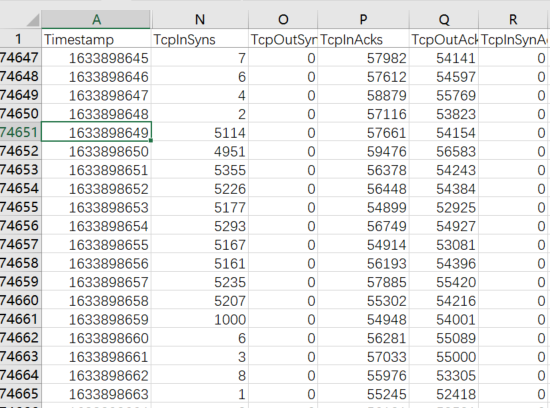
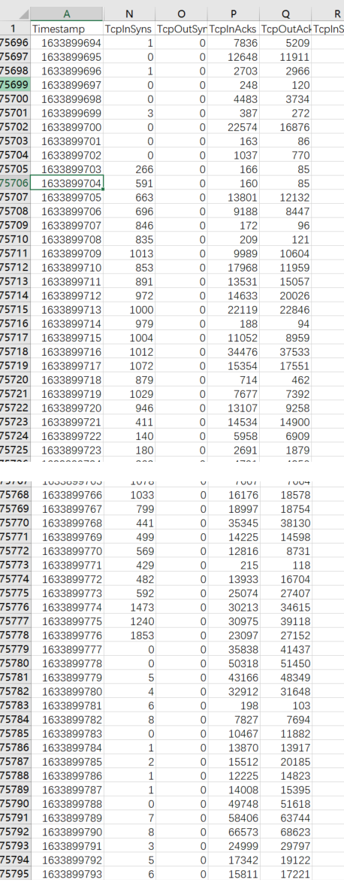
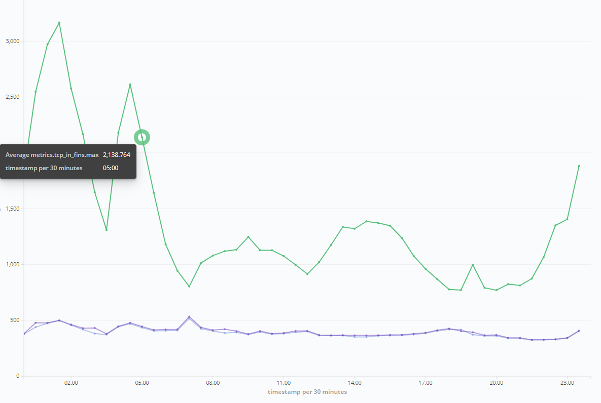
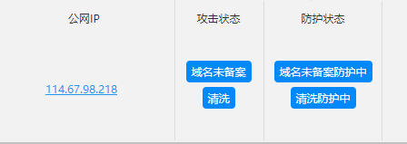
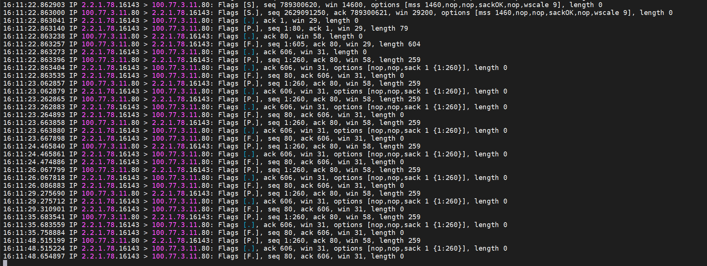

# 基于统计的攻击流量类型识别-调研 

## 涉及公式

标准差公式：
$$\sigma=\sqrt{\frac{\sum_{i=1}^n{(x-\overline{x})^2}}{n}}$$

CUSUM公式：
$$S_{H_{n+1}}=max(0,S_{H_n}+Z_n-w)$$
$$Z_n=\frac{X_n-\overline{x}}{\sigma_X}$$

其中 $\sigma{x}$为标准差，$\overline{x}$为算术平均数，$S_{H_{n}}$为当前时刻的累积和。

## SynFlood 分析

SynFlood 是一种阻断式服务攻击，攻击者发送大量伪造的SYN包，使服务器打开并维护大量半连接，从而造成无法为正常请求服务的一种攻击类型。

### Syn数据包统计分析

在正常情况下，流入的SYN包与流出的FIN包成1:1的关系，通过对流量最大100个IP地址的数据包类型的统计信息进行分析，发现 `InSYN:OutFIN` 包的比例主要出现 `2:1` 和 `1:1` 两种情况，`标准差`普遍在0.5以下（不统计每秒小于500个SYN包的情况）


怀疑`2:1`的情况为错误统计了清洗回注的流量。

### 使用CUSUM算法对SynFlood进行识别

**确认持续输入的变量: `TcpInSyns/TcpOutFins`**

```go
// InSynsDivOutFins Check SynFlood
func (i *Item) InSynsDivOutFins() float64 {
  if i.Metrics.TcpInSyns.Max < 500 { // 小于指定数量的syn包，不计算
    return float64(0)
  }
  if i.Metrics.TcpOutFins.Max == 0 {
    return float64(i.Metrics.TcpInSyns.Max)
  }
  return float64(i.Metrics.TcpInSyns.Max) / float64(i.Metrics.TcpOutFins.Max)
}
```

**确认CUSUM模型参数：**

```go
// 算术平均数： 2.2
// 标准差：   0.5
// weight:   4
p.synFlood = CUSUM.NewCUSUM(2.2, 0.5, 4)
```

**确认CUSUM模型警戒线：**

当累积和达到一定的数值时，则触发告警；此值越小则检查越灵敏，误报的可能性增大；越大则检查越迟钝，漏报的可能性增大。这里简单使用100进行检查。

```go
p.synFlood.Add(it.InSynsDivOutFins())
if rh, _ := p.synFlood.Result(); rh > 100 {
  p.synFlood.Reset()
}
```

**结果确认：**

==> 发现IP地址为`106.39.168.3`在timestamp为`1633898649`时发生SynFlood攻击，持续到`1633898659`止。

```
MEAN:  ./data/106.39.168.3.txt  0.426843  42.899501
-> CUSUM SynFlood:  ./data/106.39.168.3.txt  1633898649  2037.200000   5114   5
-> CUSUM SynFlood:  ./data/106.39.168.3.txt  1633898650  9893.600000   4951   1
-> CUSUM SynFlood:  ./data/106.39.168.3.txt  1633898651  10701.600000  5355   0
-> CUSUM SynFlood:  ./data/106.39.168.3.txt  1633898652  5217.600000   5226   2
-> CUSUM SynFlood:  ./data/106.39.168.3.txt  1633898653  5168.600000   5177   2
-> CUSUM SynFlood:  ./data/106.39.168.3.txt  1633898654  10577.600000  5293   0
-> CUSUM SynFlood:  ./data/106.39.168.3.txt  1633898655  2058.400000   5167   5
-> CUSUM SynFlood:  ./data/106.39.168.3.txt  1633898656  5152.600000   5161   2
-> CUSUM SynFlood:  ./data/106.39.168.3.txt  1633898657  10461.600000  5235   0
-> CUSUM SynFlood:  ./data/106.39.168.3.txt  1633898658  10405.600000  5207   0
-> CUSUM SynFlood:  ./data/106.39.168.3.txt  1633898659  1991.600000   1000   1
```

与原始数据进行比对，发现此刻Syn包有明显增多的趋势，持续时间为11秒，检查结果符合预期。



==> 发现IP地址为`106.39.164.60`在timestamp为`1633899704`时发生SynFlood攻击，持续到`1633899776`止。
```
MEAN:   ./data/106.39.164.60.txt	0.533345	22.788553
-> CUSUM SynFlood:   ./data/106.39.164.60.txt	1633899704	582.600000	   591   2
-> CUSUM SynFlood:   ./data/106.39.164.60.txt	1633899705	1317.600000	   663   0
...... 这里是省略号
-> CUSUM SynFlood:   ./data/106.39.164.60.txt	1633899773	1175.600000	   592   0
-> CUSUM SynFlood:   ./data/106.39.164.60.txt	1633899774	2937.600000	  1473   0
-> CUSUM SynFlood:   ./data/106.39.164.60.txt	1633899775	2471.600000	  1240   0
-> CUSUM SynFlood:   ./data/106.39.164.60.txt	1633899776	3697.600000	  1853   0
```

与原始数据进行比对，发现此刻Syn包有明显增多的趋势，持续时间为11秒，检查结果符合预期。




## FinFlood 分析

### Fin数据包统计分析

在正常情况下，流入的Fin包与流出的FIN包成1:1的关系，通过对流量最大100个IP地址的数据包类型的统计信息进行分析，发现 `InFin:OutFin` 包的比例比较符合`1:1` ，标准差普遍在0.5以下（不统计每秒小于500个FIN包的情况）

### 使用CUSUM算法对FinFlood进行识别

**确认持续输入的变量: `TcpInFins/TcpOutFins`**

```go
// InFinsDivOutFins Check FinFlood
func (i *Item) InFinsDivOutFins() float64 {
  if i.Metrics.TcpInFins.Max < 500 {
    return float64(0)
  }
  if i.Metrics.TcpOutFins.Max == 0 {
    return float64(i.Metrics.TcpInFins.Max)
  }
  return float64(i.Metrics.TcpInFins.Max) / float64(i.Metrics.TcpOutFins.Max)
}
```


**确认CUSUM模型参数：**

```go
// 算术平均数： 1.1
// 标准差：   0.5
// weight:   2
p.finFlood = CUSUM.NewCUSUM(1.1, 0.5, 2)
```

**确认CUSUM模型警戒线：**

当累积和达到一定的数值时，则触发告警；此值越小则检查越灵敏，误报的可能性增大；越大则检查越迟钝，漏报的可能性增大。这里简单使用100进行检查。

```go
p.finFlood.Add(it.InFinsDivOutFins())
if rh, _ := p.finFlood.Result(); rh > 100 {
  p.finFlood.Reset()
}
```

**结果确认：**

==> 发现IP地址为`114.67.98.218`在全天的流入的Fin包都超过警戒值，查看全天Fin的比例关系如图：



通过查询运营后台数据，发现该IP地址处于未备案域名拦截状态：




由于未备案域名会触发一个Fin包，用来终结用户的请求，客户端会重复发3个或10个Fin包来与服务器确认连接关闭：



**除了未备案域名拦截的情况，未出现其他可能是FinFlood的情况**
