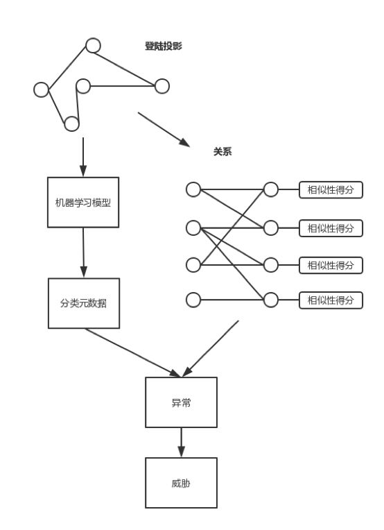
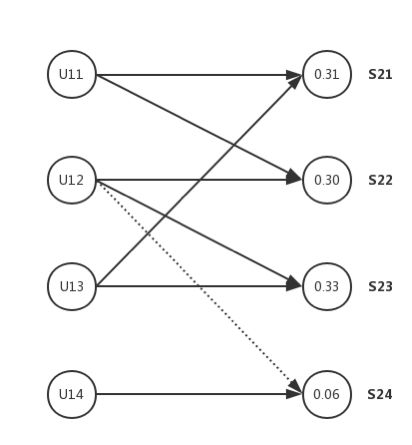
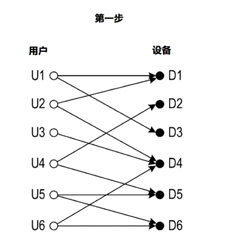
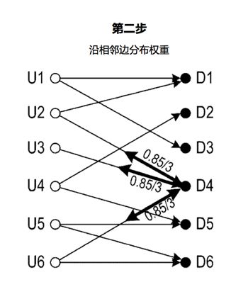
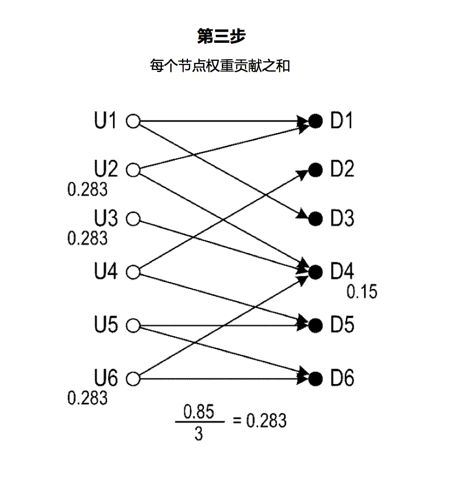
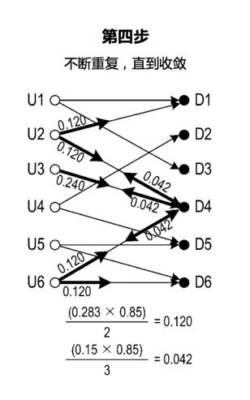
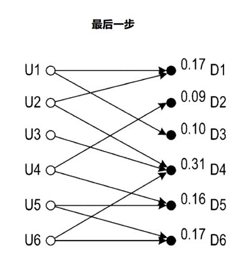
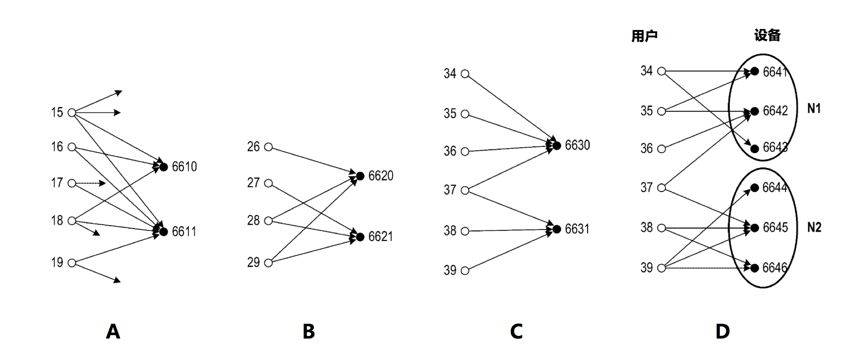
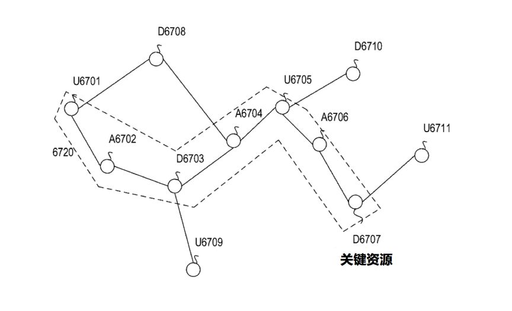

# UEBA架构设计之路(七)：横向移动检测

> 本文介绍了UEBA的横向移动检测。

作者：mcvoodoo

## 上篇引言

UEBA通过机器学习对用户、实体进行分析，不管这种威胁是不是已知，也包括了实时和离线的检测方式，能得到一个直观的风险评级和证据分析，让安全人员能够响应异常和威胁。

后面的章节则会介绍各种组件的细节，包括数据接入和准备引擎，处理引擎，实时/离线配置，机器学习模型和不同应用，交互等。

## 横向移动检测

用户可疑横向移动，通常说明用户证书密码被盗，或设备已被木马控制。横向移动检测是基于用户和设备之间的关系，给各设备分配相似性得分，设备和用户之间是关系，而相似性得分说明设备和用户的相似性。另外也基于登陆事件和设备分类元数据，解释相关性。当用户与常用设备相似性得分有明显差别时，检测出异常。

机器学习模型在这里的作用是生成分类元数据，分配相似性分数。下图则是横向移动检测框架图：

机器学习模型分析事件数据，图上是一个登陆投影，基于这个投影，模型为每个设备和用户生成分类元数据，分类元数据的作用是解释用户与设备的相关性，表示用户是普通用户、管理员或系统账号，对设备则可以表示办公终端、服务器、打印机等。所以上层模型可以实现自动识别用户、设备类型。

机器学习模型识别用户与设备之间的关系，如果事件数据包括登录相关，则模型可将使用关系指示为用户登陆事件。右侧是关系图，左边组是用户，右边组是设备节点，两组是不相交集合。二分图中每个边都将用户和设备相连，另外关系还表示事件时间顺序。

基于使用关系，模型给设备分配相似性得分，相似性得分指示哪个设备被相同或类似用户组使用。换句话说，相似用户登陆设备倾向于具有相似性得分。

上图是用户和设备的二分图示例，左侧是用户节点，右侧是设备节点，U11、U13登陆到S21，U11、U12登陆到S22，U12和U13登陆到S23，因此S21、S22和S23是与用户相似组关联。这个相似用户组就是U11、U12、U13。

注意U12在登陆到S24的时候是个虚线，表示特定登陆，而登陆S24的只有U14，这和U21、U22、U23显著不同了，这种差异反映在相似性得分分别为0.31、0.30和0.33。而S24相似性得分只有0.06。

当U12登陆到S24（虚线），模型确定S24得分0.06，无法满足常用设备相似性得分标准，这个标准可自定义，本例假设为0.255.这时模型检测到异常。

模型进一步分计算用户异常分数来判断异常，异常分数表示威胁相关可能性，可基于设备相似性得分的统计度量差异来计算，例如平均值。在这个例子中，设备S24相似度得分0.06，S22和S23平均得分0.315，相似性得分差异为0.255，模型把0.255和额外权重0.1相加得到0.355的异常得分，额外权重意思是这个设备的资产重要性。由于0.355超过0.3的阈值，所以报出异常。

不止于此，模型可基于用户的基线检测异常，这个基线包括用户和设备的相似性，例如U12的基线，与S22和S22相似性得分差异是0.03，并且小于阈值0.1。基线还包括登陆失败、成功、访问成功、访问失败等。

模型可以以各种方式向设备分配相似性得分，上图是过程。模型接收二分图，对设备D4分哦诶初始权重值1，这个过程可以随机，权重值也可以不等于1。

第二步，模型6300在设备节点D4处保持初始权重值1的百分比（15％），并且将D4的初始权重值1的剩余部分沿着D4的边缘均等地分配到节点U2，U3和U6。这个分配过程可视为马尔可夫链过程。在每个步骤中，值分配具有15％的概率（因此也称为“概率百分比”）以保持与前一步骤中相同。 值分配具有（100％-15％= 85％）概率跟随节点的边缘移动到另一节点。

第三步，节点D4保持权重值0.15（= 1 * 15％），剩余部分均等分配给U2、U3、U6，每个节点接收权重值0.283（= 0.85 / 3）。

对每个节点，模型沿边分配，直到D1-D6的权值收敛。对于D4，模型对其保持0.023(=0.15*15%)的权值，并将0.042(=(0.15*85%)/3分配给U2、U3和U6。U2，模型保持权值0.042(=0.283*15%)，并将0.120(=(0.283*85%)/2分配给D1到D4。

同样，对于U3，模型保持权值0.042(=0.283*15%)，将0.241(=(0.283*85%)/1分配给设备D4。对于用户节点U6，模型在用户节点U6上保持0.042(=0.283*15%)的权值，并将0.120(=(0.283*85%)/2分配给设备节点D4-D6。

模型继续迭代过程，直到D1-D6处的权重值收敛。在迭代的步骤中，对于每个节点，模型在节点处保持15％的权重值，然后沿边将剩余的权重值均等地分配给其他节点。收敛标准可以是指示这种收敛的任何标准，例如，当每个节点处的两个连续步骤之间的权重值的变化小于阈值时，模型可以确定迭代过程达到收敛。

最后，迭代过程达到收敛时，显示具有收敛权重值的最终步骤的状态。D1-D6的收敛权重值是分配给这些设备的相似性得分。

上图从A到D线了模型确定相似性二分图的示例。在A中，6610和6611有很多共同用户，因此趋向于接近的相似性得分。

图B，6620和6621有多个共享专用用户28和29，专用用户是仅和6620、6621交互的用户，因此20和21趋向于接近的相似性得分。

图C，6630和6631仅有单个共享用户37，因此6630和6631具有较大差异的相似性得分。

图D，6641、6642、6643是与用户类似的基团（N1），而6644、6645、6646也是类似的基团(N2)。如果把用户37移除，则基团分为两部分。用户37是连接到两组的唯一用户，与N2的6645交互，和N1的6642交互，触发组外访问异常，因为6642的6644的相似性分数差异很大。

检测到的组外异常，表示用户的可疑横向移动。基于异常，模型可以进一步确定异常是否导致安全威胁，如上图。其中U代表用户，D代表设备，A代表异常节点，这个图表达了：用户节点U6701访问了不常见的D6703。模型并不只是登陆关系，还包括其他类型诸如黑名单异常等。

A6704表示信标异常，信标异常意思：D6703设备周期性向与用户节点U 6705用户相关联发送可疑信标消息。

6720圈出来的部分是威胁的关系路径，从用户节点U6701和异常节点A6702开始，以异常节点A6706和设备节点D6707结束，D6707表示关键资源设备，可能是域控之类。威胁沿着关系路径，由一系列异常组成。

> 声明：本文来自唯品会安全应急响应中心，版权归作者所有。文章内容仅代表作者独立观点，不代表本网站立场，转载目的在于传递更多信息。如有侵权，请联系 anhk@ir0.cn。

> 原始链接：https://www.secrss.com/articles/10007