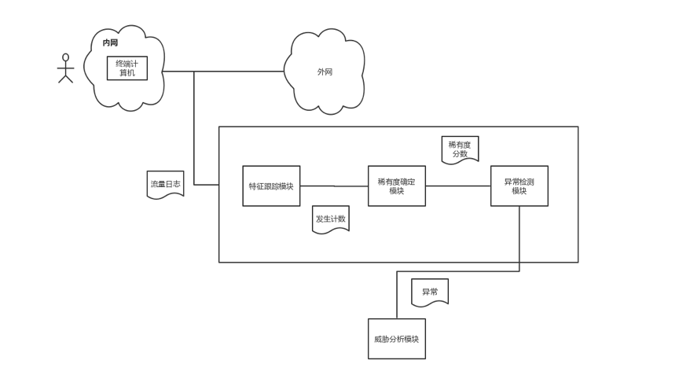
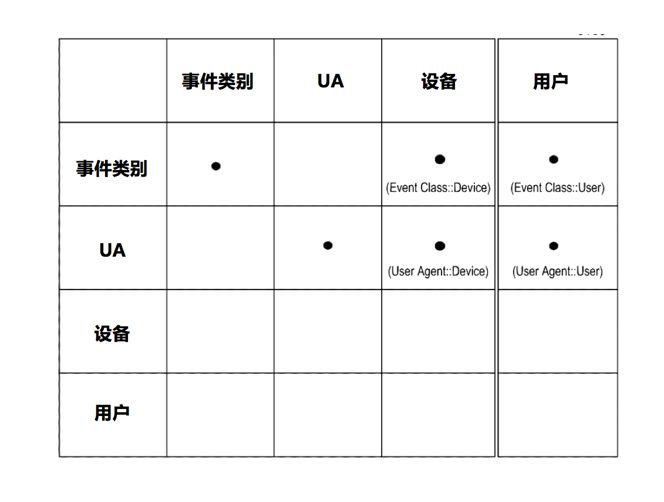
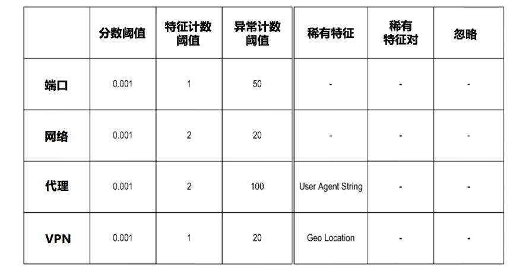
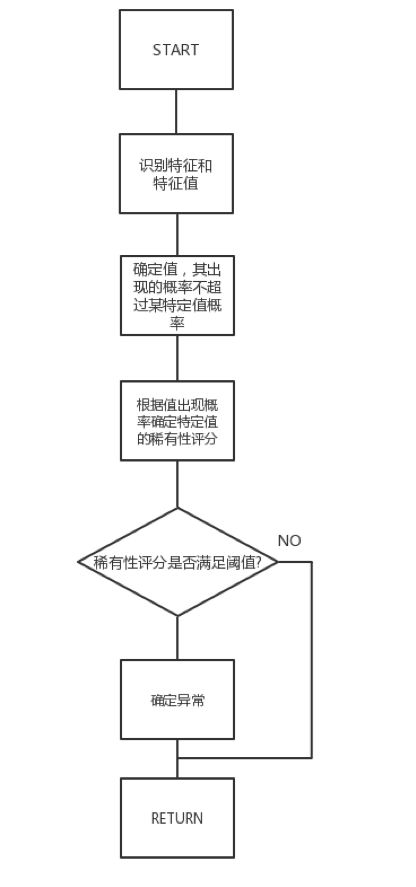

# UEBA架构设计之路10： 稀有度分析

> 本文介绍了UEBA的稀有度分析。

作者：mcvoodoo

## 上篇引言

UEBA通过机器学习对用户、实体进行分析，不管这种威胁是不是已知，也包括了实时和离线的检测方式，能得到一个直观的风险评级和证据分析，让安全人员能够响应异常和威胁。

后面的章节则会介绍各种组件的细节，包括数据接入和准备引擎，处理引擎，实时/离线配置，机器学习模型和不同应用，交互等。

## 稀有度分析

稀有度分析可以用来检测事件异常，通过计算数据特征的稀有度分数确定得分。在实际应用中，这些特征包括：流量字段的用户名、源区域、目标区域、端口、应用名、接收设备IP等。这些特征可以有高基数，例如端口号特征就具备多个值：22、20、23、25、80等。流量特征例如80端口比其他端口更频繁。

稀有度是该特征相对其他值发生概率的函数，主要考虑与该特征一样，或不太可能的值，以确定相对概率，然后计算稀有度分数，已知方法主要是delta方法。

稀有度分析也可确定多个特征的稀有度分数，特征对（X，Y）的稀有度分数表示当“Y = p”时观察到的“X = a”罕见程度，或当“X”时观察“Y = p”的罕见程度= a。例如，数据从A到B，从C到B，从D到B，，当目标区域为B时，稀有度分析可以观察源区域A的罕见程度。

稀有性分析的模型可以通过模型注册表订阅事件视图，通过事件视图模型访问流量数据，执行分析，流量中任何一个事件包括一个或多个特征，特征跟踪模块负责识别相关特征并计数，例如端口特征会多次出现，其中一些特征都有相同的端口号，第一数量事件是80，第二数量可能是20、22、23。因此特征跟踪模块存储计数和事件特征对。

稀有性确定模块确定每个特定值的稀有度分数，首先根据与特定值可能/不可能的概率来确定，概率则根据每个值总出现次数相关确定，同时从特征跟踪模块获得计数数据。

确定概率后，稀有度确定模块计算稀有度分数的概率置信区间，例如在95%处计算，稀有度分数可以是0-1之间的值，用delta方法计算置信区间，delta方法确保稀有度分数介于0和1之间。

稀有性确定模块识别特征值集合，对于特定值，稀有度确定模块确定该组值的出现次数与特定值的总和，表示为“k”。确定特征的出现总数，表示为“n”。确定稀有度分数特征值的特定值作为（k，n）的函数，例如，作为二项式（k，n）的置信区间。举例来说地理特征，从网络连接发起的IP位置，跟踪各国家出现次数：US：100，UK：30，IN：20，RU：3，CN：2，JP ：1，地理位置特征为US的事件发生了100次，稀有度确定模块将RU作为观察概率RU，CN，JP之和的罕见性，CN和JP出现的数量比RU少。因此稀有度分数确定为二项式的置信区间（k = 6且n = 156），其中k表示RU出现总和以及出现次数多于少于RU值的出现次数，n表示特征地理位置的总发生次数，RU的稀有度分数表示其他值观察值RU是罕见的。

异常检测模块基于稀有分数是否满足标准来确定异常，稀有度标准可以是得分阈值，异常计数阈值的元组，分数阈值指定稀有分数的阈值，异常计数阈值指定被识别为异常次数的阈值。如果特定值被识别为异常次数超过阈值，则异常检测模块不识别为异常。如果特定值已经发生足够的次数，也可以确定特定值不再被视为异常，因此可以动态地调整稀有度标准。

上图是用于确定事件是否异常的特征对表，事件包括特征有：事件类，也就是事件类别; UA; 设备，可以是IP、用户等。如图所示，如果上面略出的特征满足稀有性标准，则确定异常。确定稀有度可增加一些附加参数，例如异常特征对数量，事件特征对等。

上图是稀有度标准阈值，阈值包括分数阈值、特征计数阈值、异常计数阈值，参数包括稀有特征、稀有特征对和忽略。例如端口到应用的数据发送，得分阈值为0.001，特征计数阈值为1，异常计数阈值50，有特征、稀有特征对、忽略设置为空。这些阈值可被配置，如果特征大量出现被识别为异常，则系统应可动态调节阈值。

上图是根据稀有度分数确定异常的过程图。特征跟踪模块首先识别流量特征，可以是VPN，IP归属地等。第二步识别一组特征值，这个组出现概率不超过特定值的概率，也就是说，特征跟踪模块识别流量中可能和不可能值的集合，而不是特征的特定值。

第三步，稀有性确定模块确定稀有度分数，也就是该组值出现概率的函数。第四步，确定是否满足稀有度标准，满足标准则判断异常，否则返回。

确定稀有度分数的流程则是：

1. 特征跟踪模块识别一组特征值，例如前面提到的例子，特征跟踪模块确定已经发生多于或少于RU位置的集合，其次是CN和JP，特定值RU和值组CN和JP的出现之和确定为（k = 6）。
2. 特征跟踪模块确定特征的总发生次数，确定地理位置特征的出现总数，为（n = 156）。
3. 稀有度确定模块通过计算参数（k，n）的置信区间来确定稀有度分数
4. 稀有度确定模块8将RU的稀有度分数确定为参数的95％置信区间（k = 6且n = 156）。RU的稀有度分数表示相对于其他位置，观察到地理位置的发生为RU是罕见的。

> 声明：本文来自唯品会安全应急响应中心，版权归作者所有。文章内容仅代表作者独立观点，不代表本网站立场，转载目的在于传递更多信息。如有侵权，请联系 anhk@ir0.cn。

> 原始链接：https://mp.weixin.qq.com/s/alerzXPzPZtqOZlhNShypg