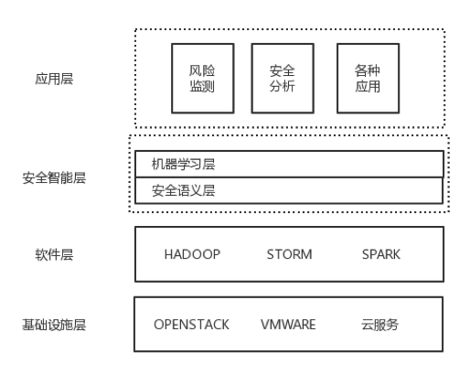
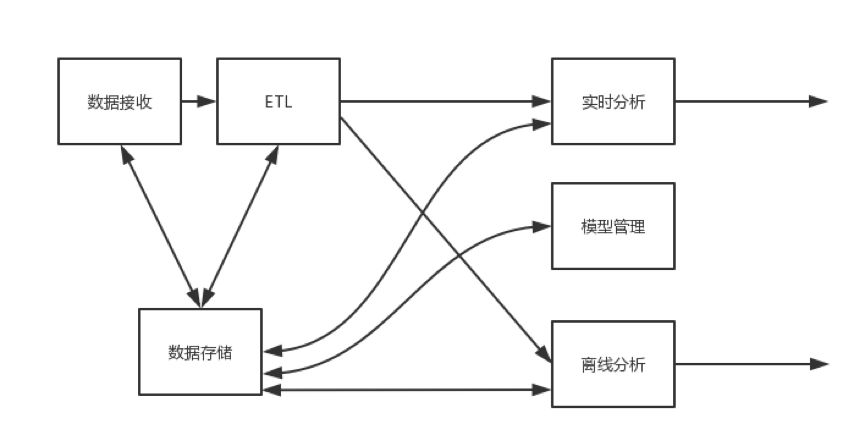
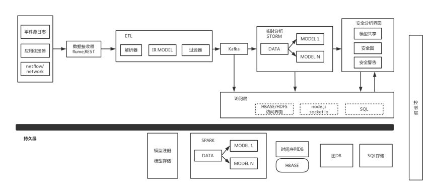
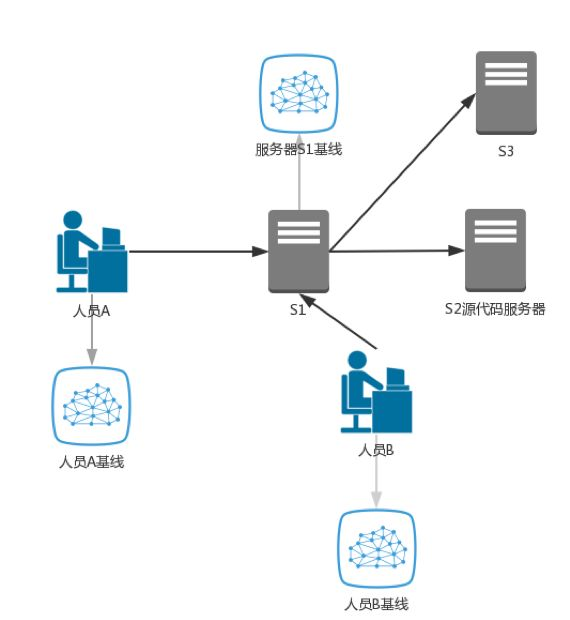

# UEBA架构设计之路 (一)：UEBA框架

> UEBA通过机器学习对用户、实体进行分析，不管这种威胁是不是已知，也包括了实时和离线的检测方式，能得到一个直观的风险评级和证据分析，让安全人员能够响应异常和威胁。本文介绍了UEBA的整体框架。

作者：mcvoodoo

## 前言

一直以来大家都在用各种技术和机制检测安全威胁，从早期的SOC到SIEM，再到现在大数据驱动的UEBA。UEBA通过机器学习对用户、实体进行分析，不管这种威胁是不是已知，也包括了实时和离线的检测方式，能得到一个直观的风险评级和证据分析，让安全人员能够响应异常和威胁。

## 背景

恶意检测一般通过对异常行为设定规则来判断，也会使用各种防御设备监控流量，例如IDS，WAF等。但这些系统的扩展性始终是个问题，当流量突发增长时很难跟得上，同时基于流量的检测可见性也不够，在交换机的接入层基本上由于成本原因，就无法再进行检测了，更不能通过其他网段的上下文来辅助，攻击如果巧妙一点，完全可以绕开这些设备。

软件是另外一种办法，在终端上监控设备之间的数据，但一样，软件的可扩展性、可见性也不令人满意。

实际上，如果设备和用户是可信的，现有的很多方法都检测不到。传统安全产品的缺点是无法检测未知威胁和内部威胁，无法扩展，难以处理大数据。而且攻击者总能找到绕过传统安全技术的方法，比如规则驱动的恶意文件签名，沙盒。此外随着数据量的增加，人工分析越来越慢，响应速度过长。举例来说杀伤链，从入侵到横向移动到渗透，传统安全产品很难关联并作出适当响应，容易被大量误报淹没。

UEBA相对来说具有洞察力和可扩展性，简单说UEBA是大数据驱动，且采用机器学习方法进行安全分析，能够检测高级、隐藏和内部威胁的行为分析技术，不需要使用签名或规则。在杀伤链上能关联数据，进行有针对性的发现，这些分析技术包括机器学习、行为建模、分类、对等组分析、统计模型和图形分析。分析结合评分机制，对比活动，最终实现异常和威胁的检测。同时，UEBA还包括威胁可视化，以可视的方式跨越杀伤链分析。

因此UEBA一个特点就是要能处理多个数据源的大量数据，这些数据源格式不同，速率也很快，后续的数据处理能够从结构化/非结构化提取有价值信息，数据处理是数据挖掘和预测分析领域的延续扩展，也是一门单独的学科：知识发现和数据挖掘。数据源分为实时和离线，实时连续监测分析传入数据，一般不考虑历史数据和第三方数据关联，因为对性能有影响。

UEBA检测到的是“异常”，异常是说和预期行为发生了变化，变化不一定是威胁，例如大促活动就会带来变化。异常表示需要引起关注，评估后给出威胁判断，威胁指标则代表了关注度的逐级上升。比如通过数据源产生了100个异常，进一步聚合为10个威胁特征，再次产生了1-2个威胁指标，这种数据扩展的方式让UEBA能够进行异常和威胁检测。

在机器学习背景下，历史数据和第三方数据都可以用来改进模型，但这些数据要比实时大的多，所以也比较慢。因此一般不把历史数据用在实时处理，即使用也以实时数据为主。实时检测后需要触发动作，例如封IP，锁定账户，杀进程，误报解除等，这些动作可以不是直接拦截，而是提供出来进行人工决策，这些决策的反馈，进一步更新改进模型。

离线处理可以发现更微妙的异常和威胁，实时处理是有短时间决策约束的，离线在这方面要宽松很多。实时处理的数据是经过过滤的，完整的数据存为离线，因此离线可以有更多属性，跨越时间地理等信息。

## 系统整体框架

整体视图上，底层是基础设施层，考虑到成本问题，可以使用各种虚拟化。基础设施层上面则是软件层，一般包括Hadoop，spark，storm等。Hadoop进行分布式存储和处理超大集群数据集，storm是分布实时计算引擎，对数据流进行实时记录计算，Spark是大规模数据处理引擎，把事件收集在一起进行批量处理。

再上面则是智能层，这一层主要功能是安全语义层和机器学习层，语义层提取转换加载数据，供给下游消费，机器学习层是语义层的消费者。

智能层上面是应用层，机器学习的输出由应用层分析。

这张图是系统内的一个概念图，数据接收模块是个负责从数据源接收数据的逻辑组件，包括了各种通信的API。ETL做数据准备，把数据接收模块的数据进行预处理，例如添加元数据，目标是为了让下游有效消费。

ETL把数据处理好，实时传递实时分析，也通过批处理路机构传递给批处理离线分析。实时数据是流式传输，逐个记录的，离线数据则是在固定时间窗口批量集合传递，所以离线分析器还可以进一步获得附加历史数据，实时分析器的结果和过程数据。

上图是整体架构了，数据源部分收数据，日志类数据例如用户登录和访问事件，数据可从操作系统和安全系统（如防火墙、安全软件）生成。应用类数据源，根据情况不同有推/拉或混合机制，这里的数据例如HR系统，CRM系统等。最后一个类别是网络数据源，例如流量类，也包括从网络操作系统获取。

数据源将数据提供给接收器，接收器有各种API和连接器，并且需要能够可选过滤，这部分主要技术是Flume和REST，Flume是开源分布服务，用来收集、聚合、传输大量日志数据。REST是访问大型数据库的界面。

数据进一步提供给语义处理器解析数据字段，也可补充数据，比如IP和身份的关联，这里的技术实现是Redis。语义处理器中也需要过滤器，对一些无需处理的事件过滤，比如数据在两个IP之间的内部备份，安全上无需进行处理的话则过滤掉。其他可配置属性也很重要，对数据的解析配置，关联用户和IP，数据属性关联外部属性，也可用来调整过滤器。

数据处理后到分发模块，分发给实时和离线处理。

实时可以用Storm或Spark Streaming，这里还有进一步的分工，后面会详细说。不同的机器学习模型可在此进行分析，并且生成安全相关评分。

评分后的指标提供给UI用户界面，用户界面中包括可视化地图、威胁警报等，也同时可以直接输出action，监测到的数据持久化存储在数据库。如果安全人员需要调查，则从数据库捞数据。如果是误报，将分析结果反馈给数据库。

在事件调查时，安全人员可能需要多种渠道获取数据，因此这里提供一个访问接入层，访问层包括了各种数据库和用户界面的API。

离线的基础设施包括，SQL访问SQL存储库，存储时间戳的时间序列数据库，图数据库。图表示实体与异常之间的关联，用户之间的交互，时间上的序列，异常节点等，另有一些附加注释。因此图数据是数据分析的一个重要工具。

离线批量分析可以从时间序列、图数据、SQL存储获取数据，也从外部获取其他三方数据。模型管理则包括模型注册和存储，注册存储模型的类型定义，存储则存储模型状态。

还有一些其他零碎模块：模型有个需求是和其他模块共享，例如跨国公司，基础设施部署地不同，安全图也可以共享。底层是Hadoop。另外也需要一个控制层，监控平台自身运作情况。

在实时处理中分为两个模块，分别代表异常检测和威胁检测阶段，异常分析的输出给威胁分析模块，在实践中，这两个阶段可以是相同模块分阶段，用不同模型执行。

异常检测输出到异常编写器，异常编写器的作用是把异常信息存储到数据库，也同步在时间序列数据库、HBase、图数据库。事件确定异常后，更新事件关联关系图，关系图建议是按频率例如每天一次聚合。同样异常分析输出也是一样的存储方式。

## 用户实体行为分析（UEBA） 

UEBA通过各种交互实体的行为基线检测异常和威胁，通过和基线比较确定，平台则根据数据自适应改变行为基线，支持多个机器学习模型。

上图是行为基线构建过程，例如人员A使用服务器S1访问源代码服务器，这是日常工作，偶尔也会访问访问服务器S3。因此平台基于人员A的网络访问活动形成基线。人员B也是如此。

但实际上，不仅可以为用户生成，也可为任何类型实体创建基线，包括用户，组，设备，设备组，应用等。上面这个例子，也可根据服务器S3生成基于时间的基线。基线可以根据新接收的时间持续更新（包括实时和批量），也即是可自适应的更新。假设人员B开始频繁访问S1服务器，且这种访问被判断为合法，他的基线则被自动更新。

通过传入事件数据，与实体基线比较进行检测。变化的阈值可以静态/动态定义，超过阈值则认为异常。比较可以基于多种技术，例如时间序列分析判断每小时登陆数，机器学习或图分析，检测有各种机器学习模型执行。

以上是整体框架。后面的章节则会介绍各种组件的细节，包括数据接入和准备引擎，处理引擎，实时/离线配置，机器学习模型和不同应用，交互等。

> 声明：本文来自唯品会安全应急响应中心，版权归作者所有。文章内容仅代表作者独立观点，不代表本网站立场，转载目的在于传递更多信息。如有侵权，请联系 anhk@ir0.cn。

> 原始链接：https://www.secrss.com/articles/7064