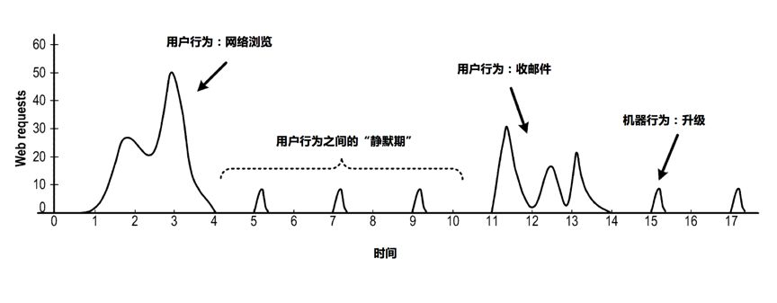
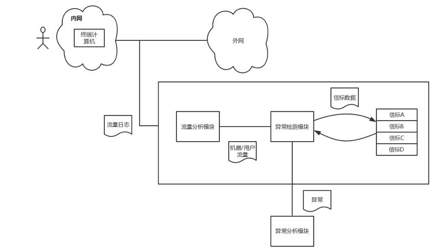
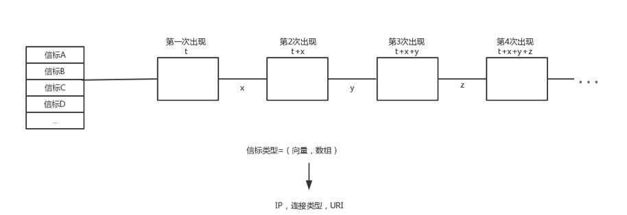
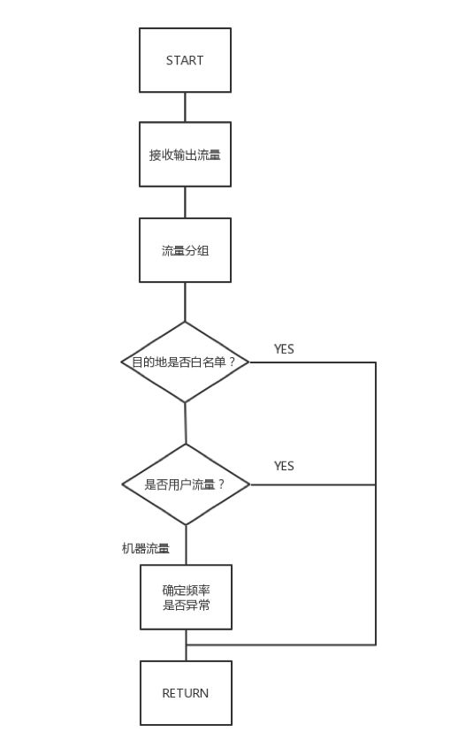
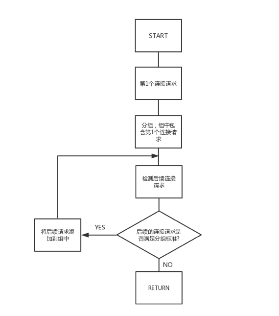
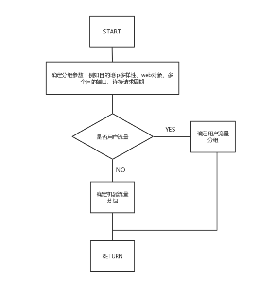

# UEBA架构设计之路 (九)： 信标检测

> 本文介绍了UEBA的信标检测。

作者：mcvoodoo

## 上篇引言

UEBA通过机器学习对用户、实体进行分析，不管这种威胁是不是已知，也包括了实时和离线的检测方式，能得到一个直观的风险评级和证据分析，让安全人员能够响应异常和威胁。

后面的章节则会介绍各种组件的细节，包括数据接入和准备引擎，处理引擎，实时/离线配置，机器学习模型和不同应用，交互等。

## 信标检测

恶意软件有很多检测方法，例如根据每个IP通信双方的流量检测，其中包括IP黑名单、发生频率等手段，但这些技术都有缺点。如果这些传出流量的IP是一个开放接口，就很可能产生误报，但最大的问题是网络中的服务数量越多，复杂度越高，而且对于实时监控也是个挑战。

恶意软件需要和控制服务器通信接受指令，而且这个通信是定期的。恶意软件生成的流量和用户生成有不同模式，但大多数技术都无法识别这个区别，因此这里是可以检测恶意软件的特征。

传出流量可能包括用户流量如网站访问、电子邮件、下载软件。还会包括合法/非法机器流量，例如应用更新、设备时间同步、心跳、恶意软件流量掺杂。机器流量有一些信标特征，所谓新标是指周期性、规律性信号发送。

技术上需要区分用户和机器流量，如果是机器流量则需判定流量是良性还是异常，有一些方法例如启发式、白名单确定是否良性。但实际上还有更多参数，例如请求数量、周期性、web对象数量、目的IP、目的端口数等。

上图是一个设备在17秒内的传出流量示意图，传出包括用户和机器流量两类。当用户活动时生成大量连接请求，当用户不活动时进入静默期，我们需要检测静默期，分析流量异常。

第一个用户网页访问，在4秒内生成接近50个请求，请求发给不同服务器获得网页、图像、CSS等，网页完成后流量迅速下降到0。也就是：连接数量迅速增加或减少。

紧接着进入机器流量，请求较低，一直都未超过10。也就是：与用户流量比，请求量低。此外连接更有周期性，每2秒出现一次。

总结为：用户活动有明显流量增加，连接请求多，非周期性。机器流量则具有周期性。

区分机器和用户的参数示例：

1. 时间段内连接数量
2. 连接周期性
3. 连接不同IP数量
4. WEB请求数量
5. 目的地端口数量
6. 目的地URI

假设对上图中的终端计算机出流量进行检测，终端计算机的出方向分别是内外部网络，系统通过流量日志检测，流量内容包括网络流量、IP流量、Web流量等，例如Web流量包含HTTP消息，可以和目的IP，目的URI，端口号，GET或POST等参数相关联。IP流量可以和目的IP地和端口号之类的参数相关联。

流量分析模块检测是否机器流量。如果是，则交给异常检测模块判断良性还是异常。确定异常，则传递给威胁分析模块，并生成警报。

在检测机器流量部分，流量分类模块分析流量中的连接请求，确定用户流量还是机器流量，可以按照20秒时间分组。然后根据前面说到的参数判断，例如周期性，分组中每个连接请求的之间周期平均值，如果超过阈值则确定为机器流量，否则是用户流量。如果目的IP呈现多样性，超过指定阈值则确认为用户流量。同样还有，下载的web对象超过阈值、端口数量超过阈值等。流量分类模块可以配置为一个或多个参数。

异常检测模块进一步检测异常，从机器流量中提取信标数据，信标数据可以理解为目的IP、目的端口之类的参数，如果是HTTP连接则进一步提取GET、POST、URI。将信标数据和已知信标类型比较，确定是否异常。

上图是信标类型的高速缓存示例，异常检测模块把信标类型存在这里，然后进行比较匹配。如果匹配到，则将信标数据添加到类型中。通常恶意软件会定期和远控端发送信标，信标之间的间隙会小于指定阈值，连接请求之间的长间隙通常可以归属良性，例如定期更新应用，但这类远不如恶意软件的信标频繁。

在上图中，信标类型第一次出现在在时间t，第二次出现在时间（t + x）等，异常检测模块负责确定出现次数和之间的时间，如果组频率满足周期性标准，例如平均时间（平均值（x，y，z））满足指定的定时阈值，异常检测模块确定该组对应于其他组是异常。当组重复但周期性不满足时，例如平均定时（平均（x，y，z））不满足指定的定时阈值，异常检测模块确定组是否至少出现第二阈值数量，第二阈值数是否大于第一阈值数的时间，如果组发生第二次阈值，则确定为异常。如果两各周期阈值都不满足，则是良性。

整个过程如上图，首先流量分类模块接收流量，然后进行分组分析，分组通常根据时间段，细节接下来会说。

第三步确认这些访问是否归属在白名单，以减少误报，白名单包括IP、URI、目的端口等。如果是白名单，则不再监控。如果不是白名单，则进入第四步判断是否用户/机器流量，用户流量放过，机器流量进入异常检测。

分组过程图，第一步识别第一个连接请求，识别出后形成组，把这个请求添加到这个组。继续监控后续连接，确定后续连接是否满足分组标准，满足则添加到组。不满足则返回。

上图是用户/机器流量判断流程图，首先流量分析模块根据参数分析请求，然后判断是否用户流量，如果IP多样性超过阈值或下载web对象超过阈值，则判断为用户流量，用户流量停止分析返回。如果不是用户流量，则判断为机器流量。

> 声明：本文来自唯品会安全应急响应中心，版权归作者所有。文章内容仅代表作者独立观点，不代表本网站立场，转载目的在于传递更多信息。如有侵权，请联系 anhk@ir0.cn。

> 原始链接：https://www.secrss.com/articles/12141