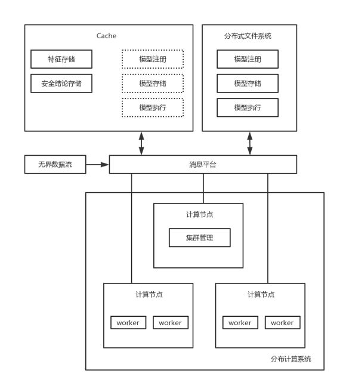
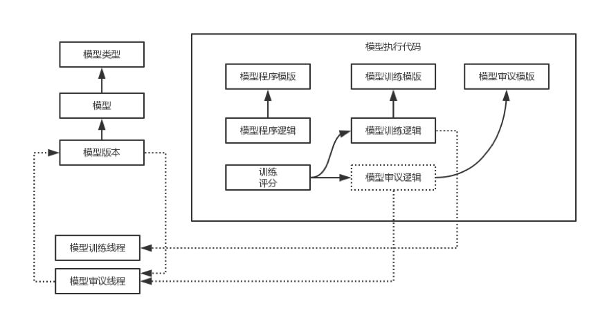
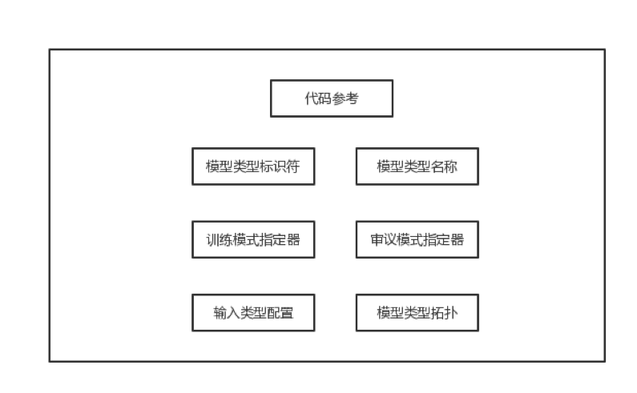
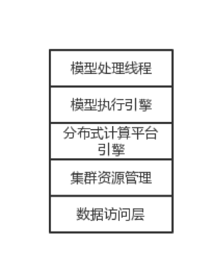
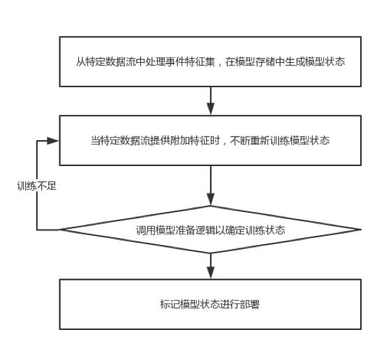
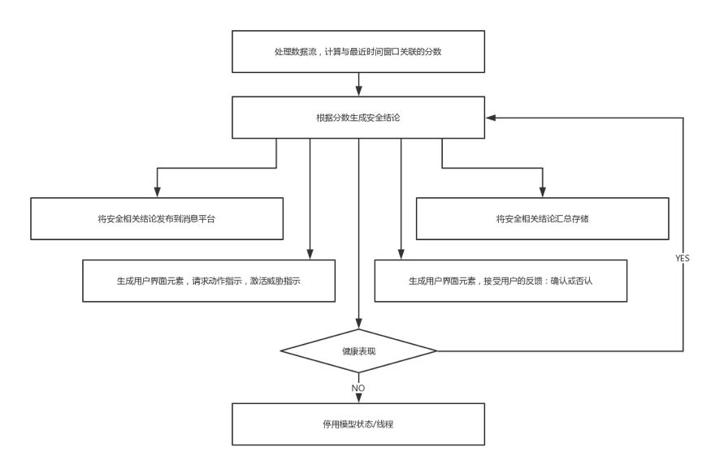

# UEBA架构设计之路(三)：复杂事件处理引擎

> 本文介绍了UEBA的复杂事件处理引擎。

作者：mcvoodoo

## 上篇引言

UEBA通过机器学习对用户、实体进行分析，不管这种威胁是不是已知，也包括了实时和离线的检测方式，能得到一个直观的风险评级和证据分析，让安全人员能够响应异常和威胁。

后面的章节则会介绍各种组件的细节，包括数据接入和准备引擎，处理引擎，实时/离线配置，机器学习模型和不同应用，交互等。

## 复杂事件处理引擎

复杂事件处理引擎跟踪分析数据流，这种数据流是无界的，也即是连续接收开放的数据序列，且终点未知。传统引擎都是基于规则的，规则的特点是计算简单，所以在实时计算中消耗较少。但规则的问题是针对已知结论的模式，对未知攻击无法识别，所以他不需要考虑历史事件。历史事件的增加，会对存储和处理能力都有新的要求。

UEBA系统使用基于ML的引擎，分布式训练和多机器学习模型的应用，模型处理事件特征集生成评分和结论。在实时处理中，收到数据，通过机器学习模型，立刻得到结论。事件特征集包括原始数据子集、关联的元数据、原始数据汇总和派生属性、标签以及这些内容的组合。通常事件处理引擎将输入输出都存放在非持久性存储器，提高I / O，减少时延。

引擎实时训练且更新模型，并可实时应用。引擎可在实时计算系统上实现，例如Storm可以实现任务的并行性，而不是数据的并行性。Spark和Apache Spark Streaming可以用数据并行来实现，分布式计算系统可以耦合到其他分布式组件，例如于簇的高速缓存Redis，分布式文件系统HDFS等。

与传统规则引擎比，能够识别未知模式，能够结合历史数据且不让计算负担过重。不仅可使用无监督模型，还可支持监督、半监督。引擎基于历史事件训练决策树，这种情况下决策树优先于规则，因为可以基于历史事件序列决策。引擎也可训练状态机，状态机不仅基于历史事件序列训练，也能应用。在处理特征集时可以跟踪实体多个状态，每个运行时状态表示实体历史，而不必跟踪实体的每个历史事件。

模型执行多种类型的分析，来自上下文各种事件数据源，各种关联的细粒度级别。举例来说，模型可对特定实体的行为分析，事件的时间序列分析，实体活动的图形相关性分析，实体对等分析和组合。原始事件数据源包括网络设备、应用服务、消息服务、终端设备等，上下文设置包括网络场景、登陆场景、文件访问场景、应用执行场景和组合。模型的输出则包括异常、威胁、威胁指示，并且通过多种手段呈现输出。

**对实体的行为分析手段有很多，例如：**

1. 概率后缀树（PST）
2. 协同过滤
3. 基于内容的推荐分析
4. 使用文本模型的白名单和黑名单统计匹配
5. 熵/随机性/ n-gram分析的分层时间记忆过程
6. 统一资源定位符
7. 网络资源定位符和域（AGD）
8. 罕见分类特征/关联分析
9. 实体的身份解析模型
10. 陆地速度异常/地理位置分析
11. 离散时间序列数据的贝叶斯时间序列统计基础（基于可变记忆马尔可夫模型和上下文树加权）
12. 周期性模式的动态阈值分析

**基于图形的实体活动分析的方法也很多：**

1. 命令和控制检测分析
2. 信标检测器
3. 设备，IP，域和用户信誉分析
4. 横向移动检测器
5. 用户/设备的动态指纹识别
6. 相似性和页面排名的实体分组
7. 社交邻域图聚类
8. 在线分布式聚类
9. 二分和通用图聚类

上图是事件处理引擎框架图，无界数据流作为输入，模型观察每个事件特征，得出结论。整个组件包括高速缓存组件、分布式文件系统、消息传递平台和纷飞时计算系统。也能支持对关系数据库的访问例如mysql，非关系存储访问HBase，事件序列数据库和图数据库。高速缓存组件也是分布式的，我们是在REDIS实现。

分布式文件系统将数据存在计算集群上，通过集群聚合提供带宽，包括了名称节点和数据节点，数据节点使用文件访问协议（块协议或文件协议）服务，这里是用Hadoop分布式文件系统（HDFS）实现。

分布式文件系统存储模型注册表、模型存储、模型执行代码库，有的设计也会把执行代码库作为模型注册表的一部分。模型注册表存储模型定义，用途是训练和应用机器学习模型的工作流。模型存储则表示机器学习模型、版本状态，模型状态将特征处理成结论。模型代码执行库存储处理逻辑和事件视图关联过程逻辑。

消息传递平台提供引擎和外部系统通信，这里是Kafka，负责接收无界流，高速缓存组件和分布式文件系统的数据发送到模型。

分布式计算系统是实时数据处理引擎，也是分布式计算集群，负责协调多个节点线程。每个计算节点是N个woker。

### 1、模型架构

引擎实现多个相同类型的学习模型，定义要训练和应用的工作流程，类型有模型注册表的模型类型来定义。

模型执行代码包括：

模型程序逻辑：描述了相关线程的数据结构和过程逻辑，程序逻辑参考训练和审议逻辑。

模型训练逻辑：将数据变成模型状态的更新，随着数据的更多输入可以更新模型状态。

模型审议逻辑：将数据转换成决策结论。

模型程序模板、模型训练模板、模型审议模板：所有类型模型之间的共享逻辑，可以限制为模型程序必须经过训练和审议逻辑。

### 2、模型类型定义器

模型类型定义用来训练应用模型的各种配置，其中包括模型类型标识符、模型类型名称、用于训练流程的处理模式指定器、审议模式指定器、模型输入类型配置、模型类型拓扑，处理模式指定器指明处理模式是实时还是离线。

输入类型配置：指定模型类型订阅哪些事件视图，事件特征集可以用视图标签来标记，引擎使用标签订阅提供给相关线程处理。

模型类型拓扑：引擎将线程分发给不同worker。指定同类模型的数据分配，这种分配既可以是数据互斥分区，也可是重叠。结合实际来理解，拓扑可以指定按照用户组分组数据，也可按照特征分组数据。

### 3、分布式计算系统

分布式计算系统实现集群资源管理，这里用的是YARN，集群资源管理实现计算平台引擎（例如Storm或Spark Streaming），在引擎上的进程可以访问数据访问层。数据访问层则提供关系数据库、图数据库、菲关系数据库、时间序列数据库、高速缓存组件、分布式文件系统。

分布式计算平台引擎可以实现模型执行引擎，然后模型执行引擎初始化模型相关线程，每个线程则是训练、审议的一系列程序指令。每个线程由分布式计算平台引擎独立管理。数据访问层可以使线程能够访问模型类型定义、模型存储、事件特征集。

### 4、拓扑

引擎基于拓扑选择数据和线程给worker，称为基于拓扑的分配。这里将拓扑和执行平台做了分离，拓扑负责分配维护定向非循环图（DAG）结构，这个结构的好处是可以动态执行线程和数据依赖，这样线程能在worker之间自由移动，可以提高模型处理性能。DAG还对安全、可伸缩性和模块化有益，在伸缩性上能够做到高速缓存、负载平衡、复制聚合数据流，模块化则在你对特定模型更新的时候，只影响相关worker。

### 5、模型训练流程

worker执行与模型关联的训练过程，如果模型状态还未存储，则根据训练逻辑产生模型状态。

当数据提供附加特征时，重新训练模型。一种是在没有相同输入数据递归或迭代情况下训练，一种则涉及增量。训练进行特征集隔离，仅重新训练其中这一部分。

接下来则训练到什么时候为止，则由模型准备逻辑来确定了，模型准备逻辑定义有多种，已经训练了多少事件、持续时间、模型状态是否收敛（阈值变化）等。模型不同逻辑也不同，当训练足够时，进入标记状态准备部署。

### 6、模型审议流程

模型审议线程处理时间窗口数据流，计算最近时间窗口的分数。引擎可在训练的同时继续创建新版本做模型审议，模型审议也可不暂停不重启重新配置。

接下来模型审议基于分数形成结论，分数与恒定阈值比较，或与动态基线比较得出结论。

一方面结论聚合存储，即可存在系统中，也可被分到分布式文件系统。另一方面将结论通过消息平台发布，使其他审议或训练模型可利用结论。

当结论表明威胁存在，生成用户界面元素触发消息动作指令，例如要求中止应用，拉黑流量或者账户。另一方面也需要分析师反馈结论，这时可根据反馈更新模型。

接下来检查健康情况，将计算得分和安全结论与其他模型比较，以确定偏差情况，如果超过一定百分比，则将健康状态置为失败，并且退出自身。

### 7、离线注意事项

处理引擎有实时和离线两种，离线有更多时间，因此主要用来处理更大量的数据，所以离线处理引擎的需求有两个，一是与分布式数据集群交互，而不是复制、移动数据；二是利用各种编程模型，例如MapReduce。

基于需求一，则要求系统可以发出指令，查询、操作HDFS连接器，因为下游处理可以取决于事件顺序，典型的场景如用户行为基线构建，所以HDFS连接器可以按照顺序检索存储事件。

需求二，离线模型可以被简化，以便和MapReduce兼容。简化模型可以映射到多个副本，每个副本仅处理特定数据集。然后可将副本所有生成信息缩减回模型，这样就获得了单个副本处理完整数据集相同的结果。也就是说，可简化模型可以并行处理数据。根据模型不同，训练阶段可能会缩小，但评分不会缩小。

离线处理引擎和HDFS连接器协作，直接访问存储在HDFS中的数据。这个功能的实现需要作业控制器，作业控制器在这里作为引擎管理器，和连接器一起使用。作业控制器使连接器针对HDFS数据库运行查询，并选择处理，典型场景是指定时间范围的查询，按事件时间排序。

有些类型的日志文件是高优先级的，需要连接器优先处理，通常这种高优先是丰富信息事件，能够提高整体分析的准确性。例如为了启用身份解析，优先处理DHCP日志，然后把用户数据和设备关联的日志，最后才是其他文件，连接器指定其排序。

对检索到的数据，作业控制器位引擎启动启动作业，跟踪进度，在完成和失败时标记。分析完成后，作业控制器可以执行其他任务，例如导出身份解析结果，导出时间序列数据，或推送到Kafka。

作业控制器对文件的检索可以基于时间，例如每小时一次或每天一次，连接器检索后，将批处理文件传给作业控制器，作业控制器又启动引擎分析。

引擎的另外一个合作是和目录编目，目录编目是个耦合到HDFS的数据库，让连接器能够确定解析文件和顺序。当连接器检索时间范围内的文件，首先引用数据库中的表directoryCatalog，检查是否存在需要处理的行，并存储它在数据库中运行的最后时间lastRunTime。如果连接器在directoryCatalog中找不到任何行，则爬取当前目录查看是否有需要处理的文件，遇到文件后检索文件的修改时间，如果早于lastRunTime则丢弃，否则进行解析。

如果连接器按照升序记录事件，则停止解析返回第一事件的时间。如果降序，连接器寻找文件结尾检索第一事件时间。如果未确定排序，连接器解析整个文件并返回第一事件时间。然后在数据库增加一条，包含文件名、第一个事件的时间。

离线引擎可以对实时中不可用的信息进行分析，例如复合关系图，因此离线引擎可以使用机器学习模型处理复合图投影。

离线引擎首先定位复合关系图，然后获取复合图投影，投影包括与机器关联用户的图，以便跟踪横向移动。投影可以是很复杂的，实体关联的用户图，用户网站活动图。

复合关系图投影模型在后面会有继续说明。

> 声明：本文来自唯品会安全应急响应中心，版权归作者所有。文章内容仅代表作者独立观点，不代表安全内参立场，转载目的在于传递更多信息。如有侵权，请联系 anquanneican@163.com。

> 原始链接：https://www.secrss.com/articles/8089