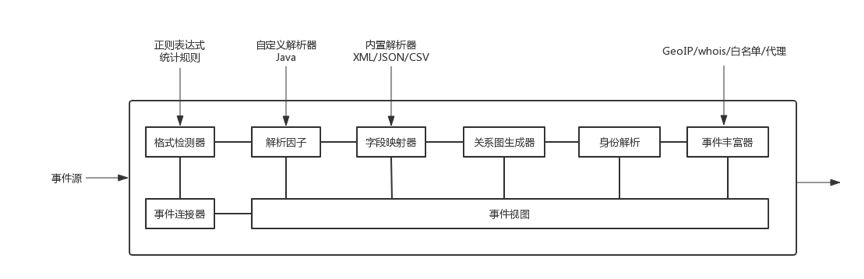
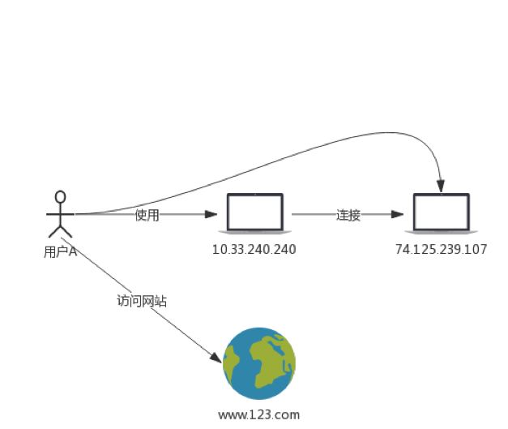
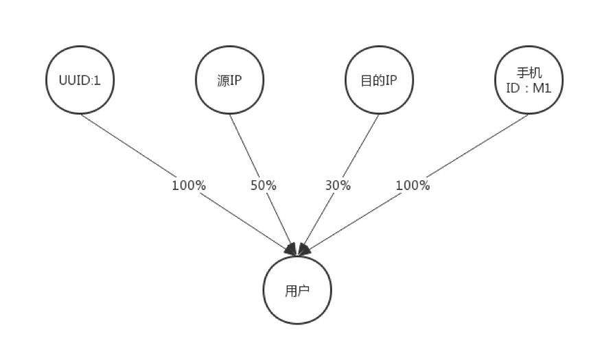
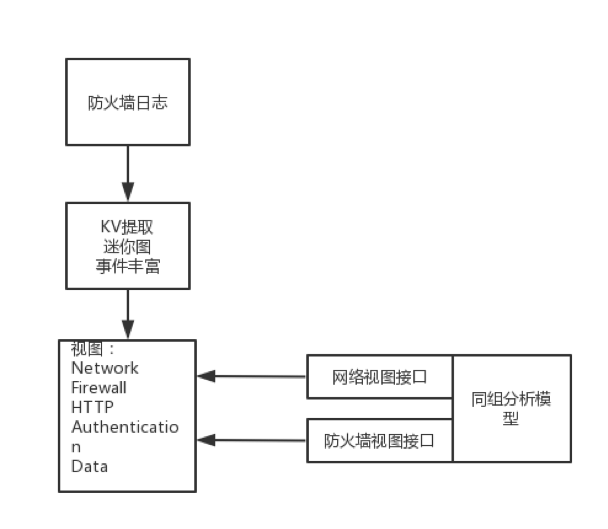

# UEBA架构设计之路(二)：数据接入和准备

> 本文介绍了UEBA的数据接入和准备引擎。

作者：mcvoodoo

## 上篇引言

UEBA通过机器学习对用户、实体进行分析，不管这种威胁是不是已知，也包括了实时和离线的检测方式，能得到一个直观的风险评级和证据分析，让安全人员能够响应异常和威胁。

后面的章节则会介绍各种组件的细节，包括数据接入和准备引擎，处理引擎，实时/离线配置，机器学习模型和不同应用，交互等。

## 数据接入和准备

| **数据类型** | **数据来源** | **数据价值** |
| -------------------------- | ------------------------------------------------------------ | ------------------------------------------------------------ |
| **应用日志** | 本地log文件，log4j，log4net，weblogic，websphere，JBOSS，.NET,PHP | 用户活动，欺诈检测，性能 |
| **业务处理日志** | 业务处理日志 | 客户活动，渠道，订单，账户变动，问题报告 |
| **点击流数据** | web | 可用性分析，用户行为分析，商品分析 |
| **配置文件** | 系统配置文件 | 基础设施安装、debug、错误、后门木马 |
| **数据库审计日志** | 数据库日志 | 数据被谁，在什么时间做了修改 |
| **文件系统日志** | 敏感数据存储和共享系统 | 监控审计敏感数据读取 |
| **API日志** | 各类API | API失败事件、爬取、越权 |
| **消息队列** | JMS，MQ等 | 应用程调试问题、日志架构主干问题 |
| **操作系统状态和诊断命令** | cpu和内存使用状态信息 | 故障、潜在问题、趋势、事件调查 |
| **包/流数据** | Tcpdump，tcpflow生成的pacp或流数据，以及其他数据包级和session级信息 | 性能下降，超时，瓶颈或可疑活动，表明网络可能受到威胁或远程攻击 |
| **Syslog** | 路由、交换、其他网络设备 | 故障、分析、安全审计 |
| **WEB访问日志** | WEB服务器 | WEB分析 |
| **PROXY日志** | PROXY | 数据泄漏 |
| **Windows事件日志** | Windows应用、安全和系统事件日志 | 检测关键应用，安全信息和使用模式 |
| **无线数据** | DNS lookup记录，协议级信息：header，content和流记录 | 监控应用性能和可用性，事件调查，网络威胁检测 |

上面这个表举了一些例子，包括数据类型和含义，计算环境内生成大量机器数据，包括性能、诊断信息、操作信息（例如上传、删除、登陆动作）和其他各种类型，可以分析出性能问题、用户操作交互问题、用户行为基线、异常或威胁等。机器数据不仅是日志，还包括配置，API数据，消息队列，事件变更、诊断命令输出，甚至也可以包括工业系统的传感探测等。

事件有很多类别，例如防火墙事件、IDS事件、登陆事件，由各种不同的系统产生，这些系统从路由到Hadoop，再到云服务器等，所以数据格式五花八门，很多数据类型不可预测，传统的SOC不是针对这种数据多样性，速度，体积和可变性设计的，所以很难应对。

另外不同类型的数据包括不同信息，事件所属的通信层（OSI七层来看）越高，事件信息越丰富。网络日志只包括IP之间通信信息，应用日志可具有最丰富的信息，不仅可以获得通信信息，还包括共享等，价值更高。会话层数据可识别用户用什么凭证登陆，使用哪个会话，比下层网络数据更有价值。

上图则是数据接入和准备阶段的实现，这里包括了多个数据连接器，格式检测，解析器，字段映射器，关系图生成器，身份解析模块和事件视图等。

## 数据连接器   

数据连接器连接各种数据源，提供访问接收功能，数据源可以包括：

1. 身份认证：例如域控制器，SSO，人力资源系统，VPN，DNS，DHCP等;
2. 活动：网关，代理服务器，防火墙，DLP，文件服务器或文件主机活动日志;
3. 安全产品：终端安全，入侵防御系统，入侵检测系统或防病毒;
4. SaaS和移动：例如阿里云，SaaS应用，移动设备;
5. 外部威胁情报：列入第三方黑名单的IP ，手机号。

数据连接器根据数据源，可以分为推/拉/混合。拉机制是基于查询的系统，例如splunk通过向数据源发出指令主动搜集数据，这种需要根据实时性能来定制查询，要考虑数据源的性能问题。对于推送机制的数据源，可以识别数据源输入端口，将数据推进来。还有混合机制，可以接收事件通知并确认，在约定时间通信接收事件。

对于HDFS这种分布式系统由于包括大量数据，优选是减少数据移动节省网络资源，所以对数据连接器的要求是生成多个作业，把作业发送并耦合到HDFS的作业处理集群，从这里接收数据。实际操作例如生成MapReduce作业，发布耦合到YARN，这样数据的移动很少，数据仍然保留在分布式文件系统中。

## 格式检测器

有种情况是，数据连接器接收到的数据格式未知，分析师还没有设定对数据如何解析，这时候格式检测器就要发挥作用了，需要对数据进行模式匹配以确定格式。这种匹配可以用正则表达式或统计规则，再高级一些可以采用启发式，分层对复杂数据格式进行模式匹配，顺序是先剥离已经识别的格式，例如syslog事件头，再递归执行数据格式化匹配。

格式检测器比较耗资源也很耗时间，其实在安全领域很多数据格式都是预先知道的，例如防火墙日志，所以只要指定数据源和格式，数据接入准备就可以根据已知格式映射数据，并不需要数据格式检测，做的更友善的话，用户可以通过界面指定自动配置。

## 字段映射器

除此之外还有一种办法，分析师可以创建新配置文件片段进行定制，比如对特定数据源，配置文件可以识别哪个字段对应时间戳，哪个对应IP，还可以包括实体、动作、token、事件类型、机器类型等。如果数据是二进制，则可利用标记或解析器。通过自定配置文件，继而可以设置字段映射、字段关联，用于身份解析的指定参数。这么做的好处是系统不需要重新编译或重启。

字段映射器根据预定数据格式解析数据，把数据标记为KEY-value。初始步骤是用正则表达式提取剥离，例如syslog，先用syslog正则表达式去除syslog外壳，显示其中事件消息，然后解析器把数据标记为多个KEY以供进一步处理。

字段映射器把提取到的KEY映射到一个或多个含义字段，可以指定提取令牌中的哪个表示实体，实体可以是用户、设备、应用、会话、URL等，也可指定哪些代表操作事件。对实体的提取可以让分析师知道一些环境信息，比如用户是谁，用户量是多少，哪些应用被用户访问，环境中有多少设备。

## 关系图生成器

关系图生成器识别并记录实体之间的多个关系，为每个事件生成单个关系图的叫做迷你图，图包括很多节点和边，每个节点代表一个实体，每个边表示两个实体的关系，任何事件涉及至少两个关系实体。图生成器可以根据动作来识别实体关系，例如可基于动作、可识别关系表进行比较来识别关系，可识别关系表是可定制的以适应数据源。可能的关系则包括：连接、使用、运行、访问、上传、下载、成功登陆、重新启动、关闭、登录失败、攻击、感染等。例如GET表明用户正在使用特定IP机器访问另一个IP的网站，但在实践中，可识别关系的数量与图的大小直接相关，会影响到平台性能和速度。可识别关系还包括相同类型实体（比如两个用户），或两个不同类型实体（例如用户和设备）的关系。

如上图，表示用户A使用IP地址10.33.240.240与外部IP74.125.239.107通信，传送了106字节，事件状态码200，HTTP状态为GET的TCP事件，除此之外还包括事件数据的很多附加信息。使用前面的解析器和字段映射器，图生成器可以容易识别并创建关系图。关系图包括实体（用节点表示）、连接的边。

图生成器将关系图附加到关联事件数据，生成的图被记录为事件数据的附加字段，也可单独存储或传到后续节点，传到Kafka之后再经过事件处理引擎进一步处理，事件处理引擎使用机器学习模型执行分析，并根据情况结合关系图进行异常分析。

Kafka可在预定时间段聚合所有事件关系图，当多个事件比较时，异常会更容易识别。例如设备周期性外部通信，但突然出现了多台非周期性的连接，则识别出了异常。所有事件的迷你图，可以组合成更大的复合关系图，计算可以耦合多个关系图。复合关系图可被存储为多个文件，每个文件对应时间段，一般可每天存储，挖掘则一周或一个月。

事件关系图持续合并到复合关系图，复合关系图随时间增长，这就要周期性的从复合关系图中删除老化数据。

节点和边写入按时间命名空间分区的图形文件，每个较小的段与主分区按天合并，合并是指将类似的节点和边合并到同一记录，同时也可增加实体节点权重，这样事件到达的时间顺序就不那么重要了，只要事件有时间戳就可以和正确分区合并，同样可以并行方式在多个节点上创建复合图。

复合图可识别所有时间窗口内的关系，随着事件增加复合关系图大小也会增加。很多单个事件看起来没多大意义，但当事件够多，且所有关系图被组合后，可以提供更多的洞察，随着关系图增加，洞察指标的准确性也逐步增加。

单独事件关系图被存储，但尚未被组合时，关系图可以随时进一步更新，例如当前事件已经觉察有异常，则可以更新该事件关联图以包括该信息，这个个体关系图被修改成异常节点，当复合关系图创建时，可用于确定影响的实体。

复合图能让系统执行分析，实体行为可以是一系列、一定量，或由机器学习模型确定。通过明确记录事件关系，关系图生成器在此引入复杂处理引擎，关注与关系的不同部分。

## 身份解析和设备解析

身份解析技术用于跟踪哪个用户，通过哪个网络，登陆到哪个特定设备。在未知威胁检测中用户行为的信息非常重要，但并非所有日志都包含用户信息，典型的例如防火墙日志不会记录用户身份，因此即使特定通信是恶意的，防火墙也不能定位到用户。所以当日志不能捕获用户信息时，就需要身份解析定位用户。

身份解析模块需要观察系统环境（比如基于认证日志）获得信息，智能建立身份解析，这里也可以用到机器学习模型跟踪用户和设备之间的关联概率，这种信息获取可以基于多个接口数据。由机器生成的叫做机器标识符，例如MAC和IP，一台机器可以生成多个机器标识符。用户标识符是用户关联的，例如用户名，电子邮件地址。身份解析模块可以通过用户标识符作为关键字查询数据库解析用户身份，数据库一般是HR系统。用户标识符可以直接被视为用户，这样虽然简单，但问题是用户会使用不同的用户标识符，这样检测会有漏过问题。

机器学习模型有不同阶段，在训练阶段，接收用户和机器标识符，解析模块创建更新关联概率。

随着事件增加，模型可以更好的训练关联概率，身份解析模块创建概率图，概率图用来记录当前正在跟踪的每个用户的关联概率，概率图包括外围节点、中心节点和边缘，如上图所示。上面四个圆圈是这台机器的外围节点，下面圆圈代表用户中心节点，节点之间的百分比表示关联概率。

模型是时间顺序概率图，概率随时间变化，也就是说，模型结果是基于时间的，对当前和历史输入有依赖性，在大型企业里，时间依赖性对首次解析用户的场景很有用，然后会被逐渐分配给不同用户。所以身份解析模块可以根据用户在不同时间点启动机器学习模型的不同版本，每个版本有生效周期，用户事件达到后，模型版本依次启动、训练、激活、连续更新、到期。

模型根据事件不断更新，事件本质上是涉及用户和机器标识符的，但也可以根据特定标识符来训练。模型根据事件类型为新事件分配不同权重，当满足标准时认为模型已经经过训练，也可根据事件量和时间窗口来定义。

训练之后（例如关联概率超过置信度阈值时），身份解析模块激活该版本模型，此后的新事件如果满足身份解析的特定标准，则创建新事件与特定用户关联记录。这些标准包括：新事件有机器标识符，或版本处于活动时间段，从经验来看，身份解析技术识别单独的机器标识符效果还不错。

根据用户关联记录，身份解析模块注释新事件，显性连接到特定用户，把用户姓名作为字段添加到事件中，将用户关联记录发送到Redis缓存服务。

解析模块并不只是关联用户和设备，也可以是设备与设备的关联，分为第一机器标识符和第二机器标识符，如果事件只有第一标识符，则解析模块创建关联机器记录，机器标识符在实际中通常被标记为例如张三的笔记本电脑，可以更友好的观察。在这里解析模块变成了设备解析技术。

设备解析技术在DHCP中使用较多，因为DHCP环境的计算机没有静态IP，每台计算机启动时都可能有不同的IP，所以只是用IP关联会导致分析错误。这样就需要创建MAC和IP映射，这种映射在生存租约周期有效，可以根据DHCP日志进行分析，随着日志更新动态建立机器标识符映射。

## 事件丰富器

类似定制版格式检测器，事件丰富器通过Java添加配置，为事件添加新字段，例如对IP进行地理位置附加，或者对来自服务器的事件进行注释，这样可以区分服务器和网络设备，或者启发式确定用户登陆情况。其他常见的丰富还有黑白名单，Whois查找等。

## 事件视图

事件处理引擎为数据接入准备阶段提供统一访问接口，也即是事件视图。各种不同类型的事件数据会让数据分析平台难以执行自动化分析，因此在这里提供统一，把多个异构数据源创建为同类。

绑定是把非结构化数据转化为结构化数据的过程，绑定的时机选择有两种，一个是早期绑定，数据在传入阶段就被转换为结构化，但早期绑定通常会丢失一些潜在信息，这些信息在案件中可能特别重要，同时也存在技术问题，因为没有办法在这个阶段提供统一的方式访问数据。

二是后期绑定，只是在数据进行操作的时候才绑定。换句话说在数据接入准备阶段没有做任何事，保留了原始事件数据，这样在后期绑定时候才处理，也让系统具有非结构化数据访问的通道。事件视图的实现是Java类，其内容包括订阅事件名称，可以包含多个字段以访问事件的某些属性，机器学习可以根据这些字段识别事件数据的子集，例如serverIP，sourceIP，sourcePort是模型需要的信息。事件视图将方法和事件属性信息关联，比如机器学习用方法来获取事件中URL随机性。事件视图存储在库中，当调用事件视图时进行加载。

数据接入准备阶段可向事件数据添加视图标识符，这个标识符允许下游复杂处理引擎选择接收信息，每个模型的注册表都可指定特定视图标识符，进行选择接收，可以理解为提供了机器学习模型的订阅机制。

上面是个防火墙事件，事件到达时首先确定生成事件的机器是X牌防火墙，基于机器类型确定该事件属于防火墙事件，然后基于配置自动添加两个视图标识符：网络和防火墙（这些都是分析师可调）。

此后下游机器学习模型订阅事件视图，订阅是指允许信息自动路由。通过事件视图可访问的信息有：接口逻辑生成的信息，事件数据集。

## 会话

会话可以和身份解析结合实现，这里有会话跟踪器和会话解析器。监测到会话开始结束时，进行会话关联事件数据的标记，然后利用身份解析或设备解析，在会话窗口内事件都和会话关联，例如RDP和SSH都登陆到另一设备，这就有了相关性，我们称为会话谱系。例如用户在晚上10:13在IP10.245.0.6首次启动AD会话，然后又有一个SSH会话以root登陆新系统，这两个会话都属于这个用户，且有会话延袭，需要会话技术关联。

被跟踪的会话分配会话标识符sessionId和相关标识符correlationId，会话标识符用于标识相同会话，相关标识符查找同一延袭的其他会话，会话跟踪器根据登陆/注销事件跟踪用户会话，会话跟踪器负责在数据库中创建维护状态。

新事件到达，且类型被设置为SessionStart，则表示新会话创建，会话跟踪器将事件存储在会话数据库跟踪，存储包括开始时间、用户标识符、设备标识符、会话ID信息，从事件视图派生的LinkContex。通过新会话，进程线程开始自动在数据库匹配，匹配通过三个字段确定：“from-session-link-context（会话源主机）”，“to-session-link-context（会话目标主机）”和“link-Event time（会话记录时间）。”

如果没有匹配，则通过离线会话扫描附加，这个进程可以配置为每15分钟一次。如果执行身份解析的话，这种识别会更准确。会话过程也可以接收超时事件，在数据库中创建“超时”类别。

> 声明：本文来自唯品会安全应急响应中心，版权归作者所有。文章内容仅代表作者独立观点，不代表本网站立场，转载目的在于传递更多信息。如有侵权，请联系 anhk@ir0.cn。

> 原始链接：https://www.secrss.com/articles/7252