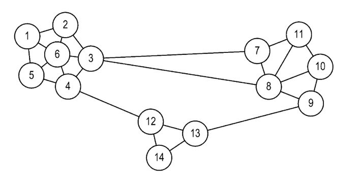
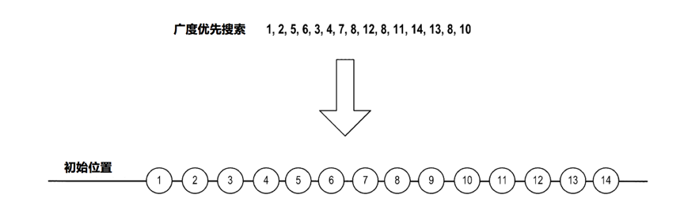
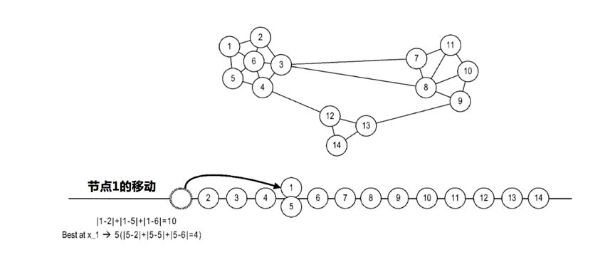
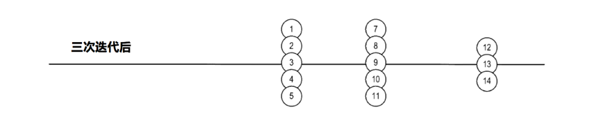

# UEBA架构设计之路(六)：图聚类

> 本文介绍了UEBA的图聚类。

作者：mcvoodoo

## 上篇引言

UEBA通过机器学习对用户、实体进行分析，不管这种威胁是不是已知，也包括了实时和离线的检测方式，能得到一个直观的风险评级和证据分析，让安全人员能够响应异常和威胁。

后面的章节则会介绍各种组件的细节，包括数据接入和准备引擎，处理引擎，实时/离线配置，机器学习模型和不同应用，交互等。

## 图聚类

图聚类是在复合关系图或投影上，识别图中的节点簇。例如检测设备相似性，检测实体活动基线偏差，这种节点簇可以方便的用于横向移动或账户被盗。簇可以表示一组用户，这些用户倾向于访问一组设备，决策引擎可以捕捉到那些有分歧的行为，比如用户访问了其他设备，这样就出现了异常。

**图聚类的需求是：** 高效、高度可扩展、并行，通过机器学习模型实现，并可在实时和离线运作。

自动集群簇识别计算图上节点L1范数值，在一维上为节点分配位置（1D）网格。然后基于1D网格上节点的分配位置来识别图中节点集群。具体来说，通过将1D网格上的节点迭代重新定位到每个节点的L1范数最小的位置来创建节点组，以这种方式找到1D网格上节点的最佳位置之后，位于1D网格上相同位置的每组节点表示群集。

**其流程为：**

1. 按任意顺序遍历图，将所有节点映射到1D网格上
2. 创建一组在一维网格中相同位置的节点，通过最小化L1范数，找到每个节点的最优位置
3. 根据节点的内部/外部边缘比例检测每个组中的簇
4. 根据节点的内/外边缘配分，检测每组的簇
5. 移动外部边缘>内部边缘的每个节点，在1d网格中向左或向右移动一个位置（浮点）
6. 如果有浮点，遍历所有浮点与集群合并
7. 如果无浮点，输出

初始过程是输入任何图，例如下面这种。这个过程可在图构建时就执行，假设边缘权重由整数表示，而不是浮点数，在适当的加权后，节点之间的多个关联被折叠成单个边缘的权重。

第一步，逐个节点遍历图，并将节点映射到一维网格上，任何顺序都可以，但广度优先搜索最方便。从遍历图得到的一维网格是：

每个节点内的数字表示被广度遍历的顺序，形成了最后的位置。

第二步，在将节点映射到1D网格之后，迭代最小化每个节点的L1范数以在1D网格上找到其“最佳”位置，创建在1D网格上具有相同位置的节点组（范数是向量空间中的每个向量分配严格正长度或大小的函数，零向量除外），L1范数是在节点的每个候选位置与所候选位置之间沿着1D网格的各个距离（绝对）的总和，候选位置是直接连接到图中所有节点的位置，最佳位置是该节点在1D网格中的位置。因此将所有节点映射到1D网格之后，将首先尝试确定节点1的最佳位置，为此在其每个候选位置中计算节点1的L1范数，节点1直接连接到图形中的节点2,5和6 ，因此节点1的候选位置是网格上的节点2,5和6占据的位置。计算节点1中每个候选位置的L1范数，并选择L1范数最小的位置作为节点1的最佳位置。如果节点1保持在1D的初始位置，其L1范数将被计算为网格上位置1和位置2,5和6之间沿着1D网格的绝对距离的总和，即：位置1处的节点1的L1范数是L1。范数1,1 = | 1-2 | + | 1-5 | + 1-6 | = 10。相反，如果要将节点1移动到1D网格上的节点5的位置，则位置5处的节点1的L1范数将被计算为L1-Norm 1,5 = | 5-2 | + | 5 -5 | + 5-6 | = 4。

在例子中的验证结果是节点1的L1范数在网格上的位置5处是最小的图，节点1移动到节点5的位置。节点的最佳位置可能在后续迭代改变，但节点可以沿着1D网格重新定位。

在第二步处理完所有节点后，节点占据网格上的相同位置，这些节点构成节点组，集群簇。但在得出这个结论之前，进程查找每个节点组与外部有更强连接的任何节点，一旦发现则沿着1D网格重新定位。

第四步，基于节点的内部到外部边缘比率来检测每个组中的实际集群，节点分为内部边缘和外部边缘，内部边缘是同节点组内，外部边缘是连接到节点组外。如果某节点有外部边缘，总和权重超过内部边缘总重，即：内部/外部边缘比率小于1，则在下一阶段将节点沿着1D网格向左或向右移动一个位置（方向无关紧要），从当前节点移除该节点。以这种方式重新定位的节点称为“浮动器”，所以在后续步骤中存在任何浮动点，则遍历所有浮动点与现有集群合并。如果没有浮动点，则输出识别的簇，输出是给给到其他机器学习模型、决策引擎、用户界面等。

三次迭代后，节点位置如上图，可以看出确定了三个集群，节点1-5，节点7-11，节点12-14。

除了高效，高度可扩展和可并行化之外，这个过程也是增量的，如果在图上添加节点，不必把整个图形重新映射，通过最小化L1范数，可以将新添加的节点直接插入到1D网格中。

上述聚类识别技术可用于识别基本上任何类型的图中的聚类。但有个特殊情况，这个情况是二分图，二分图是一个图，节点分为两个不相交的集合，分为正常节点和伪节点，他们形成了两个独立集，这样每条边连接一个正常节点和一个伪节点。在二分图里，正常节点表示用户，伪节点表示用户访问的设备，这种二分图对横向移动检测很有用。

> 声明：本文来自唯品会安全应急响应中心，版权归作者所有。文章内容仅代表作者独立观点，不代表本网站立场，转载目的在于传递更多信息。如有侵权，请联系 anhk@ir0.cn。

> 原始链接：https://www.secrss.com/articles/9384