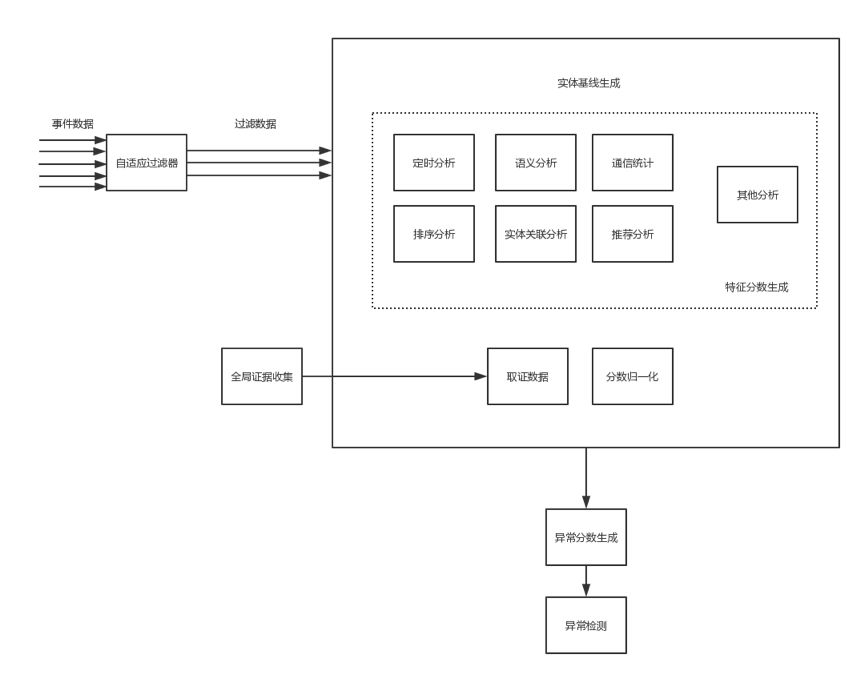
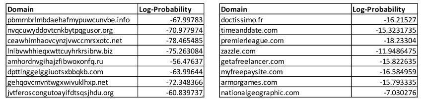

# UEBA架构设计之路(八)：恶意软件检测

> 本文介绍了UEBA的恶意软件检测。

作者：mcvoodoo

## 上篇引言

UEBA通过机器学习对用户、实体进行分析，不管这种威胁是不是已知，也包括了实时和离线的检测方式，能得到一个直观的风险评级和证据分析，让安全人员能够响应异常和威胁。

后面的章节则会介绍各种组件的细节，包括数据接入和准备引擎，处理引擎，实时/离线配置，机器学习模型和不同应用，交互等。

## 恶意软件检测

通过对网络流量的分析，可以观察到恶意软件的痕迹，例如恶意软件会定期向控制端发送信息。

### 1、恶意软件通信检测过程

左上方接收到事件数据，其中自适应过滤器会根据动态白名单过滤掉无关紧要事件，举例来说，虽然我们不知道xx.com这个域名是好是坏，但分析得知网络上大多数用户经常访问xx.com，因此推断xy.com为良性，所以对xy.com进行恶意域名关联分析没必要。动态白名单能够简化计算，减少误报。

接下来继续处理事件数据生成特征分数，并生成实体基线。特征分数包括多个，每个分数则是根据不同特征生成。这里包括定时分析、语义分析、通信统计、排序分析、实体关联分析、推荐分析和其他各种。每个分析生成一个或多个分数，例如时序分析可以生成两个分数，一个是关联通信周期性分析，另一个是关联通信间隔时间的方差。

实体基线还可通过全局证据收集丰富取证数据，例如内部黑名单或外部WHOIS数据，通过证据收集进入证据数据，这里的数据可对特征分数模型产生影响。实体基线还包括分数归一化，涉及归一化多个特征分数，以便在异常分数生成阶段进行后续处理。

接下来生成异常分数，如果异常分数满足标准，则过程结束。

### 2、生成要素分数和实体配置文件

特征分数是基于每个实体计算的，也即是实体和恶意软件关联可能性量化评估模型，模型分为处理逻辑和模型状态，生成特征和生成异常分数可以是同一个模型，常用特征分数模型是监督和无监督，监督模型由人工开发训练样例以有效生成特征分数，每个特征分数是一段范围内的值，例如0-10。

前面也说到特征分数是基于每个实体计算的，也会生成多个特征分数，下面这个表列出了xy.com的特征分数f1到fn。

|        | 定时分析 | 通信统计 | 语义分析 | 其他分析 |
| ------ | -------- | -------- | -------- | -------- |
| 实体   | f 1      | f 2      | f 3      | f n      |
| xy.com | 5.2      | 4.0      | 3.2      | 7.8      |

上面是简化的，实际情况中特征可能包括几百个，与实体关联的特征分数标示为特征向量f = {f 1 f 2 f 3。。。f n }。xy.com的实体配置文件可以表示为特征向量，f = {5.2 4.0 3.2。。。7.8}。

举一些例子有助于理解，语义分析：通过分析关联域名字符排序，这个字符排序生成了置信度。通信统计可以是通信周期性、通信间隔时间变化、通信顺序检测利用链、传输进出比率统计。定时分析，恶意软件定期从外部接收控制消息。这些分析基于安全知识，得到的评分标识了恶意软件关联性。

但随着对抗升级，恶意软件也不再是基于静态域名，而是机器不断生成新域名通信。这里的特征是高度熵或随机性，分析字符中的熵或随机性方法则是通过n-gram分析，可以使用语言域名的大量词汇来训练用于n元语法分析的机器学习模型，通过训练开发出n-gram概率列表。换句话说，n-gram分析模型可以观察域名字符序列，可以参考国外的一个n-gram分析：

人肉查看，左右域名的哪个概率更低？显然是左边，n-gram概率模型要实现的就是这个见解。

分析一定时间内，实体定时的通信消息，基于特征分配分数，其中特征分数代表了置信水平。根据安全知识，高周期性的通信不太可能是人为生成，而是机器生成。在数据传输统计上，通过进出比率能够了解到通信目的，出方向大于进方向可以指示数据泄漏。

### 3、生成异常分数

异常分数基于实体基线得到，可将异常分数概念化为实体所有特征分数的组合。生成异常分数是一个集合学习过程，应用多个模型处理多个特征。生成异常分数可以是简单的计算特征分数的加权线性组合，异常分数可以简单表示为：异常分数= ∑i = 1 n ⁢ ⁢wi fi

其中w i是每个特征分数f i的加权因子，并且异常分数仅是多个特征分数中的每一个与加权因子的总和。加权因子w i取决于很多因素，例如实体类型、用户配置项、要素分数。

应用集合学习，能够实现更好的预测性能并减少误报，适用于集成学习的则是随机森林，整个过程则是：根据多个机器学习模型处理多个实体基线，分配多个中间异常分数。

### 4、异常检测和通知

一旦生成异常分数，如果满足指定标准，则检测到异常，前面我们说异常分数可以是0-10，标准在这里可定义为大于等于6则为异常。但指定标准不一定静态的，可根据事件数据量、用户配置等动态变化。

如果检测到异常，则输出异常指示线是个用户，示例输出如：

| 域名             | 通信分数 | 定时分数 | 7层分数 | NLP分数 | 建议                       |
| ---------------- | -------- | -------- | ------- | ------- | -------------------------- |
| www.abc.com      | 高       | 中       | 中      | 无      | 优先级：高，通信正常，活跃 |
| www.frejghrf.com | 0        | 中       | 0       | 高      | 优先级：低，防火墙拦截     |
| www.baidu.com    | 无       | 无       | 无      | 无      | 无                         |

最后的建议是根据前面得分进行解释，而在得分上分为高中无，也可以是数字。www.abc.com 通信分数为高，表示通信正常且未拦截，因此建议中是高优先级处理。这个建议根据人工给定规则生成。

检测到的异常存储在异常图数据结构中，异常图数据结构表示关联实体的多个节点，以及链接节点中的多个边。

> 声明：本文来自唯品会安全应急响应中心，版权归作者所有。文章内容仅代表作者独立观点，不代表本网站立场，转载目的在于传递更多信息。如有侵权，请联系 anhk@ir0.cn。

> 原始链接：https://www.secrss.com/articles/10727