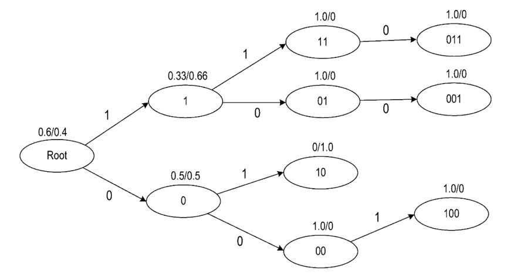
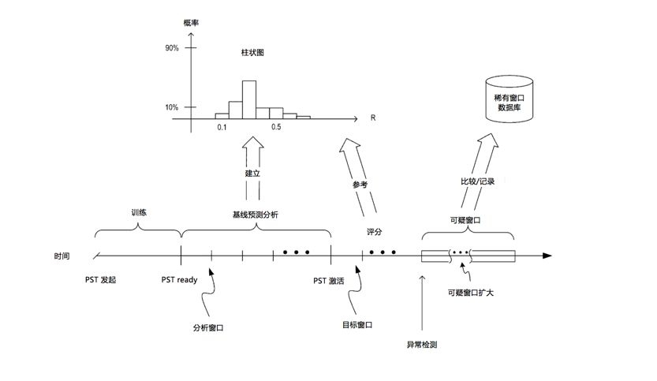
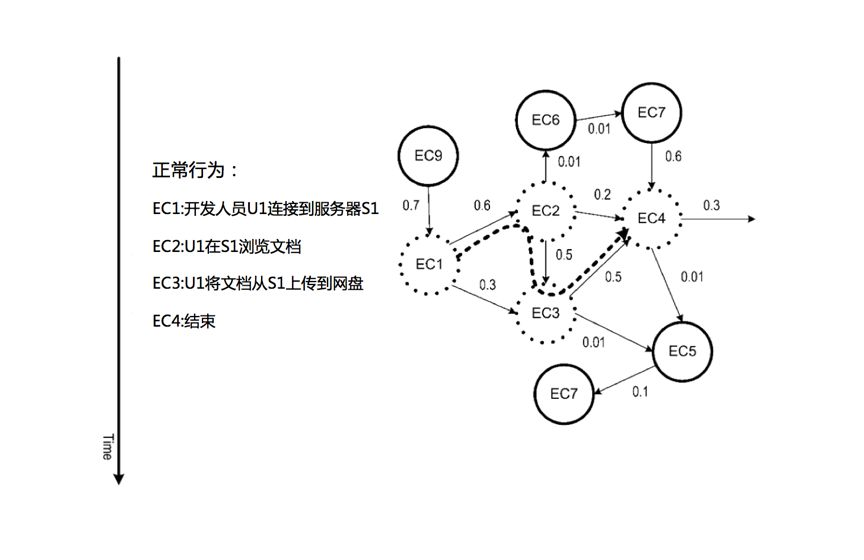
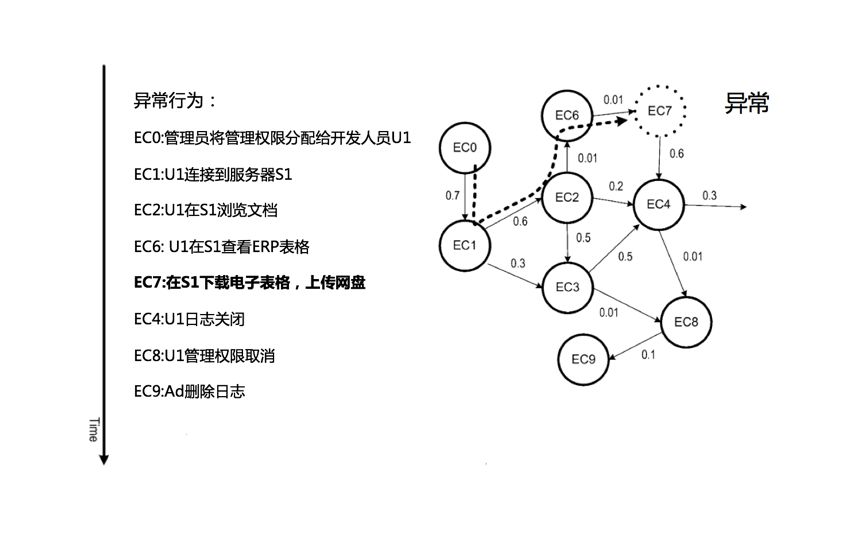
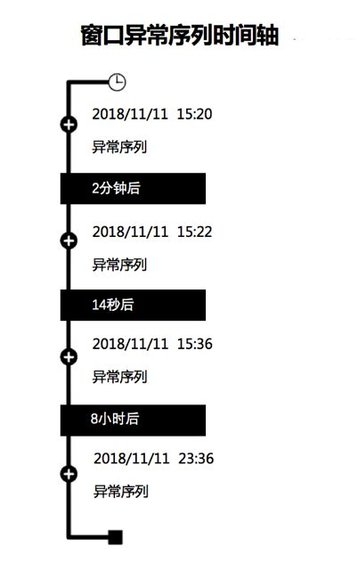

# UEBA架构设计之路(五)： 概率后缀树模型

> 本文介绍了UEBA的概率后缀树模型。

作者：mcvoodoo

## 上篇引言

UEBA通过机器学习对用户、实体进行分析，不管这种威胁是不是已知，也包括了实时和离线的检测方式，能得到一个直观的风险评级和证据分析，让安全人员能够响应异常和威胁。

后面的章节则会介绍各种组件的细节，包括数据接入和准备引擎，处理引擎，实时/离线配置，机器学习模型和不同应用，交互等。

## 概率后缀树模型

传统技术只关注单一事件，但实际上单一事件正常，并不代表整体正常。在UEBA中，用了许多模型来发现异常，概率后缀数则是对异常序列进行检测的方法。序列可以对任何符号检测（符号是指特定类型的安全事件，例如连接失败、密码重置、文件访问等，机器可以观察到的事件）。事件类型符号用单个字符（例如，x，y，z）或整数（例如，0,1）表示，概率后缀数Probabilistic Suffix Tree，本文简化为PST模型。

具体来说：给定多个符号的观察窗口，则PST模型可预测下一个符号，通过异常计数识别异常。PST模型需要训练才能更准确预测，可以有一组特定历史符号训练，这组训练量要能确定预测是否可信。训练通常包括固定时间、固定数量、自动训练等方法，固定时间和固定数量都好理解，自动训练则是直到模型满足某个标准，例如收敛、得分向量和其他模型比较等标准。为了把计算复杂度保持在合理程度，训练也可小量，只训练四到五个符号。这种序列分析方法利用了“可以记忆”的PST特性。PST模型的序列生成过程可被建模为可变长度马尔可夫链，类似于有限状态自动机生成。PST模型的存储容量可以通过历史符号的最大长度来控制，历史符号则是概率后缀树的深度，并且是马尔可夫链长度。

在训练PST模型之后，能够可靠预测下一个符号。换句话说，给定多个符号历史，PST模型可针对实体看到下一个符号的整个概率分布，下一个符号的概率标示为P（下一个I历史），也称之为预测。例如，PST模型生成P(a|aabcd)=0.1, P(b|aabcd)=0.8, P(c|aabcd)=0.1, 和P(d|aabcd)=0，这个意思是，给定历史“aabcd”，预测下一符号是“a”的概率为10％，“b”是80％，“c”是10％，“d”不可能是下一个符号。如果下一个符号是“d”，由于“d”的概率非常低，所以该事件是罕见的，则触发异常。当PST模型预测符号出现概率小于阈值（例如0.1%）时，异常符号出现。

上图是PST模型训练示例，PST的深度是3。

由于不同类型实体行为特征不同，为了进一步增强预测准确性，PST模型可以首先建立特定实体基线，使用连续预测的分析窗口来构建这个基线，说人话就是：对于特定实体，了解特定窗口有多少异常事件时是正常的。

当PST模型训练完成后，记录下一个符号预测结果，利用这个额外的基线预测剖面图层，PST模型可以更加稳健抵御噪声，降低误报。换句话说，假设在分析窗口有10个异常符号是正常的，那么模型可以通过基线预测剖面学习，减少误报概率。分析窗口表示为“W”，分析窗口的长度可以表示为| W |。

上图说明概率后缀树的模型的训练，基线预测的建立，以及模型版本的激活。

分析窗口可以根据需要调整，例如对阈值低于长度的预测数量比率R计数来评估分析窗口，R也就是稀有分数。举例来说，长度为10的分析窗口内，有4个预测值低于0.01％，则该分析窗口中异常事件的比率R为4/10（或R = 0.4）。

PST模型准备就绪之后，通过将分析窗口滑动一定时间长度，收集每个分析窗口内的预测。时间长度标示为基线预测分析阶段图，然后用柱状图观察比率，柱状图记录了特定用户的常用R，也即是一段时间内重复执行每个分析窗口的预测，这个时间段时分析窗口长度的N倍（即，N×| W |）。在PST模型ready后的一段时间内，跟踪每个分析窗口的R并存储在柱状图，这个学习的柱状图表示为“H”，利用这个柱状图，任何新的R，PST模型就可以产生P（R | H）。P（R | H）是在给定先前Rs的历史的情况下看到具有比率R窗口的概率，以这种方式，可以构建特定实体的基线预测。

构建柱状图后，激活PST模型开始检测，进入了评分阶段，为了检测异常，首先记录稀有序列。具体来说，激活模型后，使用目标窗口识别稀有序列。类似基线分析阶段评分过程，PST模型生成预测并计算给定目标窗口的比率R，对目标窗口进行评分。为了更好的预测精度，可将目标窗口的大小设置为与分析窗口相同，在为目标窗口生成R之后，PST模型参考柱状图找到具有该级别的至少R窗口概率，如果该概率（即，P（R | H））低于某个阈值（，则PST模型确定该特定目标窗口是异常，并记录该异常窗口。

另外在实际中，也可使用可疑窗口扩大技术，这样可以完全的捕获异常。当目标窗口具有具有足够低概率的R时，启动窗口收集过程，可疑窗口扩大技术目的是扩展异常活动窗口，尝试在单个窗口内尽可能多包括相关异常。这个技术让原始目标窗口发现异常时扩展到指定大小，但需要注意，窗口可以扩展的时间越长，所需的内存就越大，展开的窗口可以表示为“E，“其中| E | 等于或大于| W |。

为了实现可疑窗口扩大，在检测到目标窗口中的异常R时，PST模型固定目标窗口的起点并开始增加窗口的大小。当正常R的下一个窗口时，异常窗口的收集过程停止。

将上述收集的异常窗口与稀有窗口的数据库进行比较，每次有一个新的稀有窗口时，引用该数据库以检查过去是否存在任何“类似”罕见窗口。这种罕见窗口缓存技术的基本原理是：过去多次观察到的罕见窗口往往比罕见的活动窗口“异常”，这种活动窗口与之前不同，例如对是否共享帐户的发现就可使用此技术。

对于给定的序列，为了确定系统之前是否已经看到，PST模型能够将两个序列相互比较，通过使用两个度量的组合，余弦相似性和Jaccard相似性。

**PST-SIM：**余弦相似性（PST-SIM）的PST实现是表示两个序列的两个向量之间的余弦相似性。每个载体由通过训练每个序列的分离PST而学习的概率组成，PST-SIM度量可用于捕获两个序列的频繁子序列之间的相似性。

**JAC-SIM：**Jaccard相似性的PST实现（也称为Jaccard索引）是两个序列中符号之间的Jaccard相似性。它可以定义为JAC-SIM（A，B）= | A交点B | / | A union B |该JAC-SIM度量对于少数不同符号的存在给予了更多权重，不考虑符号的出现频率和顺序。

因为观察到这两个度量具有不同的目标，所以采用两个度量的组合。PST-SIM强调符号分布的更大整体图像，并评估了分布的相似程度。而JAC-SIM对两个序列之间符号的存不存在更敏感。换句话说，与另一个序列相比，一个序列中存在的新符号越多，JAC-SIM结果就越不同。相反，如果仅缺少几个符号，并且其余的公共符号在两个序列中以相同或相似的方式出现，则PST-SIM结果不受少数缺失符号的影响。通过Sim（S1，S2）= 0.5×PST-SIM（S1，S2）+ 0.5×JAC-SIM（S1，S2）计算两个序列之间的相似性。

为了查看PST训练是否已开始收敛到另一个PST时，需要比较两个PST。PST包含训练中使用的所有符号的条件和边际概率。因此，比较两个PST的一种方法是对两个PST进行矢量化，并逐个比较它们相应的概率。在对PST进行矢量化之后，产生两个概率矢量，可以使用合适的矢量相似性度量（例如，欧几里德距离或余弦相似度）来比较两个PST。

考虑具有三个可能符号{x，y，z}和深度为2的PST的情况，意味着PST模型最多查看两个历史符号以预测下一个符号。假设边际概率是P（x）= 0.8，P（y）= 0.15，并且P（z）= 0.05，并且条件概率是P（x | xx）= 0.7，P（y | xx）= 0.3，P（z | y）= 1.0，依此类推。然后，对于两个序列A和B，表1是两个序列的PST的两个概率向量的示例。

|       | P（x） | P（y） | P（Z） | P（X \| XX） | P（Y \| XX） | P（Z \| Y） | . . . |
| ----- | ------ | ------ | ------ | ------------ | ------------ | ----------- | ----- |
| PST-A | 0.8    | 0.15   | 0.05   | 0.7          | 0.3          | 1           | . . . |
| PST-B | 0.6    | 0.4    | 0      | 1            | 0.4          | 0.8         | . . . |

对于每个稀有序列，也就是矢量化PST，PST摘要保持在稀有窗口高速缓存。由于序列的PST摘要包括所有概率信息，因此可以将PST摘要视为罕见的窗口签名。表示罕见序列的PST摘要可用于与另一序列进行比较。另外对于每个罕见窗口，罕见窗口缓存保持已经观察到稀有窗口的次数的记录，可以保存多天。通过这种方式，当出现新的罕见窗口时，PST模型则检查稀有窗口缓存确定之前是否出现了新的罕见窗口，如果是肯定的话，有多少次、多少天不同。这个信息可用于确定新稀有窗口是否需要发出警报。

上图是概率后缀树模型的一个正常行为序列，和下面这个比较一下：

这个图则是异常行为序列，从这两个图可以看出，即使在多用户协作的复杂环境，PST模型也可区分出异常。而异常则可以再用户交互这里呈现给用户，如下图。界面包括文本描述，哪个用户异常，什么样的异常，窗口内多少个事件，持续时间等。

此外可向用户显示异常序列时间轴，如下图按照时间轴显示，用户可在每个时间轴点击进行交互。

以这些方式，PST模型可让整个系统确定：事件序列是否偏离预期基线，从而发现异常。并提供直观方式让用户接收警报，理解相关信息作出决定。

> 声明：本文来自唯品会安全应急响应中心，版权归作者所有。文章内容仅代表作者独立观点，不代表本网站立场，转载目的在于传递更多信息。如有侵权，请联系 anhk@ir0.cn。

> 原始链接：https://www.secrss.com/articles/8986