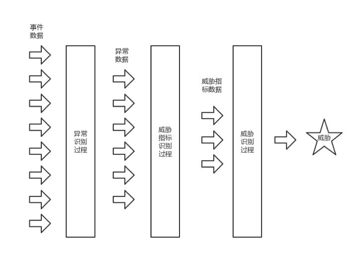
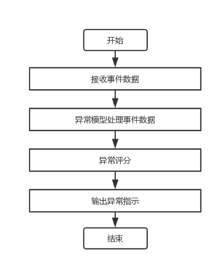
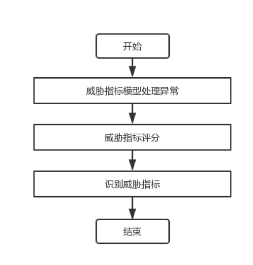
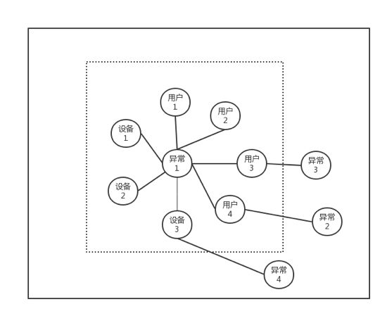
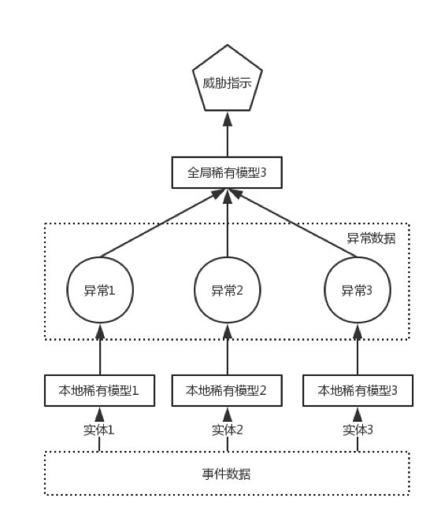
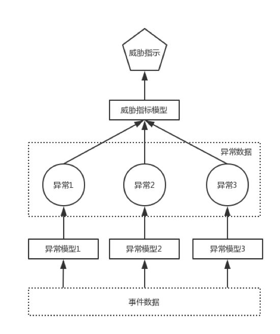
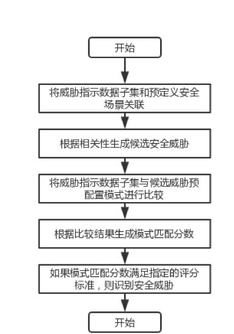
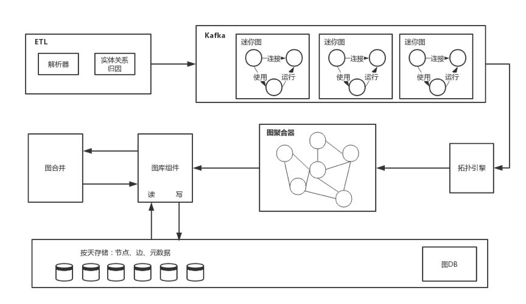
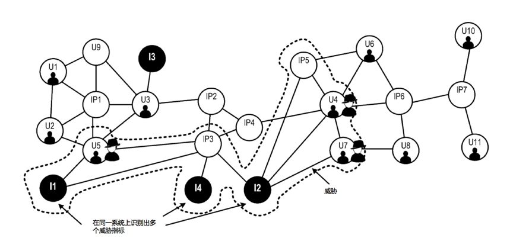
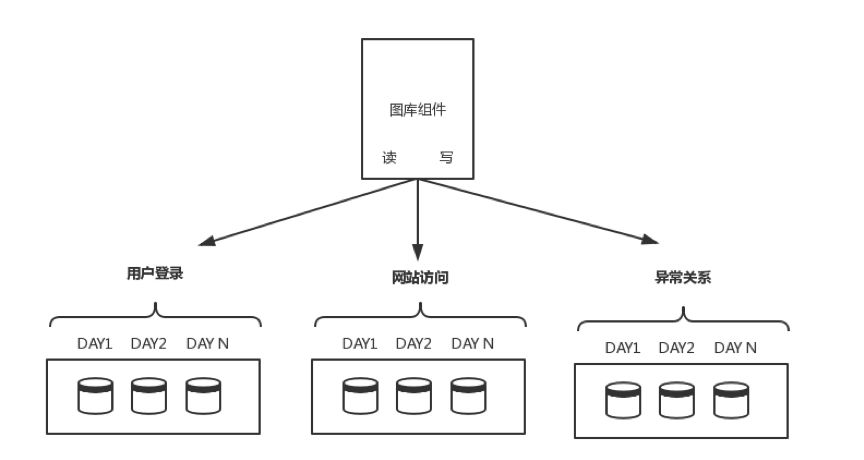

# UEBA架构设计之路(四)：异常、威胁指标和威胁

> 本文介绍了UEBA的异常、威胁指标、威胁以及复合关系图。

##上篇引言

UEBA通过机器学习对用户、实体进行分析，不管这种威胁是不是已知，也包括了实时和离线的检测方式，能得到一个直观的风险评级和证据分析，让安全人员能够响应异常和威胁。

后面的章节则会介绍各种组件的细节，包括数据接入和准备引擎，处理引擎，实时/离线配置，机器学习模型和不同应用，交互等。

## 异常、威胁指标和威胁

系统平台检测首先异常，进一步基于异常形成威胁。还有一个名词是威胁指标，是指安全威胁的潜在中间级别，安全威胁指标又可分为底层威胁、威胁指标、顶级威胁。之所以这样逐步演进，目标是为了减少误报，降低噪音。

上图是威胁识别处理流程，为了减少误报，整个流程先处理大量事件检测异常，进一步处理得到威胁指标，最后处理多个威胁指标识别出真正的威胁。

异常表示预期行为发生了变化，变化不一定威胁，但表示了可能引起关注的事件，由于大型系统中异常是海量的，所以在这一步无法进行人工介入调查。例如传入了1亿个事件，产生了100个异常，进一步处理则得到10个威胁指示，再被进一步处理得到1-2个威胁。

### 1、异常检测

上图是异常检测流程，从ETL接收数据，异常模型处理数据。异常模型包括模型处理逻辑，定义了给事件打分的过程，同时也定义模型状态。异常模型可以有多个类型，例如横向移动、黑名单、恶意软件、罕见事件等。

之后进行评分，评分也是异常模型的处理逻辑完成，将异常相关程度量化。打分是一定范围的值，例如0-10，0表示最小异常，10表示最大。

如果异常分数满足阈值，输出异常指示。阈值不是静态的，应该基于场景可变，所谓场景例如事件数据量、预定义事件是否存在、异常检测量等。

### 2、识别威胁指标

威胁指示的生成和异常流程一样，不再赘述。

### 3、识别威胁指标——实体关联

检测到的异常通常与多个实体相关，比如发现多个设备异常，而设备又和多个用户相关，这些异常组成异常数据集。在上图中的小方框里，异常1与7个各类实体关联，但是异常2、3、4则只和一个单独实体对应。所以从整体上来看，异常1由于关联较多，所以威胁指标评分更高。换句话说，检测到的关联实体越多则威胁越大。在前面阶段的异常检测级别是没有这个范围视图的，因为异常模型是基于每个实例来处理，也即是异常模型是基于特定实体，而威胁指标则涉及整体范围。这是其中的差别。

### 4、识别威胁指标——异常持续时间

在时间段t0到tn阶段检测到异常1～N，实际场景中表示短时间内发生大量异常，异常具有开始时间和结束时间，如果检测到的异常持续时间满足标准，则识别为威胁指标。

### 5、识别威胁指标——罕见度分析

罕见度分析也可以理解为稀有度分析，如果事件确定为罕见，则检测为异常。这种异常检测是局部稀有性分析，在特定实体的背景下观察事件罕见性。基于本地异常汇集成全局稀有性分析，这样异常的数量就是严重程度的重要指标。全局稀有性模型和本地稀有性模型是相同的处理逻辑的模型，不同在于一个是检测集合，一个是检测单个实体。

### 6、识别威胁指标——关联异常

关联异常是指用不同模型检测同样的数据，同一个数据被稀有度分析模型检测出异常，也被其他模型检测出异常，这样的组合观察能提供更多视图，基于这种组合的结果打分。

上面的关联是并行的，另外一种组合是串行，第一个模型处理完交给第二个模型，例如先看是否有关联异常，再看是否稀有度异常。

### 7、识别威胁指标——异常数据丰富

除了内部检测模型，还可使用诸如威胁情报之类的外部数据，例如检测到实体连接外部木马远控服务器。通过外部信息合并，可增加置信度，并且在一些情况下识别威胁指示。

### 8、识别威胁

首先，威胁指示符数据的子集和预定义的安全性场景相关联，根据相关性识别出候选威胁。相关性我们后面再解释，可以理解为类似恶意软件威胁范围关联，或者杀伤链关联组件实体。

接下来把威胁指示数据和预先配置的预设规则比较，例如内部威胁可以和专家规则关联。然后生成模式匹配的分数。如果满足标准则识别为安全威胁。

## 复合关系图

复合关系图总结了整个网络所有角度来看安全，复合关系图可以表示各种实体以及异常节点，然后各种模型可以使用复合关系图检测威胁。

迷你图生成后，复合关系图把同类型进行压缩合并为一条，分配到不同投影。每个投影代表复合关系图子集，例如运维部门的登录、web访问、文件访问、跳板机活动就是一个投影。投影存在Hadoop集群中，基于时间戳细分存储，相关文件存在集群附近提高访问效率。通过关联复合关系图可进一步识别异常，例如邻域计算算法来识别一组异常，基于时间窗口的异常和置信度度量等。

从数据源接收事件数据，然后ETL解析生成关系信息。这个过程把每个事件的实体和关系生成一个迷你图，每个迷你图对应节点和边。拓扑引擎对迷你图进行处理检测异常，图聚合器把迷你图和异常组合到复合关系图，图库组件处理底层图数据库存储，图合并组件运行后台作业，周期性将新数据合并到复合关系图。

上面是一个复合关系图，有用户U1-U11，设备IP1-IP7，异常节点I1-I4。其中I1、I2、I4的异常都指向了设备IP3，I1、I2、I4同时还分别连接到了U4、U5、U7、IP5，这些说明它们是可疑用户。因此决策引擎可以识别一组节点表示的威胁。

上图表示了复合关系图存储投影的过程，复合关系图的每个边（关系），图库组件检查边的类型以确定所属投影，例如登录投影、网站访问投影、异常投影等。确定后将特定边分配给投影。

图库组件进一步将投影分解为多个文件，每个文件存储特定时间段记录，再精细一些，将投影分为对应到天的目录，每个目录对应到小时。这个粒度也可以动态调整，例如对过去两个月，分解为每小时。对两个月前的记录，分解为每周，随着时间推移则进行合并。

这里的异常关系也是复合关系图的一个子集，包括用户进行异常活动的边，每个投影根据时间戳存储，系统识别时间戳后将其相邻存储，提高网络读取效率。

**复合关系图的威胁检测过程：**

1. 接收事件数据
2. 生成事件特定关系图（迷你图）
3. 获取异常数据并存储
4. 将特定关系图压缩组合
5. 将特定关系图与异常数据组合成复合关系图
6. 从复合关系图和时间范围，使用模型分析
7. 模型分析后，将复合关系图转换为异常关系图，识别安全威胁
8. 确认异常

